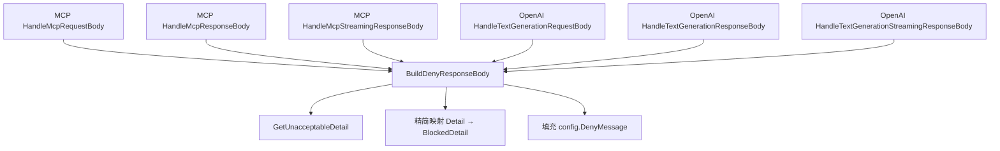

# Design Document: Deny Response Format Refactor

## Overview

精简 `DenyResponseBody` 结构体，新增 `BlockedDetail` 类型，修改 `BuildDenyResponseBody` 函数。改动完全集中在 `config/config.go` 一个文件中，不需要修改任何 handler 代码（MCP、OpenAI 等），因为所有拦截路径都通过 `BuildDenyResponseBody` 获取拦截内容。

### Design Rationale

所有拦截路径（MCP JSON/SSE、LLM OpenAI 流式/非流式、LLM Original）都调用同一个 `BuildDenyResponseBody` 函数。因此只需修改这个函数和相关结构体定义，即可让所有协议路径统一生效，无需逐个 handler 修改。

## Architecture

改动范围：

```
config/config.go
├── 新增 BlockedDetail struct
├── 修改 DenyResponseBody struct
└── 修改 BuildDenyResponseBody()
```

调用链不变：



## Components and Interfaces

### 新增类型：`BlockedDetail`

```go
type BlockedDetail struct {
    Type  string `json:"type"`
    Level string `json:"level"`
}
```

仅保留防护维度和风险等级，JSON key 使用小写。

### 修改类型：`DenyResponseBody`

**当前定义：**
```go
type DenyResponseBody struct {
    BlockedDetails []Detail `json:"blockedDetails"`
    RequestId      string   `json:"requestId"`
    GuardCode      int      `json:"guardCode"`
}
```

**新定义：**
```go
type DenyResponseBody struct {
    Code           int              `json:"code"`
    DenyMessage    string           `json:"denyMessage,omitempty"`
    BlockedDetails []BlockedDetail  `json:"blockedDetails"`
}
```

变更点：
- `BlockedDetails` 类型从 `[]Detail` 改为 `[]BlockedDetail`
- 移除 `RequestId` 字段
- `GuardCode` 重命名为 `Code`，JSON key 从 `"guardCode"` 改为 `"code"`
- 新增 `DenyMessage` 字段，`omitempty` 确保未配置时不出现

### 修改函数：`BuildDenyResponseBody`

**当前实现：**
```go
func BuildDenyResponseBody(response Response, config AISecurityConfig, consumer string) ([]byte, error) {
    body := DenyResponseBody{
        BlockedDetails: GetUnacceptableDetail(response.Data, config, consumer),
        RequestId:      response.RequestId,
        GuardCode:      response.Code,
    }
    return json.Marshal(body)
}
```

**新实现：**
```go
func BuildDenyResponseBody(response Response, config AISecurityConfig, consumer string) ([]byte, error) {
    details := GetUnacceptableDetail(response.Data, config, consumer)
    blocked := make([]BlockedDetail, 0, len(details))
    for _, d := range details {
        blocked = append(blocked, BlockedDetail{
            Type:  d.Type,
            Level: d.Level,
        })
    }
    body := DenyResponseBody{
        Code:           response.Code,
        DenyMessage:    config.DenyMessage,
        BlockedDetails: blocked,
    }
    return json.Marshal(body)
}
```

### 不变的组件

- `GetUnacceptableDetail()` — 过滤逻辑不变，仍返回 `[]Detail`，映射在 `BuildDenyResponseBody` 中完成
- `Detail` struct — 保持原样，仍用于内部安全检查逻辑
- 所有 handler 代码（`mcp.go`、`openai.go`、`text/openai.go` 等）— 不需要任何修改
- `DenyResponse` / `DenySSEResponse` 常量模板 — 不变
- `OpenAIResponseFormat` / `OpenAIStreamResponseFormat` 常量模板 — 不变

## Data Models

### 输出格式对比

**修改前：**
```json
{
  "blockedDetails": [
    {
      "Type": "contentModeration",
      "Level": "high",
      "Suggestion": "block",
      "Result": [{"Label": "xxx", "RiskWords": "xxx", ...}]
    }
  ],
  "requestId": "xxx-xxx-xxx",
  "guardCode": 200
}
```

**修改后（配置了 denyMessage）：**
```json
{
  "code": 200,
  "denyMessage": "很抱歉，我无法回答您的问题",
  "blockedDetails": [
    {"type": "contentModeration", "level": "high"}
  ]
}
```

**修改后（未配置 denyMessage）：**
```json
{
  "code": 200,
  "blockedDetails": [
    {"type": "contentModeration", "level": "high"}
  ]
}
```

### 各协议最终返回效果

**MCP 非流式：**
```json
{"jsonrpc":"2.0","id":0,"error":{"code":403,"message":"{\"code\":200,\"denyMessage\":\"很抱歉，我无法回答您的问题\",\"blockedDetails\":[{\"type\":\"contentModeration\",\"level\":\"high\"}]}"}}
```

**MCP 流式（SSE）：**
```
event: message
data: {"jsonrpc":"2.0","id":0,"error":{"code":403,"message":"{\"code\":200,\"denyMessage\":\"很抱歉，我无法回答您的问题\",\"blockedDetails\":[{\"type\":\"contentModeration\",\"level\":\"high\"}]}"}}
```

**LLM OpenAI 非流式：**
```json
{
  "id": "chatcmpl-xxxx",
  "object": "chat.completion",
  "model": "from-security-guard",
  "choices": [{
    "index": 0,
    "message": {
      "role": "assistant",
      "content": "{\"code\":200,\"denyMessage\":\"很抱歉，我无法回答您的问题\",\"blockedDetails\":[{\"type\":\"contentModeration\",\"level\":\"high\"}]}"
    },
    "finish_reason": "stop"
  }]
}
```

**LLM Original 协议：**
```json
{"code":200,"denyMessage":"很抱歉，我无法回答您的问题","blockedDetails":[{"type":"contentModeration","level":"high"}]}
```

## Error Handling

无新增错误路径。`BuildDenyResponseBody` 的错误处理保持不变（`json.Marshal` 失败时返回 error，调用方已有处理逻辑）。

## Testing Strategy

### Unit Tests

在 `config/` 目录下新增或修改测试：

1. **TestBuildDenyResponseBody_WithDenyMessage**: 配置 `DenyMessage`，验证输出包含 `denyMessage` 字段
2. **TestBuildDenyResponseBody_WithoutDenyMessage**: 不配置 `DenyMessage`，验证输出不包含 `denyMessage` key
3. **TestBuildDenyResponseBody_BlockedDetailsOnlyTypeAndLevel**: 验证 `blockedDetails` 中每个条目只有 `type` 和 `level`，无 `Suggestion`、`Result` 等字段
4. **TestBuildDenyResponseBody_CodeField**: 验证 `code` 字段值等于 `response.Code`
5. **TestBuildDenyResponseBody_NoRequestId**: 验证输出不包含 `requestId` key
6. **TestBuildDenyResponseBody_FallbackSynthesis**: 验证 top-level RiskLevel/AttackLevel fallback 合成的条目也被正确精简

### 现有测试影响

如果现有测试中有断言 `DenyResponseBody` 的 JSON 输出格式（如检查 `requestId`、`guardCode` 字段），需要同步更新。
