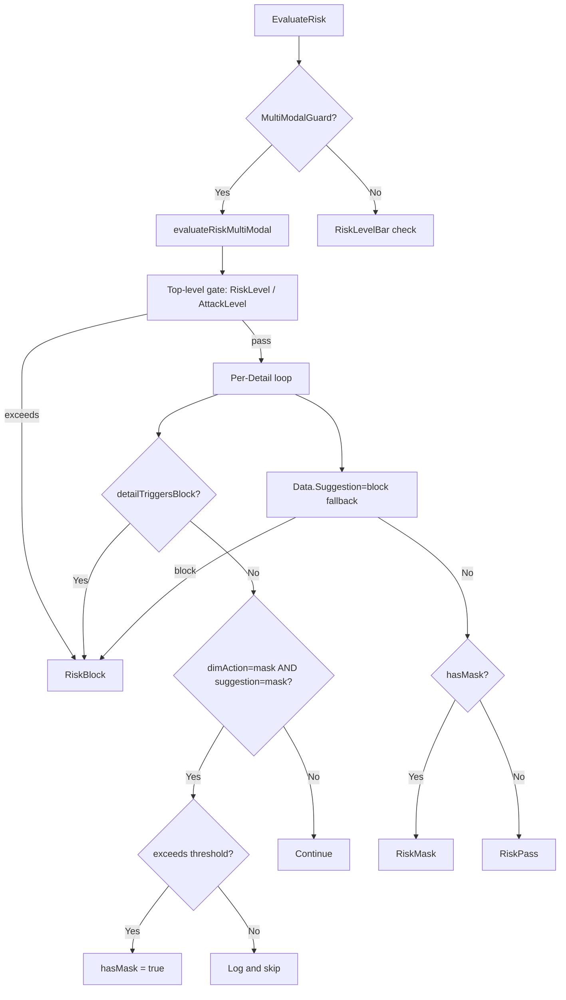

# Design Document: Sensitive Data Mask Threshold

## Overview

This change modifies the `evaluateRiskMultiModal()` function in the `ai-security-guard` WASM Go plugin to incorporate threshold checking into the mask decision path. Currently, when `dimAction == "mask"` and `detail.Suggestion == "mask"`, the function unconditionally sets `hasMask = true`. The fix adds a check against the `exceeds` variable (which already evaluates whether `detail.Level >= sensitiveDataLevelBar`) so that only details meeting or exceeding the configured threshold contribute to a `RiskMask` result. Details below threshold are logged and passed through.

### Design Rationale

The `exceeds` variable is already computed via `detailExceedsThreshold()` for every detail in the loop — it's just not consulted in the mask branch. This is a minimal, surgical change: add `exceeds` to the existing `if` condition and add an `else` branch for logging. No new functions, types, or configuration fields are needed.

## Architecture

The change is confined to a single function within the existing architecture:



### Scope of Change

- **Modified function**: `evaluateRiskMultiModal()` in `config/config.go`
- **Modified tests**: `evaluate_risk_test.go` — update existing tests whose expected results change, add new threshold-boundary tests
- **No new files, types, or configuration fields**

## Components and Interfaces

### Modified Component: `evaluateRiskMultiModal()`

**Current mask branch** (lines ~800-803 of config.go):
```go
if dimAction == "mask" && detail.Suggestion == "mask" {
    hasMask = true
}
```

**New mask branch**:
```go
if dimAction == "mask" && detail.Suggestion == "mask" {
    if exceeds {
        hasMask = true
    } else {
        proxywasm.LogInfof("safecheck_mask_skipped: type=%s, suggestion=%s, level=%s, threshold=%s",
            detail.Type, detail.Suggestion, detail.Level, config.GetSensitiveDataLevelBar(consumer))
    }
}
```

### Unchanged Interfaces

- `EvaluateRisk(action string, data Data, config AISecurityConfig, consumer string) RiskResult` — public API unchanged
- `detailTriggersBlock()` — unchanged
- `detailExceedsThreshold()` — unchanged
- `ResolveRiskActionByType()` — unchanged
- `ExtractDesensitization()` — unchanged
- All configuration parsing — unchanged

## Data Models

No data model changes. All existing types remain as-is:

- `AISecurityConfig` — `SensitiveDataLevelBar` field already exists and is already used by `detailExceedsThreshold()`
- `Detail` — `Level` field already exists
- `RiskResult` — `RiskPass`, `RiskMask`, `RiskBlock` constants unchanged
- `Data` — unchanged

### Level Ordering (existing)

The `LevelToInt()` function maps levels to integers for comparison:

| Level | Int | Sensitive Level | Int |
|-------|-----|-----------------|-----|
| max   | 4   | s4              | 4   |
| high  | 3   | s3              | 3   |
| medium| 2   | s2              | 2   |
| low   | 1   | s1              | 1   |
| none  | 0   | s0              | 0   |

`exceeds` is `true` when `LevelToInt(detail.Level) >= LevelToInt(config.GetSensitiveDataLevelBar(consumer))`.


## Correctness Properties

*A property is a characteristic or behavior that should hold true across all valid executions of a system — essentially, a formal statement about what the system should do. Properties serve as the bridge between human-readable specifications and machine-verifiable correctness guarantees.*

### Property 1: Above-threshold mask produces RiskMask

*For any* valid sensitive level `L` and threshold `T` where `LevelToInt(L) >= LevelToInt(T)`, when `evaluateRiskMultiModal` is called with a single Detail of `Type=sensitiveData`, `Suggestion=mask`, `Level=L`, config `SensitiveDataAction=mask`, `SensitiveDataLevelBar=T`, and no other blocking conditions, the result SHALL be `RiskMask`.

**Validates: Requirements 1.1, 4.1**

### Property 2: Below-threshold mask produces RiskPass

*For any* valid sensitive level `L` and threshold `T` where `LevelToInt(L) < LevelToInt(T)`, when `evaluateRiskMultiModal` is called with any combination of Details where the only mask candidate is a `Type=sensitiveData`, `Suggestion=mask`, `Level=L` detail, config `SensitiveDataAction=mask`, `SensitiveDataLevelBar=T`, and no other blocking conditions, the result SHALL be `RiskPass`.

**Validates: Requirements 1.2, 1.3**

### Property 3: Per-detail threshold independence for multiple sensitiveData details

*For any* list of sensitiveData Details each with `Suggestion=mask` and varying levels, and a threshold `T`, when `evaluateRiskMultiModal` is called with `SensitiveDataAction=mask` and no blocking conditions: the result SHALL be `RiskMask` if and only if at least one Detail has `LevelToInt(Level) >= LevelToInt(T)`.

**Validates: Requirements 1.4**

### Property 4: Block triggers always produce RiskBlock

*For any* Detail where `Suggestion=block`, regardless of `dimAction`, threshold, or config, `evaluateRiskMultiModal` SHALL return `RiskBlock`. Additionally, *for any* Detail where `dimAction=block` and `detailExceedsThreshold` returns true, the result SHALL be `RiskBlock`.

**Validates: Requirements 3.1, 3.2**

### Property 5: Top-level gates produce RiskBlock

*For any* `Data.RiskLevel` and `contentModerationLevelBar` where `LevelToInt(RiskLevel) >= LevelToInt(contentModerationLevelBar)`, or *for any* `Data.AttackLevel` and `promptAttackLevelBar` where `LevelToInt(AttackLevel) >= LevelToInt(promptAttackLevelBar)`, `evaluateRiskMultiModal` SHALL return `RiskBlock` regardless of Detail content.

**Validates: Requirements 3.3, 3.4**

### Property 6: Data.Suggestion=block fallback produces RiskBlock

*For any* set of Details that do not individually trigger block, when `Data.Suggestion=block`, `evaluateRiskMultiModal` SHALL return `RiskBlock`.

**Validates: Requirements 3.5**

## Error Handling

This change does not introduce new error paths. The existing error handling remains:

- **Unknown detail types**: `detailExceedsThreshold()` returns `false` for unknown types — unchanged
- **Empty/invalid levels**: `LevelToInt()` returns `-1` for unrecognized levels, which is less than any valid threshold — effectively treated as below-threshold, resulting in `RiskPass` for mask scenarios (correct behavior: unknown levels should not trigger masking)
- **Empty detail lists**: Loop is skipped, falls through to `Data.Suggestion` check or `RiskPass` — unchanged
- **Missing config fields**: `GetSensitiveDataLevelBar()` returns the configured value or default — unchanged

The new log statement in the `else` branch uses `proxywasm.LogInfof`, which is a non-failing logging call consistent with the existing log statement at the top of the loop.

## Testing Strategy

### Property-Based Tests

The feature is suitable for property-based testing because:
- `evaluateRiskMultiModal` is a pure function (no side effects beyond logging) with clear input/output behavior
- The input space (level × threshold × detail combinations) is large
- Universal properties hold across all valid inputs
- Cost per iteration is negligible (in-memory, no I/O)

**Library**: Use [`rapid`](https://github.com/flyingmutant/rapid) for Go property-based testing (or `testing/quick` from stdlib).

**Configuration**:
- Minimum 100 iterations per property test
- Each test tagged with: `Feature: sensitive-data-mask-threshold, Property {N}: {title}`

**Properties to implement**:
1. Property 1: Generate random (level, threshold) pairs where level >= threshold → verify RiskMask
2. Property 2: Generate random (level, threshold) pairs where level < threshold → verify RiskPass
3. Property 3: Generate random lists of sensitiveData details with mixed levels → verify RiskMask iff any level >= threshold
4. Property 4: Generate random details with Suggestion=block → verify RiskBlock
5. Property 5: Generate random top-level RiskLevel/AttackLevel exceeding thresholds → verify RiskBlock
6. Property 6: Generate random non-blocking details with Data.Suggestion=block → verify RiskBlock

### Unit Tests (Example-Based)

Update existing tests in `evaluate_risk_test.go`:

- **TC_EVAL_001**: Currently expects `RiskMask` with `Level=S2` and default `SensitiveDataLevelBar=S4`. After the change, S2 < S4 so this should expect `RiskPass`. Alternatively, lower the threshold to S2 to preserve the RiskMask expectation.
- **TC_EVAL_005**: Same issue — `Level=S1` with threshold `S4`, should become `RiskPass` or threshold should be adjusted.
- **TC_EVAL_013**: `Level=S1` with threshold not explicitly set (defaults to S4), should become `RiskPass` or threshold adjusted.
- **TC_EVAL_018**: `Level=S2` with threshold S4, same adjustment needed.
- **TC_EVAL_022**: `Level=S2` with threshold S4, same adjustment needed.
- **TC_EVAL_027**: `Level=S2` with threshold S4, same adjustment needed.
- **TC_EVAL_028**: `Level=S1` with threshold S4, mask candidate changes but block fallback still applies — result stays RiskBlock.
- **TC_EVAL_029**: `Level=S1` with threshold S4, same adjustment needed.
- **TC_EVAL_035**: `Level=S1` with threshold S4, same adjustment needed.

Add new test cases:
- Below-threshold mask → RiskPass (explicit threshold boundary test)
- At-threshold mask → RiskMask (exact boundary)
- Mixed above/below threshold details → RiskMask (only above-threshold contributes)
- Below-threshold mask with non-blocking other details → RiskPass

### Logging Verification

- Add an example-based test that captures `proxywasm.LogInfof` output to verify the skip log message contains type, suggestion, level, and threshold fields.
