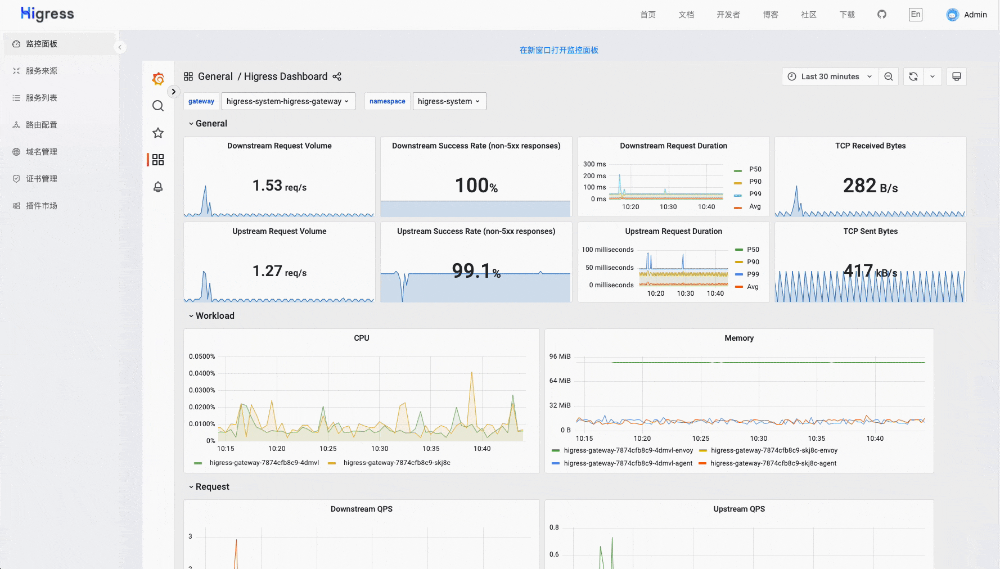
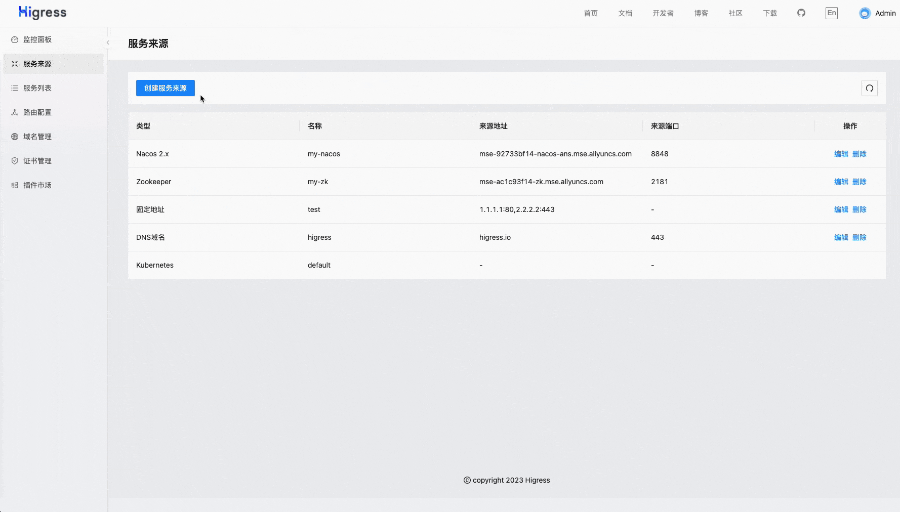

<h1 align="center">
    
   
  Cloud Native API Gateway
</h1>

[**官网**](https://higress.io/) &nbsp; |
&nbsp; [**文档**](https://higress.io/zh-cn/docs/overview/what-is-higress) &nbsp; |
&nbsp; [**博客**](https://higress.io/zh-cn/blog) &nbsp; |
&nbsp; [**开发指引**](https://higress.io/zh-cn/docs/developers/developers_dev) &nbsp; |
&nbsp; [**Higress 企业版**](https://www.aliyun.com/product/aliware/mse?spm=higress-website.topbar.0.0.0) &nbsp;

   <a href="README_EN.md"> English <a/> | 中文

Higress 是基于阿里内部两年多的 Envoy Gateway 实践沉淀，以开源 [Istio](https://github.com/istio/istio) 与 [Envoy](https://github.com/envoyproxy/envoy) 为核心构建的云原生 API 网关。Higress 实现了安全防护网关、流量网关、微服务网关三层网关合一，可以显著降低网关的部署和运维成本。

## Summary
    
- [**功能展示**](#功能展示)
- [**使用场景**](#使用场景)
- [**核心优势**](#核心优势)
- [**Quick Start**](https://higress.io/zh-cn/docs/user/quickstart)
- [**社区**](#社区)

## 使用场景

- **Kubernetes Ingress 网关**:

  Higress 可以作为 K8s 集群的 Ingress 入口网关, 并且兼容了大量 K8s Nginx Ingress 的注解，可以从 K8s Nginx Ingress 快速平滑迁移到 Higress。
  
  支持 [Gateway API](https://gateway-api.sigs.k8s.io/) 标准，支持用户从 Ingress API 平滑迁移到 Gateway API。
  
- **微服务网关**:

  Higress 可以作为微服务网关, 能够对接多种类型的注册中心发现服务配置路由，例如 Nacos, ZooKeeper, Consul, Eureka 等。
  
  并且深度集成了 [Dubbo](https://github.com/apache/dubbo), [Nacos](https://github.com/alibaba/nacos), [Sentinel](https://github.com/alibaba/Sentinel) 等微服务技术栈，基于 Envoy C++ 网关内核的出色性能，相比传统 Java 类微服务网关，可以显著降低资源使用率，减少成本。
  
- **安全防护网关**:

  Higress 可以作为安全防护网关， 提供 WAF 的能力，并且支持多种认证鉴权策略，例如 key-auth, hmac-auth, jwt-auth, basic-auth, oidc 等。  

## 核心优势

- **生产等级**

  脱胎于阿里巴巴2年多生产验证的内部产品，支持每秒请求量达数十万级的大规模场景。

  彻底摆脱 reload 引起的流量抖动，配置变更毫秒级生效且业务无感。
  
- **平滑演进**

  支持 Nacos/Zookeeper/Eureka 等多种注册中心，可以不依赖 K8s Service 进行服务发现，支持非容器架构平滑演进到云原生架构。

  支持从 Nginx Ingress Controller 平滑迁移，支持平滑过渡到 Gateway API，支持业务架构平滑演进到 ServiceMesh。

- **兼收并蓄**
  
  兼容 Nginx Ingress Annotation 80%+ 的使用场景，且提供功能更丰富的 Higress Annotation 注解。
  
  兼容 Ingress API/Gateway API/Istio API，可以组合多种 CRD 实现流量精细化管理。
  
- **便于扩展**
  
  提供 Wasm、Lua、进程外三种插件扩展机制，支持多语言编写插件，生效粒度支持全局级、域名级，路由级。

  插件支持热更新，变更插件逻辑和配置都对流量无损。

## 功能展示
    
- **丰富的可观测**

  提供开箱即用的可观测，Grafana&Prometheus 可以使用内置的也可对接自建的

  
    

- **插件扩展机制**

  官方提供了多种插件，用户也可以[开发](./plugins/wasm-go)自己的插件，构建成 docker/oci 镜像后在控制台配置，可以实时变更插件逻辑，对流量完全无损。

  

- **多种服务发现**

  默认提供 K8s Service 服务发现，通过配置可以对接 Nacos/ZooKeeper 等注册中心实现服务发现，也可以基于静态 IP 或者 DNS 来发现

  
    

- **域名和证书**

  可以创建管理 TLS 证书，并配置域名的 HTTP/HTTPS 行为，域名策略里支持对特定域名生效插件

  

- **丰富的路由能力**

  通过上面定义的服务发现机制，发现的服务会出现在服务列表中；创建路由时，选择域名，定义路由匹配机制，再选择目标服务进行路由；路由策略里支持对特定路由生效插件

  

## 社区

### 感谢

如果没有 Envoy 和 Istio 的开源工作，Higress 就不可能实现，在这里向这两个项目献上最诚挚的敬意。

### 交流群

### 技术分享

微信公众号：

