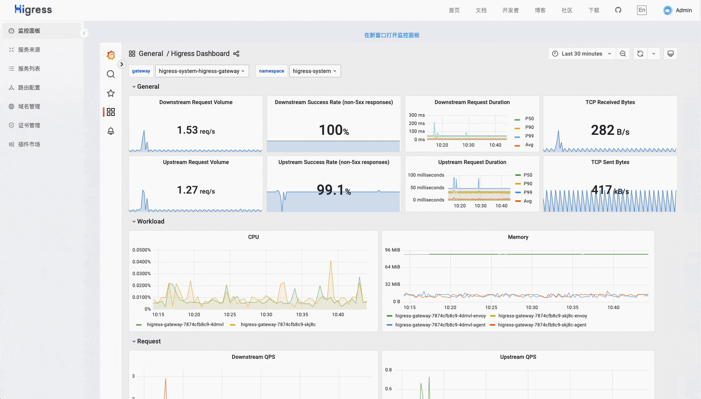
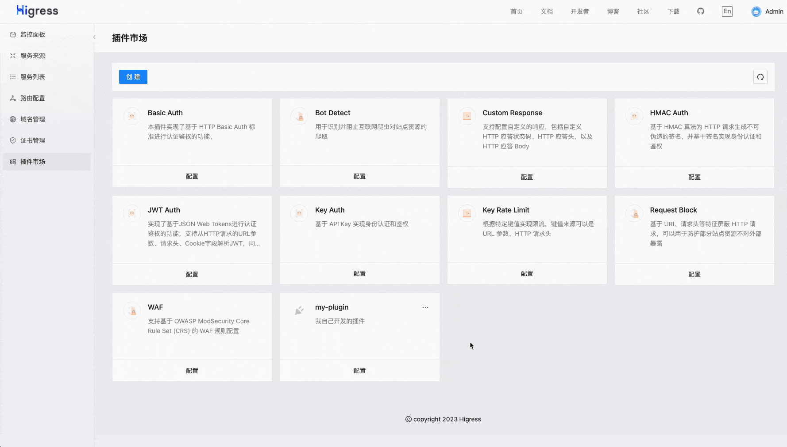
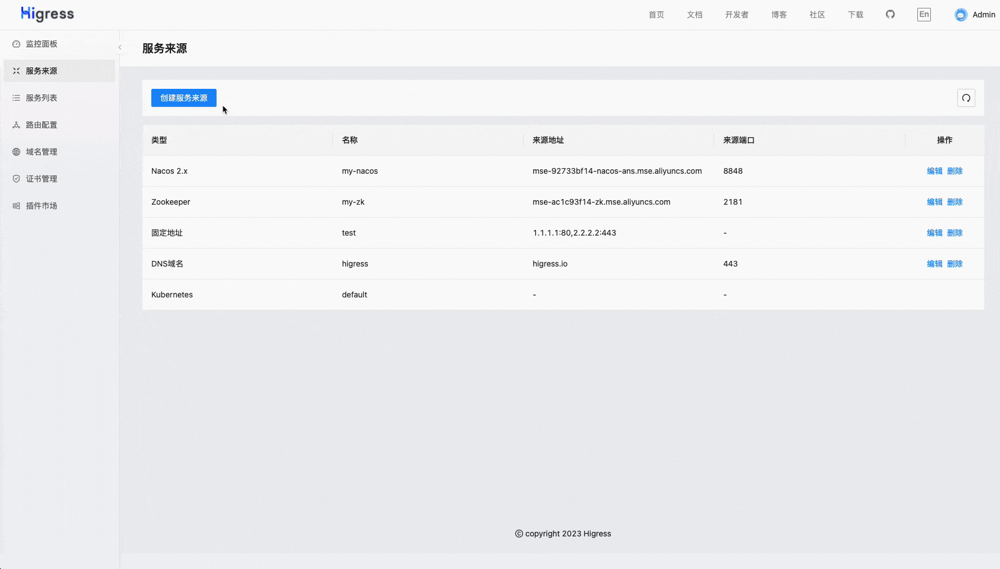
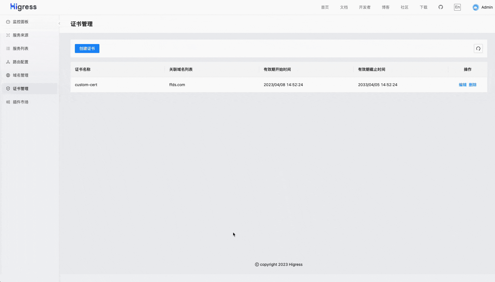

<a name="readme-top"></a>
<h1 align="center">
    
  <br>
  AI Gateway
</h1>
<h4 align="center"> AI Native API Gateway </h4>

<div align="center">
    
[](https://github.com/alibaba/higress/actions)
[](https://www.apache.org/licenses/LICENSE-2.0.html)

<a href="https://trendshift.io/repositories/10918" target="_blank"></a>
</div>

[**官网**](https://higress.cn/) &nbsp; |
&nbsp; [**文档**](https://higress.cn/docs/latest/overview/what-is-higress/) &nbsp; |
&nbsp; [**博客**](https://higress.cn/blog/) &nbsp; |
&nbsp; [**电子书**](https://higress.cn/docs/ebook/wasm14/) &nbsp; |
&nbsp; [**开发指引**](https://higress.cn/docs/latest/dev/architecture/) &nbsp; |
&nbsp; [**AI插件**](https://higress.cn/plugin/) &nbsp;


<p>
   <a href="README.md"> English <a/>| 中文 | <a href="README_JP.md"> 日本語 <a/> 
</p>


Higress 是一款云原生 API 网关，内核基于 Istio 和 Envoy，可以用 Go/Rust/JS 等编写 Wasm 插件，提供了数十个现成的通用插件，以及开箱即用的控制台（demo 点[这里](http://demo.higress.io/)）

Higress 在阿里内部为解决 Tengine reload 对长连接业务有损，以及 gRPC/Dubbo 负载均衡能力不足而诞生。

阿里云基于 Higress 构建了云原生 API 网关产品，为大量企业客户提供 99.99% 的网关高可用保障服务能力。

Higress 的 AI 网关能力支持国内外所有[主流模型供应商](https://github.com/alibaba/higress/tree/main/plugins/wasm-go/extensions/ai-proxy/provider)和基于 vllm/ollama 等自建的 DeepSeek 模型；在阿里云内部支撑了通义千问 APP、百炼大模型 API、机器学习 PAI 平台等 AI 业务。同时服务国内头部的 AIGC 企业（如零一万物），以及 AI 产品（如 FastGPT）


## Summary

- [**快速开始**](#快速开始)    
- [**功能展示**](#功能展示)
- [**使用场景**](#使用场景)
- [**核心优势**](#核心优势)
- [**社区**](#社区)

## 快速开始

Higress 只需 Docker 即可启动，方便个人开发者在本地搭建学习，或者用于搭建简易站点:

```bash
# 创建一个工作目录
mkdir higress; cd higress
# 启动 higress，配置文件会写到工作目录下
docker run -d --rm --name higress-ai -v ${PWD}:/data \
        -p 8001:8001 -p 8080:8080 -p 8443:8443  \
        higress-registry.cn-hangzhou.cr.aliyuncs.com/higress/all-in-one:latest
```

监听端口说明如下：

- 8001 端口：Higress UI 控制台入口
- 8080 端口：网关 HTTP 协议入口
- 8443 端口：网关 HTTPS 协议入口

**Higress 的所有 Docker 镜像都一直使用自己独享的仓库，不受 Docker Hub 境内访问受限的影响**

K8s 下使用 Helm 部署等其他安装方式可以参考官网 [Quick Start 文档](https://higress.cn/docs/latest/user/quickstart/)。

如果您是在云上部署，生产环境推荐使用[企业版](https://higress.io/cloud/)，开发测试可以使用下面一键部署社区版：

[](https://computenest.console.aliyun.com/service/instance/create/default?type=user&ServiceName=Higress社区版)


## 使用场景

- **AI 网关**:

  Higress 能够用统一的协议对接国内外所有 LLM 模型厂商，同时具备丰富的 AI 可观测、多模型负载均衡/fallback、AI token 流控、AI 缓存等能力：

  

- **MCP Server 托管**:

  Higress 作为基于 Envoy 的 API 网关，支持通过插件方式托管 MCP Server。MCP（Model Context Protocol）本质是面向 AI 更友好的 API，使 AI Agent 能够更容易地调用各种工具和服务。Higress 可以统一处理工具调用的认证/鉴权/限流/观测等能力，简化 AI 应用的开发和部署。

  

  通过 Higress 托管 MCP Server，可以实现：
  - 统一的认证和鉴权机制，确保 AI 工具调用的安全性
  - 精细化的速率限制，防止滥用和资源耗尽
  - 完整的审计日志，记录所有工具调用行为
  - 丰富的可观测性，监控工具调用的性能和健康状况
  - 简化的部署和管理，通过 Higress 插件机制快速添加新的 MCP Server
  - 动态更新无损：得益于 Envoy 对长连接保持的友好支持，以及 Wasm 插件的动态更新机制，MCP Server 逻辑可以实时更新，且对流量完全无损，不会导致任何连接断开

- **Kubernetes Ingress 网关**:

  Higress 可以作为 K8s 集群的 Ingress 入口网关, 并且兼容了大量 K8s Nginx Ingress 的注解，可以从 K8s Nginx Ingress 快速平滑迁移到 Higress。
  
  支持 [Gateway API](https://gateway-api.sigs.k8s.io/) 标准，支持用户从 Ingress API 平滑迁移到 Gateway API。

  相比 ingress-nginx，资源开销大幅下降，路由变更生效速度有十倍提升：

  
  
  
- **微服务网关**:

  Higress 可以作为微服务网关, 能够对接多种类型的注册中心发现服务配置路由，例如 Nacos, ZooKeeper, Consul, Eureka 等。
  
  并且深度集成了 [Dubbo](https://github.com/apache/dubbo), [Nacos](https://github.com/alibaba/nacos), [Sentinel](https://github.com/alibaba/Sentinel) 等微服务技术栈，基于 Envoy C++ 网关内核的出色性能，相比传统 Java 类微服务网关，可以显著降低资源使用率，减少成本。

  
  
- **安全防护网关**:

  Higress 可以作为安全防护网关， 提供 WAF 的能力，并且支持多种认证鉴权策略，例如 key-auth, hmac-auth, jwt-auth, basic-auth, oidc 等。 

## 核心优势

- **生产等级**

  脱胎于阿里巴巴2年多生产验证的内部产品，支持每秒请求量达数十万级的大规模场景。

  彻底摆脱 Nginx reload 引起的流量抖动，配置变更毫秒级生效且业务无感。对 AI 业务等长连接场景特别友好。

- **流式处理**

  支持真正的完全流式处理请求/响应 Body，Wasm 插件很方便地自定义处理 SSE （Server-Sent Events）等流式协议的报文。

  在 AI 业务等大带宽场景下，可以显著降低内存开销。  
    
- **便于扩展**
  
  提供丰富的官方插件库，涵盖 AI、流量管理、安全防护等常用功能，满足90%以上的业务场景需求。

  主打 Wasm 插件扩展，通过沙箱隔离确保内存安全，支持多种编程语言，允许插件版本独立升级，实现流量无损热更新网关逻辑。

- **安全易用**
  
  基于 Ingress API 和 Gateway API 标准，提供开箱即用的 UI 控制台，WAF 防护插件、IP/Cookie CC 防护插件开箱即用。

  支持对接 Let's Encrypt 自动签发和续签免费证书，并且可以脱离 K8s 部署，一行 Docker 命令即可启动，方便个人开发者使用。


## 功能展示

### AI 网关 Demo 展示

[从 OpenAI 到其他大模型，30 秒完成迁移
](https://www.bilibili.com/video/BV1dT421a7w7/?spm_id_from=333.788.recommend_more_video.14)


### Higress UI 控制台
    
- **丰富的可观测**

  提供开箱即用的可观测，Grafana&Prometheus 可以使用内置的也可对接自建的

  
    

- **插件扩展机制**

  官方提供了多种插件，用户也可以[开发](./plugins/wasm-go)自己的插件，构建成 docker/oci 镜像后在控制台配置，可以实时变更插件逻辑，对流量完全无损。

  


- **多种服务发现**

  默认提供 K8s Service 服务发现，通过配置可以对接 Nacos/ZooKeeper 等注册中心实现服务发现，也可以基于静态 IP 或者 DNS 来发现

  
    

- **域名和证书**

  可以创建管理 TLS 证书，并配置域名的 HTTP/HTTPS 行为，域名策略里支持对特定域名生效插件

  


- **丰富的路由能力**

  通过上面定义的服务发现机制，发现的服务会出现在服务列表中；创建路由时，选择域名，定义路由匹配机制，再选择目标服务进行路由；路由策略里支持对特定路由生效插件

  


## 社区

### 感谢

如果没有 Envoy 和 Istio 的开源工作，Higress 就不可能实现，在这里向这两个项目献上最诚挚的敬意。

### 交流群


### 技术分享

微信公众号：


### 关联仓库

- Higress 控制台：https://github.com/higress-group/higress-console
- Higress（独立运行版）：https://github.com/higress-group/higress-standalone

### 贡献者

<a href="https://github.com/alibaba/higress/graphs/contributors">
  
</a>

### Star History

[](https://star-history.com/#alibaba/higress&Date)

<p align="right" style="font-size: 14px; color: #555; margin-top: 20px;">
    <a href="#readme-top" style="text-decoration: none; color: #007bff; font-weight: bold;">
        ↑ 返回顶部 ↑
    </a>
</p>
