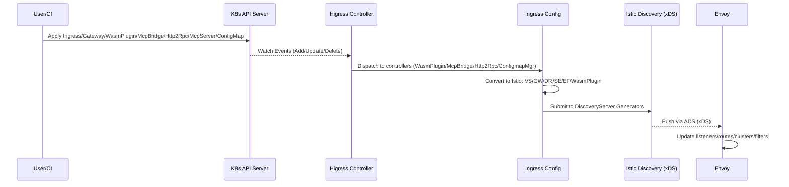
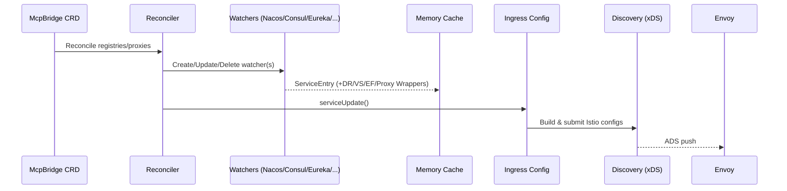
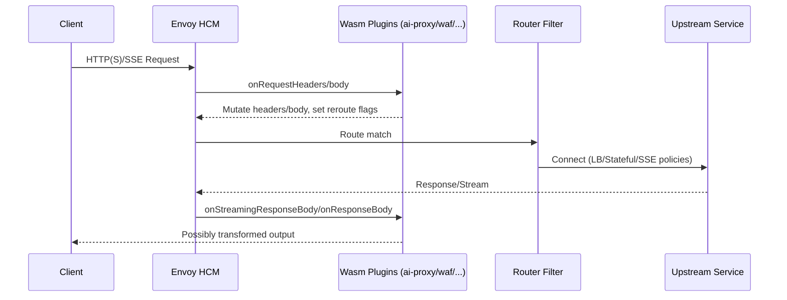
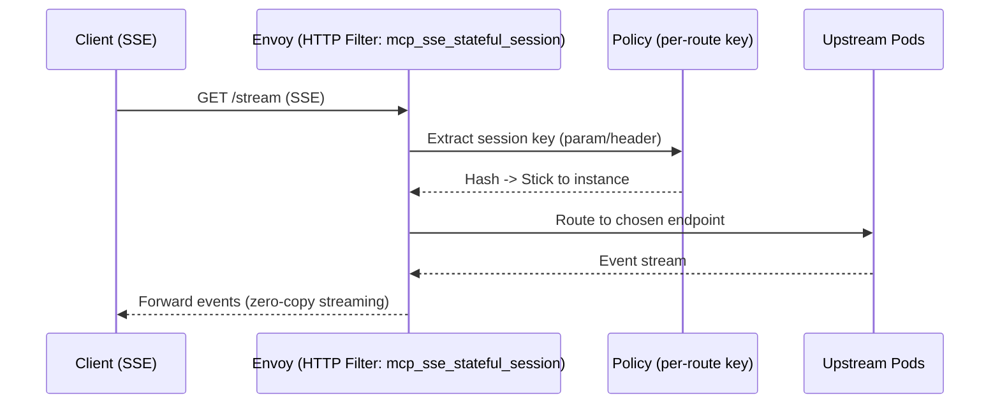
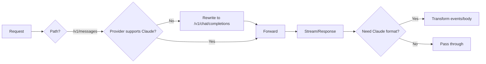
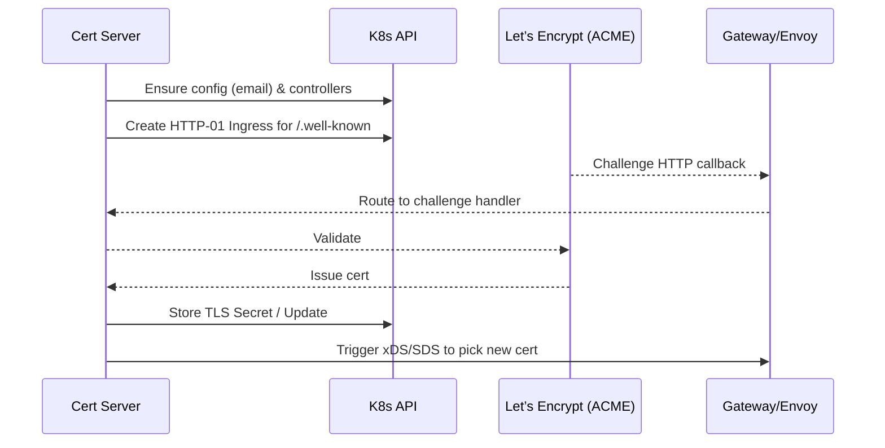

# Higress 架构与技术实现原理（深度版）

本文基于本地源码进行整理，系统梳理 Higress 的总体架构、关键数据/控制流，以及核心技术实现细节。配有可渲染的 Mermaid 架构图与时序图，便于后续查阅、培训与扩展开发。

提示：在 GitHub、VS Code（Mermaid 插件）等支持的渲染环境下可直接预览 Mermaid 图形；否则可用 mermaid-cli 导出 PNG/SVG。

## 总览

- 核心定位：基于 Istio + Envoy 的云原生 API 网关，主打 AI 网关场景与 Wasm 插件扩展（Go/Rust/JS/C++）。
- 组件划分：控制面（Higress Controller）+ 数据面（Higress Gateway）+ 可选控制台（Higress Console/Admin SDK）。
- 配置来源：Kubernetes Ingress/Gateway API、Higress 扩展 CRD（McpBridge、Http2Rpc、WasmPlugin、McpServer）、外部注册中心（Nacos/Consul/ZooKeeper/Eureka/DNS/Static）。
- 动态下发：统一经 Istio xDS（ADS）向 Envoy 下发，毫秒级生效，长连接业务零感知，无需类似 Nginx reload。

### 架构图

```mermaid
graph TD
  subgraph Client[Clients]
    U1[Browser / App]
    U2[AI Agents]
  end

  subgraph Data[Higress Gateway (Data Plane)]
    E[Envoy]
    subgraph EFilters[HTTP Filter Chain]
      W1[Wasm Plugins\n(ai-proxy/waf/oidc/...)]
      F1[Envoy Native Filters\n(HCM, router, gzip, ...)]
    end
  end

  subgraph Control[Higress Controller (Control Plane)]
    IConf[Ingress Config]
    McpB[McpBridge Controller]
    WPC[WasmPlugin Controller]
    H2R[Http2Rpc Controller]
    CfgM[ConfigmapMgr\n(gzip/tracing/MCP Server)]
    Cert[Cert Server]
  end

  subgraph Istio[Istio Pilot / Discovery]
    XDS[xDS (ADS)]
  end

  subgraph ExtReg[External Registries]
    Nacos[Nacos / Nacos2/3]
    Consul[Consul]
    Eureka[Eureka]
    ZK[ZooKeeper]
    DNS[Static/DNS]
  end

  U1 -->|HTTP(S)/SSE| E
  U2 -->|LLM API| E
  E -->|Upstream| Svc[(Backend Services)]

  EFilters --> E
  W1 --> F1

  IConf -->|GVK to Istio| XDS
  McpB --> IConf
  WPC --> IConf
  H2R --> IConf
  CfgM --> IConf
  Cert --> IConf

  XDS -->|gRPC| E

  McpB <-->|watch/reconcile| ExtReg
  ExtReg --> McpB
```


## 控制面：核心组成与职责

### Ingress Config（转换与汇聚）

- 将 Ingress/Gateway API 与扩展 CRD 转换为 Istio 资源：VirtualService、Gateway、DestinationRule、ServiceEntry、EnvoyFilter、WasmPlugin。
- 控制器装配与事件分发：集中初始化 McpBridge/WasmPlugin/Http2Rpc/ConfigmapMgr 控制器 + Lister，注册 Add/Update/Delete 事件。
  - 源码：higress/pkg/ingress/config/ingress_config.go:102
- 统一列举与模板处理：`List` 聚合 Ingress/Gateway 列表，处理模板与 Secret 引用（TemplateProcessor 与 SecretConfigMgr），并合并 ConfigMap 生成的全局 EnvoyFilter 缓存。
  - 源码：higress/pkg/ingress/config/ingress_config.go:220
- WasmPlugin 增删改与转换：监听 Higress 扩展 WasmPlugin，转换为 Istio WasmPlugin，并推送 xDS。
  - 源码：higress/pkg/ingress/config/ingress_config.go:1128
- Http2Rpc：将 HTTP 映射到 Dubbo 等 RPC 协议，自动生成 EnvoyFilter。
  - 源码：higress/pkg/ingress/config/ingress_config.go:640
- ConfigmapMgr：监听 `higress-config` 并构造 gzip、tracing、MCP Server 相关 EnvoyFilter，与其它来源统一下发。
  - 源码：higress/pkg/ingress/kube/configmap/*.go

### Cert Server（自动证书与 SDS）

- 使用 certmagic/ACME 自动签发/续期 TLS 证书，自动创建/清理 HTTP-01 Ingress，证书变更触发 XDS/SDS 生效。
- 源码：higress/pkg/cert/server.go:44, higress/pkg/cert/server.go:81

## 数据面：xDS 与 Envoy

### DiscoveryServer 与资源生成器

- 初始化注册 WasmPlugin/VirtualService/DestinationRule/EnvoyFilter/Gateway/ServiceEntry 的生成器，作为 ADS 服务提供 xDS。
- 源码：higress/pkg/bootstrap/server.go:341

### 配置事件到 xDS 推送

- 控制面对任意 GVK 的变更统一封装为 PushRequest，调用 `xdsServer.ConfigUpdate` 推送。
- 源码：higress/pkg/bootstrap/server.go:96

## 关键时序

### 配置流转（K8s/CRD → Envoy 生效）




### 外部注册中心（McpBridge）到 Envoy




### 数据平面请求生命周期（含 Wasm）




## 深入实现细节

### xDS 生成器与资源封装

- 位置：higress/pkg/ingress/mcp/generator.go
- 将 `config.Config`（Istio Schema 对象）封装为 `mcp.Resource` 再转为 `discovery.Resource` 一致下发，支持 KeepConfigLabels/Annotations 选项。

### EnvoyFilter 构建与缓存

- IngressConfig 在转换阶段统一构建特殊 EnvoyFilter（如 BasicAuth、Http2Rpc、MCP SSE 状态会话、代理重定向、本地监听转发等），缓存避免重复计算。
- 示例：
  - SSE 状态会话 HTTP Filter 注入与 per-route 配置：higress/pkg/ingress/config/ingress_config.go:1959
  - 代理透传（删除原集群 + 注入 STATIC 集群指向本地 listener，必要时 Upstream TLS/SNI）：higress/pkg/ingress/config/ingress_config.go:1746

### SSE 有状态负载（会话粘性）




### Wasm 插件（以 ai-proxy 为例）

- 自动协议兼容：若请求走 Claude `/v1/messages` 但目标厂商不支持，插件改写为 OpenAI `/v1/chat/completions`，并在响应侧再转换回 Claude。
  - 关键处理：`onHttpRequestHeader`/`onStreamingResponseBody`/`onHttpResponseBody`
  - 源码：higress/plugins/wasm-go/extensions/ai-proxy/main.go:91, higress/plugins/wasm-go/extensions/ai-proxy/main.go:142, higress/plugins/wasm-go/extensions/ai-proxy/main.go:266, higress/plugins/wasm-go/extensions/ai-proxy/main.go:360




### MCP Server 托管（ECDS + EnvoyFilter）

- 在 `higress-config` 中声明 MCP Server，ConfigmapMgr 生成带 ECDS 的 EnvoyFilter：HTTP_FILTER 使用 `config_discovery` 引用，EXTENSION_CONFIG 提供实际 Golang Filter 配置，实现对工具/工作流的挂载。
- 源码：higress/pkg/ingress/kube/configmap/mcp_server.go:350-394，模型：higress/pkg/ingress/kube/mcpserver/model.go:22

### 证书自动化（ACME/HTTP-01）




## 可观测性与诊断

- 内置探针与调试：/ready、xDS debug handlers、注册中心健康与就绪状态查询 REST（higress/pkg/bootstrap/server.go:360, higress/pkg/bootstrap/server.go:412）。
- 指标：Envoy/Prometheus 集成；日志与 tracing 可与插件结合扩展（例如 ai-statistics 中的 tracing span 属性）。

## 部署与运维建议

- 单机体验：Docker all-in-one（控制面+数据面+控制台）。
- 生产：K8s Helm/Operator，按需启用 Gateway API、自动证书、WAF、外部注册中心、MCP Server 等（higress/helm）。
- 配置变更：毫秒级下发，适合长连接/SSE/AI 流式业务；结合 DebounceAfter/DebounceMax 控制推送节奏（XdsOptions）。

## 设计取舍与性能要点

- Istio/Envoy 生态：复用成熟 xDS 动态控制面与 Envoy 可插拔过滤链，避免 reload 抖动；Wasm 沙箱提升扩展安全与稳定性。
- 与 K8s 解耦：通过 MCP/McpBridge 打通多注册中心；McpServer 托管工具工作流，统一治理能力。
- 面向 AI 优化：流式零拷贝、SSE 会话粘性、自动协议适配、模型映射、多 Token 管理与容错重试、上游端能力差异化封装。

## 源码索引（便跳/便查）

- xDS 服务器与生成器注册：higress/pkg/bootstrap/server.go:341
- 控制面事件到推送：higress/pkg/bootstrap/server.go:96
- IngressConfig 初始化与事件：higress/pkg/ingress/config/ingress_config.go:102
- EnvoyFilter 计算与缓存：higress/pkg/ingress/config/ingress_config.go:598, higress/pkg/ingress/config/ingress_config.go:1608
- SSE 有状态负载 EnvoyFilter：higress/pkg/ingress/config/ingress_config.go:1959
- McpBridge 调和与 Watcher：higress/registry/reconcile/reconcile.go:112, higress/registry/reconcile/reconcile.go:200
- MCP Server ECDS/EnvoyFilter 注入：higress/pkg/ingress/kube/configmap/mcp_server.go:350
- ai-proxy 自动协议/SSE 处理：higress/plugins/wasm-go/extensions/ai-proxy/main.go:91, :142, :266, :360
