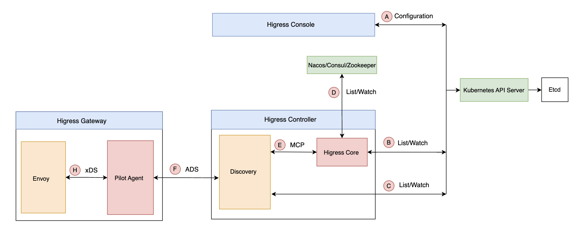
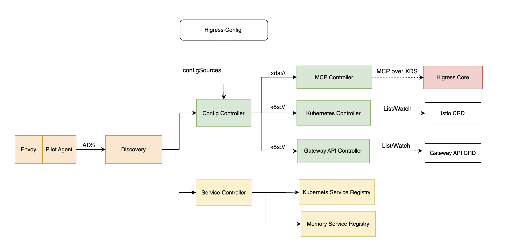
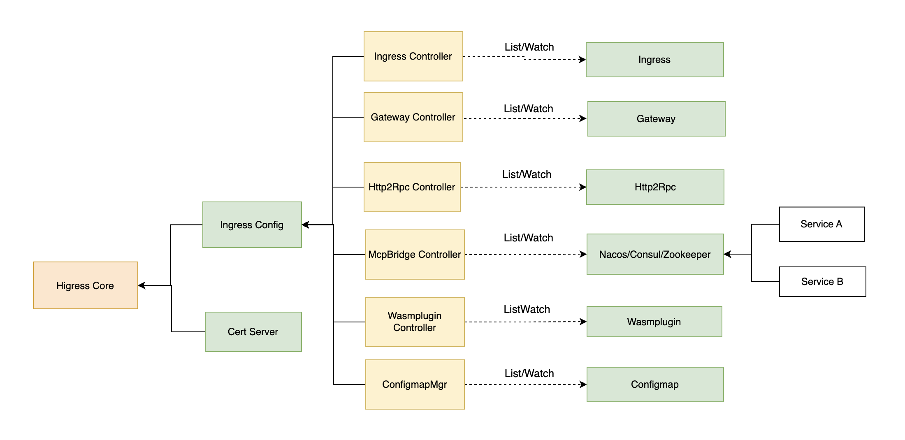
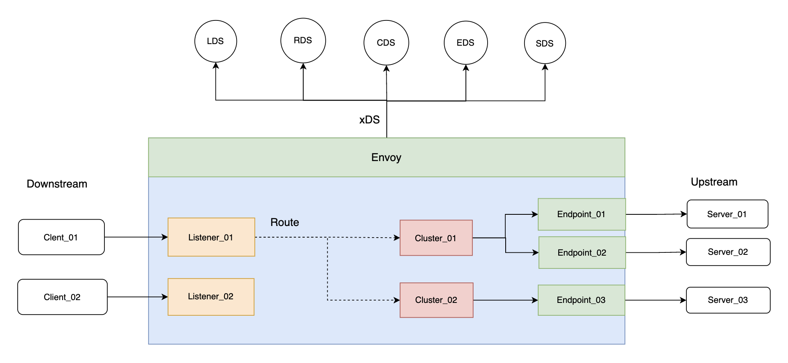

# Higress 核心组件和原理

Higress 是基于 Envoy 和 Istio 进行二次定制化开发构建和功能增强，同时利用 Envoy 和 Istio 一些插件机制，实现了一个轻量级的网关服务。其包括 3 个核心组件：Higress Controller（控制器）、Higress Gateway（网关）和 Higress Console（控制台）。
下图概况了其核心工作流程：



本章将重点介绍 Higress 的两个核心组件：Higress Controller 和 Higress Gateway。

## 1 Higress Console

Higress Console 是 Higress 网关的管理控制台，主要功能是管理 Higress 网关的路由配置、插件配置等。

### 1.1 Higress Admin SDK

Higress Admin SDK 脱胎于 Higress Console。起初，它作为 Higress Console 的一部分，为前端界面提供实际的功能支持。后来考虑到对接外部系统等需求，将配置管理的部分剥离出来，形成一个独立的逻辑组件，便于和各个系统进行对接。目前支持服务来源管理、服务管理、路由管理、域名管理、证书管理、插件管理等功能。
Higress Admin SDK 现在只提供 Java 版本，且要求 JDK 版本不低于 17。具体如何集成请参考 Higress 官方 BLOG [如何使用 Higress Admin SDK 进行配置管理](https://higress.io/zh-cn/blog/admin-sdk-intro)。

## 2 Higress Controller

Higress Controller（控制器） 是 Higress 的核心组件，其功能主要是实现 Higress 网关的服务发现、动态配置管理，以及动态下发配置给数据面。Higress Controller 内部包含两个子组件：Discovery 和  Higress Core。

### 2.1 Discovery 组件

Discovery 组件（Istio Pilot-Discovery）是 Istio 的核心组件，负责服务发现、配置管理、证书签发、控制面和数据面之间的通讯和配置下发等。Discovery 内部结构比较复杂，本文只介绍 Discovery 配置管理和服务发现的基本原理，其核心功能的详细介绍可以参考赵化冰老师的 BLOG [Istio Pilot 组件介绍](https://www.zhaohuabing.com/post/2019-10-21-pilot-discovery-code-analysis/)。
Discovery 将 Kubernetes Service、Gateway API 配置等转换成 Istio 配置，然后将所有 Istio 配置合并转成符合 xDS 接口规范的数据结构，通过 GRPC 下发到数据面的 Envoy。其工作原理如下图：



#### 2.1.1 Config Controller

Discovery 为了更好管理 Istio 配置来源，提供 `Config Controller` 用于管理各种配置来源，目前支持 4 种类型的 `Config Controller`：

- Kubernetes：使用 Kubernetes 作为配置信息来源，该方式的直接依赖 Kubernetes 强大的 CRD 机制来存储配置信息，简单方便，是 Istio 最开始使用的配置信息存储方案, 其中包括 `Kubernetes Controller` 和 `Gateway API Controller` 两个实现。
- MCP（Mesh Configuration Protocol）：使用 Kubernetes 存储配置数据导致了 Istio 和 Kubernetes 的耦合，限制了 Istio 在非 Kubernetes 环境下的运用。为了解决该耦合，Istio 社区提出了 MCP。
- Memory：一个基于内存的 Config Controller 实现，主要用于测试。
- File：一个基于文件的 Config Controller 实现，主要用于测试。

1. Istio 配置

Istio 配置包括：`Gateway`、`VirtualService`、`DestinationRule`、`ServiceEntry`、`EnvoyFilter`、`WasmPlugin`、`WorkloadEntry`、`WorkloadGroup` 等，可以参考 Istio 官方文档[流量管理](https://istio.io/latest/zh/docs/reference/config/networking/)了解更多配置信息。

2. Gateway API 配置

Gateway API 配置包括：`GatewayClass`、`Gateway`、`HttpRoute`、`TCPRoute`、`GRPCRoute` 等, 可以参考 Gateway API 官方文档 [Gateway API](https://gateway-api.sigs.k8s.io/api-types/gateway/) 了解更多配置信息。

3. MCP over xDS

Discovery 作为 MCP Client，任何实现了 MCP 协议的 Server 都可以通过 MCP 协议向 Discovery 下发配置信息，从而消除了 Istio 和 Kubernetes 之间的耦合, 同时使 Istio 的配置信息处理更加灵活和可扩展。
同时 MCP 是一种基于 xDS 协议的配置管理协议，Higress Core 通过实现 MCP 协议，使 Higress Core 成为 Discovery 的 Istio 配置来源。

4. Config Controller 来源配置

在 `higress-system` 命名空间中，名为 `higress-config` 的 Configmap 中，`mesh` 配置项包含一个 `configSources` 属性用于配置来源。其 Configmap 部分配置项如下：

```yaml
apiVersion: v1
kind: ConfigMap
metadata:
  name: higress-config
  namespace: higress-system
data:
  mesh: |-
    accessLogEncoding: TEXT
    ...
    configSources:
    - address: xds://127.0.0.1:15051
    - address: k8s://
    ...
  meshNetworks: "networks: {}"
```

#### 2.1.2 Service Controller

`Service Controller` 用于管理各种 `Service Registry`，提供服务发现数据，目前 Istio 支持的 `Service Registry` 主要包括：

- Kubernetes：对接 Kubernetes Registry，可以将 Kubernetes 中定义的 Service 和 Endpoint 采集到 Istio 中。
- Memory：一个基于内存的 Service Controller 实现，主要用于测试。

### 2.2 Higress Core 组件

Higress Core 核心逻辑如下图：




Higress Core 内部包含两个核心子组件: Ingress Config 和 Cert Server。

#### 2.2.1 Ingress Config

Ingress Config 包含 6 个控制器，各自负责不同的功能：

- Ingress Controller：监听 Ingress 资源，将 Ingress 转换为 Istio 的 Gateway、VirtualService、DestinationRule 等资源。
- Gateway Controller：监听 Gateway、VirtualService、DestinationRule 等资源。
- McpBridge Controller：根据 McpBridge 的配置，将来自 Nacos、Eureka、Consul、Zookeeper 等外部注册中心或 DNS 的服务信息转换成 Istio ServiceEntry 资源。
- Http2Rpc Controller：监听 Http2Rpc 资源，实现 HTTP 协议到 RPC 协议的转换。用户可以通过配置协议转换，将 RPC 服务以 HTTP 接口的形式暴露，从而使用 HTTP 请求调用 RPC 接口。
- WasmPlugin Controller：监听 WasmPlugin 资源，将 Higress WasmPlugin 转化为 Istio WasmPlugin。Higress WasmPlugin 在 Istio WasmPlugin 的基础上进行了扩展，支持全局、路由、域名、服务级别的配置。
- ConfigmapMgr：监听 Higress 的全局配置 `higress-config` ConfigMap，可以根据 tracing、gzip 等配置构造 EnvoyFilter。
  `mcpServer.redis` 支持通过 Secret 引用保存敏感信息，密码字段可以使用 `passwordSecret` 指向 `higress-system` 命名空间下的 Kubernetes Secret，避免在 ConfigMap 中保存明文密码，例如：

  ```yaml
  higress: |-
    mcpServer:
      redis:
        address: "redis:6379"
        passwordSecret:
          name: redis-credentials
          key: password
  ```

#### 2.2.2 Cert Server

Cert Server 管理 Secret 资源和证书自动签发。

## 3 Higress Gateway

Higress Gateway 内部包含两个子组件：Pilot Agent 和 Envoy。Pilot Agent 主要负责 Envoy 的启动和配置，同时代理 Envoy xDS 请求到 Discovery。 Envoy 作为数据面，负责接收控制面的配置下发，并代理请求到业务服务。 Pilot Agent 和 Envoy 之间通讯协议是使用 xDS 协议， 通过 Unix Domain Socket（UDS）进行通信。
Envoy 核心架构如下图：



### 1 Envoy 核心组件

- 下游（Downstream）:
  下游是 Envoy 的客户端，它们负责发起请求并接收 Envoy 的响应。下游通常是最终用户的设备或服务，它们通过 Envoy 代理与后端服务进行通信。

- 上游（Upstream）:
  上游是 Envoy 的后端服务器，它们接收 Envoy 代理的连接和请求。上游提供服务或数据，对来自下游客户端的请求进行处理并返回响应。

- 监听器（Listener）:
  监听器是可以接受来自下游客户端连接的网络地址（如 IP 地址和端口，Unix Domain Socket 等）。Envoy 支持在单个进程中配置任意数量的监听器。监听器可以通过 `Listener Discovery Service（LDS）`来动态发现和更新。

- 路由（Router）:
  路由器是 Envoy 中连接下游和上游的桥梁。它负责决定如何将监听器接收到的请求路由到适当的集群。路由器根据配置的路由规则，如路径、HTTP 标头 等，来确定请求的目标集群，从而实现精确的流量控制和路由。路由器可以通过 `Route Discovery Service（RDS）`来动态发现和更新。

- 集群（Cluster）:
  集群是一组逻辑上相似的服务提供者的集合。集群成员的选择由负载均衡策略决定，确保请求能够均匀或按需分配到不同的服务实例。集群可以通过 `Cluster Discovery Service（CDS）`来动态发现和更新。

- 端点（Endpoint）:
  端点是上游集群中的具体服务实例，可以是 IP 地址和端口号的组合。端点可以通过 `Endpoint Discovery Service（EDS）`来动态发现和更新。

- SSL/TLS:
  Envoy 可以通过 `Secret Discovery Service (SDS)` 动态获取监听器和集群所需的 TLS 证书、私钥以及信任的根证书和撤销机制等配置信息。

通过这些组件的协同工作，Envoy 能够高效地处理网络请求，提供流量管理、负载均衡、服务发现和动态路由等关键功能。
要详细了解 Envoy 的工作原理，可以参考[Envoy 官方文档](https://www.envoyproxy.io/docs/envoy/latest/intro/intro)，最佳的方式可以通过一个请求通过 [Envoy 代理的生命周期](https://www.envoyproxy.io/docs/envoy/latest/intro/life_of_a_request)事件的过程来理解 Envoy 的工作原理。


## 参考

- [1] [Istio Pilot 组件介绍](https://www.zhaohuabing.com/post/2019-10-21-pilot-discovery-code-analysis/)
- [2] [Istio 服务注册插件机制代码解析](https://www.zhaohuabing.com/post/2019-02-18-pilot-service-registry-code-analysis/)
- [3] [Istio Pilot代码深度解析](https://www.zhaohuabing.com/post/2019-10-21-pilot-discovery-code-analysis/)
- [4] [Envoy 官方文档](https://www.envoyproxy.io/docs/envoy/latest/intro/intro)
