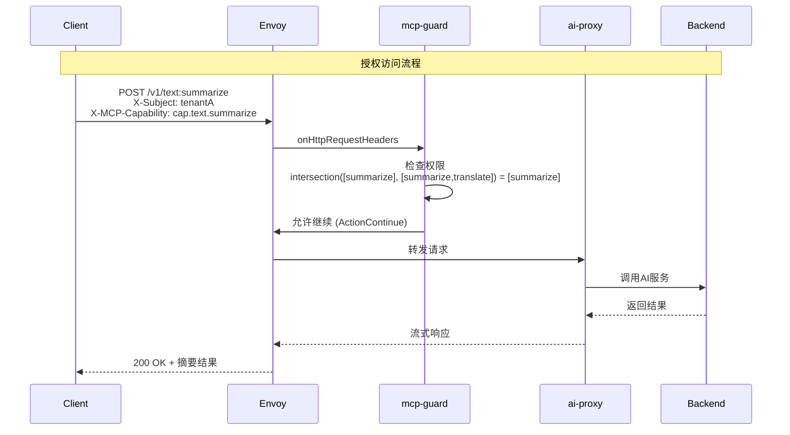
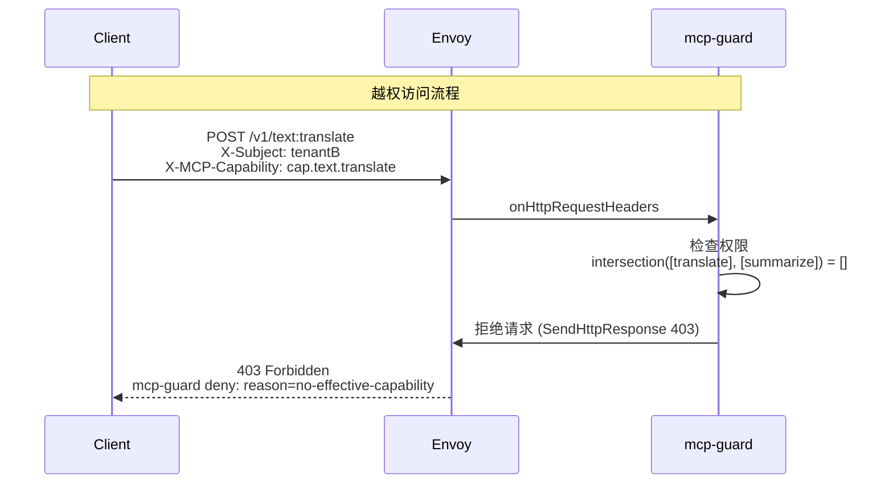
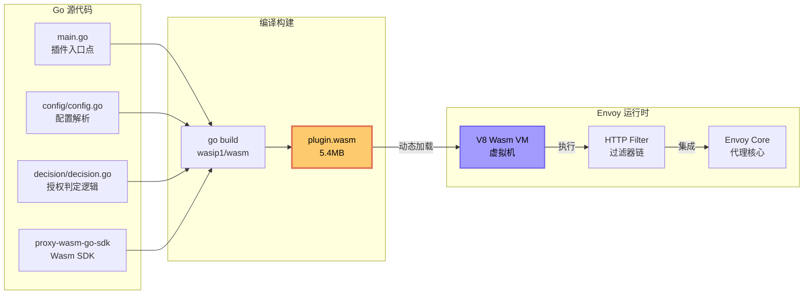
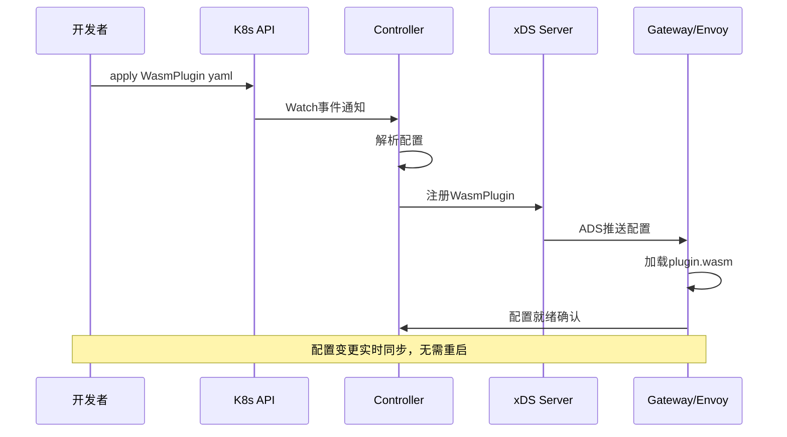
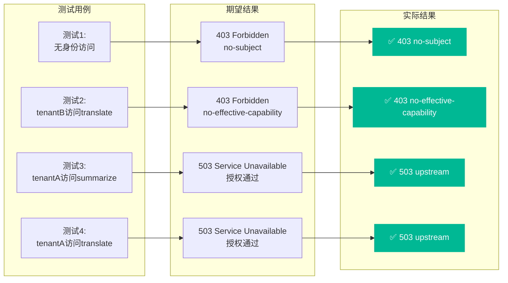
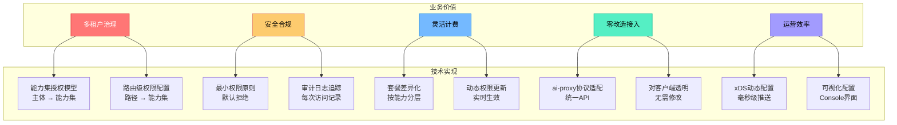
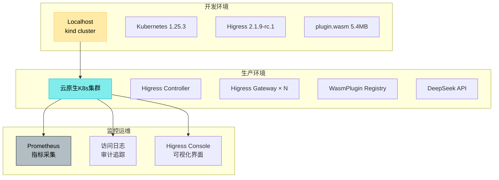

# MCP-GUARD 架构图集

## 1. 整体系统架构

```mermaid
graph TB
    %% 客户端层
    subgraph Client["🖥️ 客户端层"]
        C1[tenantA<br/>白金客户]
        C2[tenantB<br/>标准客户]
        C3[未授权用户]
    end

    %% 网关层
    subgraph Gateway["🌐 Higress Gateway (数据面)"]
        E[Envoy 代理]
        subgraph Filter["🔍 HTTP Filter Chain"]
            MG[mcp-guard<br/>Wasm插件<br/>优先级: 0]
            AP[ai-proxy<br/>Wasm插件<br/>优先级: 100]
            R[Envoy Router]
        end
    end

    %% 控制层
    subgraph Control["⚙️ Higress Controller (控制面)"]
        IC[Ingress Config<br/>转换/聚合]
        WP[WasmPlugin<br/>控制器]
        XDS[xDS Server<br/>配置分发]
    end

    %% 外部服务
    subgraph Service["🚀 后端服务"]
        AI[DeepSeek AI]
        TEST[测试后端]
    end

    %% 认证层
    subgraph Auth["🔐 认证层"]
        JWT[jwt-authn<br/>或 jwt-auth]
    end

    %% 连接关系
    C1 -->|HTTP(S)| E
    C2 -->|HTTP(S)| E
    C3 -->|HTTP(S)| E

    E --> Filter
    MG -->|授权通过| AP
    AP -->|转发| R
    R -->|下游调用| Service

    IC -->|WasmPlugin| XDS
    XDS -->|动态配置| E

    Auth -.->|注入身份| MG

    style MG fill:#ff6b6b,stroke:#d63031,stroke-width:3px,color:#fff
    style C1 fill:#4ecdc4,stroke:#00b894,color:#000
    style C2 fill:#45b7d1,stroke:#0984e3,color:#000
    style C3 fill:#e17055,stroke:#d63031,color:#fff
```

## 2. 请求处理时序图

### 场景1: 授权访问 (tenantA 访问 summarize)



### 场景2: 越权访问 (tenantB 访问 translate)



## 3. 权限判定模型

```mermaid
graph TD
    A[请求进入 mcp-guard] --> B[提取身份主体<br/>X-Subject]
    B --> C[提取路由路径<br/>/v1/text:summarize]
    C --> D[提取请求能力<br/>X-MCP-Capability]
    D --> E[获取主体权限集<br/>tenantA: [summarize, translate]]
    D --> F[获取路由允许权限集<br/>summarize路由: [summarize]]

    E --> G[计算交集<br/>intersection()]
    F --> G

    G --> H{交集为空?}
    H -->|是| I[返回 403<br/>reason: no-effective-capability]
    H -->|否| J{请求能力为空?}
    J -->|是| K[允许访问<br/>继续后续过滤链]
    J -->|否| L{请求能力在交集中?}
    L -->|否| M[返回 403<br/>reason: requested-cap-not-allowed]
    L -->|是| K

    K --> N[交由 ai-proxy 处理]
    I --> O[终止请求]
    M --> O

    style G fill:#74b9ff,stroke:#0984e3,stroke-width:2px,color:#000
    style K fill:#00b894,stroke:#00b894,stroke-width:2px,color:#000
    style I fill:#ff7675,stroke:#d63031,stroke-width:2px,color:#fff
    style M fill:#ff7675,stroke:#d63031,stroke-width:2px,color:#fff
```

## 4. Wasm插件技术架构



## 5. 配置分发机制 (xDS)



## 6. 多租户权限模型

```mermaid
graph TD
    subgraph "租户权限配置"
        A[tenantA<br/>白金客户]
        B[tenantB<br/>标准客户]
    end

    subgraph "能力集定义"
        C[cap.text.summarize<br/>文本摘要]
        D[cap.text.translate<br/>文本翻译]
        E[cap.image.moderate<br/>图像审核]
    end

    subgraph "授权映射"
        F[白名单:<br/>tenantA → [C, D]]
        G[白名单:<br/>tenantB → [C]]
    end

    subgraph "路由规则"
        H[/v1/text:summarize<br/>→ [C]]
        I[/v1/text:translate<br/>→ [D]]
        J[/v1/images:moderate<br/>→ [E]]
    end

    A --> F
    B --> G
    F --> H
    F --> I
    G --> H

    C --> H
    D --> I
    E --> J

    style A fill:#4ecdc4,stroke:#00b894,color:#000
    style B fill:#45b7d1,stroke:#0984e3,color:#000
    style F fill:#55efc4,stroke:#00b894,color:#000
    style G fill:#74b9ff,stroke:#0984e3,color:#000
```

## 7. 测试验证流程



## 8. 业务价值架构



## 9. 部署架构



---

## 图例说明

| 图标 | 含义 |
|------|------|
| 🖥️ | 客户端/用户层 |
| 🌐 | 网关层 |
| ⚙️ | 控制层面 |
| 🚀 | 服务层 |
| 🔐 | 安全认证 |
| 🔍 | 过滤器/中间件 |
| ✅ | 成功/通过 |
| ❌ | 失败/拒绝 |
| 📊 | 数据/配置 |
