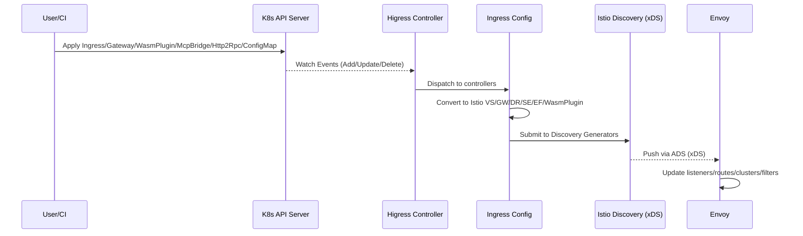
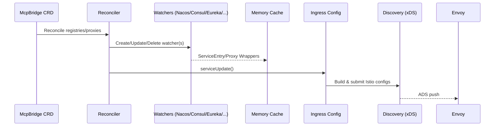
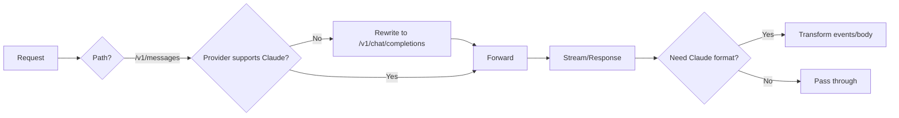
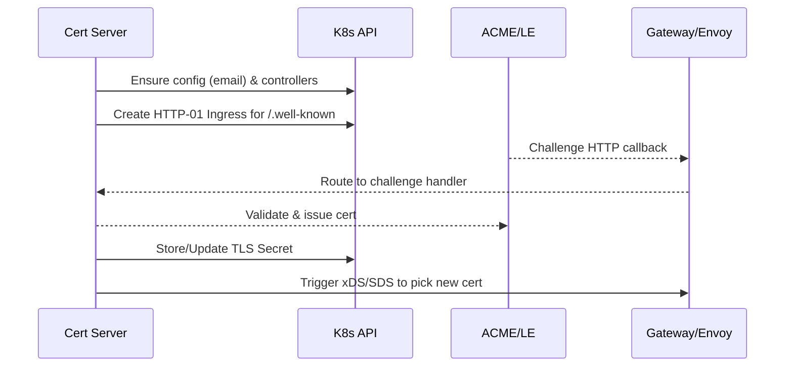

# Higress 架构与技术实现原理（仓库本地版）

本文基于当前工作目录内的源码与文档梳理（未修改 `higress/` 仓库内容），系统说明 Higress 的总体架构、核心数据/控制流、关键实现细节与源码索引。文中附带可渲染的 Mermaid 图，便于二次沟通与演示。

提示：在支持 Mermaid 的渲染环境（GitHub、VS Code 扩展、mermaid-cli）下可直接预览本文中的图形。

## 总览

- 定位：基于 Istio + Envoy 的云原生 API 网关，兼具“传统 API 网关”与“AI 网关”双能力（协议适配、SSE 流式、Token/Quota、可观测、安全）。
- 组件：
  - 控制面（Higress Controller）：聚合配置与服务发现，转换为 Istio 资源，经 xDS/ADS 动态下发。
  - 数据面（Higress Gateway）：Pilot Agent + Envoy 构成，接收控制面配置并转发流量。
  - 管理面（Console/Admin SDK）：供外部系统编排与集成（非本文重点）。
- 配置来源：Kubernetes Ingress/Gateway API、Higress 扩展 CRD（McpBridge、Http2Rpc、WasmPlugin、McpServer）、ConfigMap 全局配置、外部注册中心（Nacos/Consul/Eureka/ZooKeeper/DNS/Static）。
- 下发机制：所有配置统一转为 Istio 资源并通过 xDS（ADS）下发至 Envoy，毫秒级生效，无需 reload。

### 架构图（逻辑视图）

```mermaid
graph TD
  subgraph Client[Clients]
    U1[Browser / App]
    U2[AI Agents]
  end

  subgraph Data[Higress Gateway (Data Plane)]
    E[Envoy]
    subgraph EFilters[HTTP Filter Chain]
      W1[Wasm Plugins\n(ai-proxy/waf/oidc/...)]
      F1[Envoy Native Filters\n(HCM, router, gzip, ...)]
    end
  end

  subgraph Control[Higress Controller (Control Plane)]
    IConf[Ingress Config\n(转换&汇聚)]
    McpB[McpBridge Controller]
    WPC[WasmPlugin Controller]
    H2R[Http2Rpc Controller]
    CfgM[ConfigmapMgr\n(gzip/tracing/MCP Server)]
    Cert[Cert Server]
  end

  subgraph Istio[Istio Pilot / Discovery]
    XDS[xDS (ADS)]
  end

  subgraph ExtReg[External Registries]
    Nacos[Nacos / Nacos2/3]
    Consul[Consul]
    Eureka[Eureka]
    ZK[ZooKeeper]
    DNS[Static/DNS]
  end

  U1 -->|HTTP(S)/SSE| E
  U2 -->|LLM API| E
  E -->|Upstream| Svc[(Backend Services)]

  EFilters --> E
  W1 --> F1

  IConf -->|GVK→Istio| XDS
  McpB --> IConf
  WPC --> IConf
  H2R --> IConf
  CfgM --> IConf
  Cert --> IConf

  XDS -->|gRPC| E

  McpB <-->|watch/reconcile| ExtReg
  ExtReg --> McpB
```


## 控制面（Controller）

- 入口与生命周期
  - 统一初始化并串联：KubeClient、xDS Server、HTTP 诊断端点、配置控制器、注册中心事件、认证器、自动证书。
  - 参考：`higress/pkg/bootstrap/server.go:160`, `higress/pkg/bootstrap/server.go:312`（xDS 生成器注册）。

- Ingress Config（转换与汇聚）
  - 职责：将 Ingress/Gateway API 与扩展 CRD 转换为 Istio 资源：`Gateway`、`VirtualService`、`DestinationRule`、`ServiceEntry`、`EnvoyFilter`、`WasmPlugin`，并统一对接 xDS。
  - 初始化与事件：集中初始化 McpBridge/WasmPlugin/Http2Rpc/ConfigmapMgr 控制器，注册变更事件。
  - 模板与密钥：支持在转换阶段处理模板变量与 Secret 引用，避免在 ConfigMap 中保存明文敏感信息。
  - EnvoyFilter 聚合：根据路由注解自动生成 BasicAuth、代理透传、Http2Rpc、MCP SSE 有状态会话等 EnvoyFilter，并做缓存去重。
  - 参考：`higress/pkg/ingress/config/ingress_config.go:180`, `higress/pkg/ingress/config/ingress_config.go:220`, `higress/pkg/ingress/config/ingress_config.go:640`, `higress/pkg/ingress/config/ingress_config.go:700`。

- McpBridge（外部注册中心聚合）
  - 职责：对接 Nacos/Consul/Eureka/ZK/DNS/Static 等注册中心，Watcher 采集服务并生成 `ServiceEntry`/`ProxyWrapper`，触发 Ingress Config 进行转换与下发。
  - Reconcile：对比差异后创建/更新/删除 Watcher，并阻塞等待 ready/healthy，再触发推送。
  - 参考：`higress/registry/reconcile/reconcile.go:60`, `higress/registry/reconcile/reconcile.go:212`。

- MCP Server（工作流/工具挂载，走 ECDS）
  - 通过 `higress-config` ConfigMap 声明 MCP Server，ConfigmapMgr 生成 EnvoyFilter：
    - HTTP_FILTER 使用 `config_discovery` 引用（ADS 动态加载）。
    - EXTENSION_CONFIG 提供实际 Golang HTTP Filter 的 typed_config。
  - 参考：`higress/pkg/ingress/kube/configmap/mcp_server.go:320`。

- Cert Server（自动证书/续期与 SDS）
  - 使用 certmagic/ACME 进行 HTTP-01 挑战，签发成功后写入 TLS Secret 并触发 xDS/SDS 动态加载证书。
  - 参考：`higress/pkg/cert/server.go:44`, `higress/pkg/cert/server.go:81`。

### 配置流转（K8s/CRD → Envoy 生效）




## 数据面（Gateway）

- 组成：Pilot Agent + Envoy。Agent 负责启动与转发 xDS 请求；Envoy 负责路由、LB、熔断、HTTP 过滤链与 Wasm 插件执行。
- xDS 资源生成器
  - 注册：对 `WasmPlugin/DestinationRule/EnvoyFilter/Gateway/VirtualService/ServiceEntry` 建立专用生成器，其他 GVK 走回退生成器。
  - 统一封装：将 Istio `config.Config` 规整为 `mcp.Resource` → `discovery.Resource`，保持标签/注解可选透传。
  - 参考：`higress/pkg/bootstrap/server.go:312`, `higress/pkg/ingress/mcp/generator.go:160`。
- 请求生命周期（含 Wasm）
  - 下游请求 → HCM → Wasm 插件（请求头/体、流式事件）→ Router → 上游 → 返回时再经插件变换（协议适配/观测/安全等）。

### 外部注册中心（McpBridge）到 Envoy




## 关键实现要点

- EnvoyFilter 构建与缓存
  - Ingress 转换阶段汇总路由注解，统一构造特殊 EnvoyFilter：
    - BasicAuth、Http2Rpc（HTTP→RPC 协议转换）、代理透传（STATIC 集群重定向本地 listener + SNI/TLS）、MCP SSE 有状态会话等。
  - 避免重复计算：在控制面本地缓存并与 ConfigMap 生成的 EnvoyFilter 合并。
  - 参考：`higress/pkg/ingress/config/ingress_config.go:700`。

- SSE 有状态会话（MCP）
  - 全局注入 1 个 `envoy.filters.http.mcp_sse_stateful_session` HTTP Filter，并在具体路由的 `typed_per_filter_config` 中指定 session 提取 key 与分块边界（适配不同上游流式实现）。
  - 参考：`higress/pkg/ingress/config/ingress_config.go:1940`。

- Wasm 插件（AI 场景：ai-proxy）
  - 自动协议适配：请求为 Claude `/v1/messages` 但目标厂商不支持时，改写为 OpenAI `/v1/chat/completions`；响应侧将 OpenAI 格式再转换回 Claude，兼容调用方协议预期。
  - 流式事件：提取 SSE 事件边界，重组为目标协议格式并持续下发；必要时对 headers/body 做相应变换（移除压缩、防止干扰下游过滤）。
  - 参考：`higress/plugins/wasm-go/extensions/ai-proxy/main.go:91`, `higress/plugins/wasm-go/extensions/ai-proxy/main.go:220`, `higress/plugins/wasm-go/extensions/ai-proxy/main.go:360`。



- MCP Server（ECDS 动态装配）
  - ConfigMap 打开 `mcpServer` 后，生成两个配置片段：
    - HTTP_FILTER：通过 `config_discovery` 引用动态扩展配置（ADS 拉取）。
    - EXTENSION_CONFIG：携带 Golang Filter 的 typed_config（名称需与 HTTP_FILTER 引用一致）。
  - 参考：`higress/pkg/ingress/kube/configmap/mcp_server.go:320`。

- 证书自动化（ACME/HTTP-01）




## 可观测性与诊断

- 健康与状态：
  - `/ready` 探针汇总内部子系统就绪状态。
  - xDS debug handlers：排障 xDS 推送与缓存状态。
  - 外部注册中心 Watcher 健康/就绪列表：`/registry/watcherStatus`。
  - 参考：`higress/pkg/bootstrap/server.go:720`。
- 指标与日志：Envoy/Prometheus 原生集成；Wasm 插件可扩展 tracing 属性、按路由/租户增加观测维度。

## 部署与运维建议

- 本地/单机：Docker 一体化镜像（控制面+数据面+控制台）。
- 生产：K8s Helm/Operator 部署；按需启用 Gateway API、自动证书、WAF、外部注册中心、MCP Server。
- 推送节奏：利用 `XdsOptions` 控制去抖（`DebounceAfter`/`DebounceMax`），稳定大规模变更；参考 `higress/pkg/bootstrap/server.go:20`。
- 敏感信息：在 ConfigMap 中通过 Secret 引用（如 Redis 密码）而非明文存放；参考 `higress/docs/architecture.md:120` 说明。

## 设计取舍与性能要点

- 动态稳定：基于 Istio xDS 的动态配置面 + Envoy 可插拔过滤链，避免 reload 抖动；Wasm 沙箱隔离增强稳定性与安全性。
- 解耦生态：McpBridge 解耦 K8s 与注册中心，McpServer 将工具与工作流以 ECDS 动态挂载。
- 面向 AI：零拷贝流式、SSE 会话粘性、跨厂商协议自动适配、Token 管理与容错重试、上游能力差异屏蔽。

## 源码索引（便查）

- xDS 服务器与生成器注册：`higress/pkg/bootstrap/server.go:312`
- 事件触发 xDS 推送：`higress/pkg/bootstrap/server.go:120`
- IngressConfig 初始化与事件：`higress/pkg/ingress/config/ingress_config.go:180`
- EnvoyFilter 计算与缓存：`higress/pkg/ingress/config/ingress_config.go:700`
- SSE 有状态会话 EnvoyFilter：`higress/pkg/ingress/config/ingress_config.go:1940`
- McpBridge 调和与 Watcher：`higress/registry/reconcile/reconcile.go:60`, `higress/registry/reconcile/reconcile.go:212`
- MCP Server（ECDS/EnvoyFilter）：`higress/pkg/ingress/kube/configmap/mcp_server.go:320`
- AI 协议适配/流式转换示例：`higress/plugins/wasm-go/extensions/ai-proxy/main.go:91`, `:220`, `:360`

---

附注：本文件为“当前工作目录内源码解读”版，不对 `higress/` 子仓库做任何修改，便于后续对比上游变化与二次定制。

