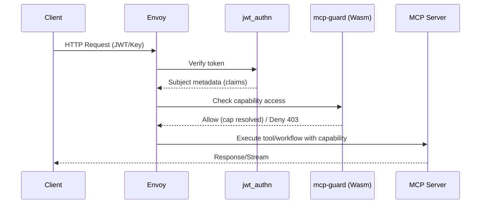
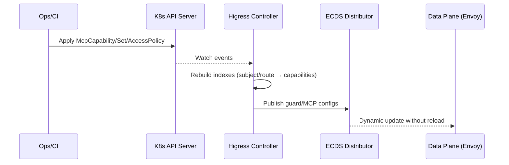

# MCP 能力注册与权限管理方案（设计草案）

本文提出在 Higress 中为 MCP 相关能力引入“注册制 + 授权制”的统一治理方案：所有 API 请求必须携带身份，数据面基于本地策略判定其对“能力集（Capability Set）”的访问权限，未授权即拒绝。方案保持与现有 xDS/ECDS 体系兼容，尽量小幅改造即可落地。

## 1. 目标与范围

- 目标
  - 将 MCP 能力进行显式注册，形成统一能力目录与健康状态。
  - 引入最小权限原则：API 仅能访问其被授权的能力集。
  - 数据面本地快速判定（低延迟），控制面动态下发（xDS/ECDS）。
  - 兼容现有身份体系（JWT/OIDC/API Key/mTLS），便于多租户治理与审计。
- 非目标
  - 不改造已有上游业务服务接口协议。
  - 不强制替换现有认证插件，优先复用（jwt-auth/oidc/key-auth 等或 Envoy 原生 jwt_authn）。

## 2. 架构概览

```mermaid
graph TD
  subgraph Client[Client / App]
    C1[API Request\n(JWT/OIDC/Key/mTLS)]
  end

  subgraph DataPlane[Higress Gateway / Envoy]
    J[jwt_authn / jwt-auth\n(身份验签)]
    G[mcp-guard (Wasm)\n(授权守卫)]
    M[MCP Server / Golang Filter\n(工具/工作流执行, ECDS)]
    H[HTTP Connection Manager]
  end

  subgraph ControlPlane[Higress Controller]
    CRDs[CRD Controllers\n(McpCapability/Set/AccessPolicy)]
    IC[Ingress Config\n(转换/注入 per-route 配置)]
    CFG[ConfigmapMgr / ECDS\n(分发能力注册表/策略)]
    XDS[xDS/ADS]
  end

  subgraph Registry[MCP 能力实现]
    T1[工具/工作流 插件]
    T2[外部服务/集群]
  end

  C1 -->|HTTP(S)| J --> G --> M --> H
  CRDs --> IC --> XDS --> DataPlane
  CFG -->|ECDS| DataPlane
  M -->|调用| Registry
```

- 身份：由 `jwt_authn`（或现有 `jwt-auth/oidc/key-auth` 插件）校验，向下游插件注入主体信息（claims/subject/tenant）。
- 授权：`mcp-guard` 插件根据“路由允许的能力集 + 主体被授权的能力集 + 请求声明的目标能力”在数据面本地做集合判定。
- 执行：通过 MCP Server/Golang Filter 执行工具/工作流，或代理到外部服务。
- 下发：控制面为每条路由注入 per-route 配置；能力注册表与策略通过 ECDS/xDS 动态分发，无需 reload。

## 3. 数据模型（CRD）

- McpCapability（能力注册）
  - 字段：`metadata.name`、`spec.type`(tool/workflow)、`spec.version`、`spec.bindings`（实现绑定：pluginName/cluster/endpoint）、`spec.io`（输入/输出描述）、`spec.tags`、`status.health`。
- McpCapabilitySet（能力集）
  - 字段：`metadata.name`、`spec.capabilities[]`（引用 `McpCapability`）、`spec.labels`（用途标签，如 ai.tools/security）。
- McpAccessPolicy（授权策略）
  - 字段：`metadata.name`
  - `spec.subjectSelector`：匹配主体（JWT claims：iss/sub/aud/client_id/tenant 等）。
  - `spec.objectSelector`：匹配对象（域名/路由/方法/服务/namespace/labels）。
  - `spec.allowedSets[]`：允许的能力集（可直接列 capabilities 以覆盖/追加）。
  - 可选：条件（时段/环境/IP 段）、配额/限流、审计标志。

示例（精简）：

```yaml
apiVersion: mcp.higress.io/v1alpha1
kind: McpCapability
metadata:
  name: tool.image-moderation.v1
spec:
  type: tool
  version: v1
  bindings:
    pluginName: mcp-tool-image-moderation
    endpoint: http://tool-svc:8080
  tags: ["security", "ai"]
---
apiVersion: mcp.higress.io/v1alpha1
kind: McpCapabilitySet
metadata:
  name: capset.ai-security
spec:
  capabilities:
    - tool.image-moderation.v1
---
apiVersion: mcp.higress.io/v1alpha1
kind: McpAccessPolicy
metadata:
  name: policy.tenantA
spec:
  subjectSelector:
    claims:
      tenant_id: tenantA
  objectSelector:
    hosts: ["api.example.com"]
    paths: ["/v1/images:moderate"]
    methods: ["POST"]
  allowedSets:
    - capset.ai-security
```

## 4. 控制面改动

- 新增 CRD 与控制器
  - 监听 `McpCapability/McpCapabilitySet/McpAccessPolicy`，构建：
    - 能力注册表（按 name/version 索引）。
    - 主体授权索引（subject 条件 → 允许的能力集）。
    - 路由授权元数据（route → 允许的能力集/解析规则）。
- IngressConfig 注入 per-route 配置
  - 在转换 `VirtualService` 时，为匹配到的路由写入 `typed_per_filter_config`，包含：
    - `allowedCapabilitySets`（或扁平化的 capabilities）。
    - `requestedCapabilityFrom`（从 header/query/body 提取请求所需能力的字段名，若无则固定能力）。
  - 参考接入点：`higress/pkg/ingress/config/ingress_config.go:220`, `:700`（EnvoyFilter/插件配置聚合）。
- ConfigmapMgr / ECDS 分发
  - 通过 ECDS 为 `mcp-guard` 与 `MCP Server` 分发：
    - 全局能力注册表（只读）与健康状态摘要（用于快速拒绝不可用能力）。
    - 主体授权映射（可按租户/应用分段下发以控尺）。
  - 参考现有 ECDS 用法：`higress/pkg/ingress/kube/configmap/mcp_server.go:320`。

## 5. 数据面改动

- 过滤链顺序（建议）
  1. `jwt_authn` 或 `jwt-auth/oidc/key-auth`（身份验签 → dynamic metadata）
  2. `mcp-guard`（Wasm 插件，本地授权判定，未授权 403）
  3. `MCP Server`/Golang Filter（工具/工作流执行）
  4. 其他观测/安全插件
- mcp-guard 插件（Wasm）
  - 输入：
    - 动态元数据中的主体信息（sub/tenant/client_id/scopes）。
    - per-route 下发的 `allowedCapabilitySets` 与解析规则。
    - ECDS 下发的“主体 → 能力集”授权映射与能力注册表。
    - 请求声明的目标能力（从 header/query/body 提取，或默认路由能力）。
  - 判定逻辑：
    - 计算 intersection(主体可用能力集, 路由允许能力集, 请求目标能力[可选]) 非空即允许，否则 403。
    - 可选：shadow 模式（仅记录不拦截）。
  - 输出：
    - 统计与审计日志（能力名、主体、路由、结果、耗时）。
    - 将核准后的能力名注入到后续 MCP Server 的上下文中（用于选择具体工具/工作流）。
- 兼容项
  - 可选用 Envoy RBAC/OPA Wasm 代替 `mcp-guard` 实现策略判定，但复杂“能力集”模型更适合专用插件。

## 6. 关键流程

### 6.1 请求授权流程



### 6.2 策略与能力更新流程



## 7. 配置示例（路由注入片段）

- 在 `VirtualService` 路由级别注入（概念示意）：

```yaml
route:
- name: api.images.moderate
  match:
    - uri:
        exact: /v1/images:moderate
  typed_per_filter_config:
    envoy.filters.http.mcp_guard:
      "@type": type.googleapis.com/udpa.type.v1.TypedStruct
      type_url: type.googleapis.com/higress.extensions.filters.http.mcp_guard.v1.Config
      value:
        allowedCapabilitySets: ["capset.ai-security"]
        requestedCapabilityFrom:
          header: X-MCP-Capability
```

- 身份校验（示例）：
  - 复用 Envoy `jwt_authn`（或现有 `jwt-auth/oidc` 插件）配置；claims 注入 dynamic metadata，供 `mcp-guard` 使用。

## 8. 价值与收益

- 安全与合规：
  - 最小权限：API 仅可访问显式授权的能力集，默认拒绝。
  - 审计可追溯：每次访问记录主体/能力/路由/结果，可对接 SIEM。
- 多租户治理：
  - 按租户/应用/路由维度授权，易于跨团队隔离与配额策略叠加。
- 稳定与性能：
  - 数据面本地决策，毫秒级；xDS/ECDS 动态更新，零中断。
- 可运维性：
  - 能力注册表统一可见，健康状态可在控制面聚合展示。

## 9. 性能与实现要点

- 数据面缓存：
  - `mcp-guard` 在 worker 线程内维护只读快照，批量热更新（ECDS）。
  - 策略匹配尽量预计算（将 subjectSelector 编译为前缀表/哈希索引）。
- 配置体量控制：
  - 授权映射按租户/命名空间分片下发；路由只携带引用。
- 失败与降级：
  - 当 ECDS 尚未同步完成，路由可设为“保守拒绝”或“宽松放行+审计告警”（灰度）。
- 兼容长连接/流式：
  - 在 HCM 首包完成前完成授权判定；对 SSE/流式保持零拷贝路径。

## 10. 上线计划（分阶段）

- 阶段 1（MVP）
  - CRD：`McpCapability`、`McpCapabilitySet`、`McpAccessPolicy`。
  - 插件：`mcp-guard`（Go Wasm），仅做本地集合判定；身份使用 `jwt_authn`。
  - 控制面：路由 per‑route 注入 + ECDS 分发“主体→能力集”映射与注册表。
  - 运行模式：支持 Shadow（只记录不拦截）→ Enforce（强制）。
- 阶段 2
  - 配额/限流/速率：按能力/主体维度叠加令牌桶（可与现有 ratelimit 结合）。
  - 更细策略：时间窗、IP 段、上下文属性（geo、device）。
- 阶段 3
  - 控制台/可视化：能力注册/授权一体化管理；健康与使用报表。

## 11. 风险与备选方案

- 风险
  - 能力模型碎片化：命名与版本管理需规范，否则策略难维护。
  - 策略规模过大：需分片与增量下发，否则影响内存与 xDS 体量。
- 备选
  - 以 Envoy RBAC 代替 `mcp-guard`：适合简单 allow/deny，但难以表达“能力集”与请求期望能力的交集语义。
  - 以 OPA Wasm（`opa` 插件）实现：策略可读性强，但 Rego 维护门槛与执行开销需评估。

## 12. 与现有代码的集成点（参考）

- 控制面：
  - Ingress 转换与 EnvoyFilter 注入：`higress/pkg/ingress/config/ingress_config.go:220`, `:700`。
  - ECDS 分发参考：`higress/pkg/ingress/kube/configmap/mcp_server.go:320`。
- 数据面：
  - 插件链路放置在 MCP Server 之前，保持与现有 Wasm/ECDS 一致的装配方式。

---

本文档为设计草案，放置于当前目录，未改动 `higress/` 子仓库内容；用于需求评审与迭代讨论。

