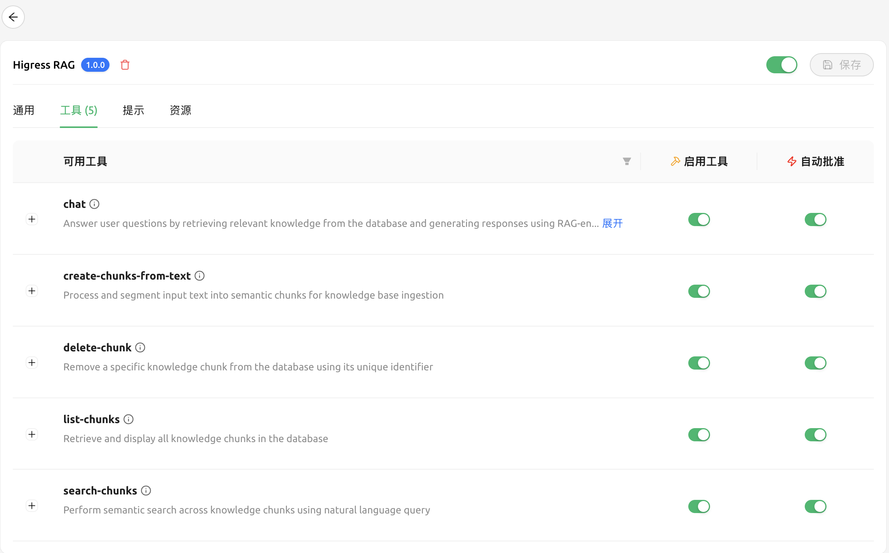
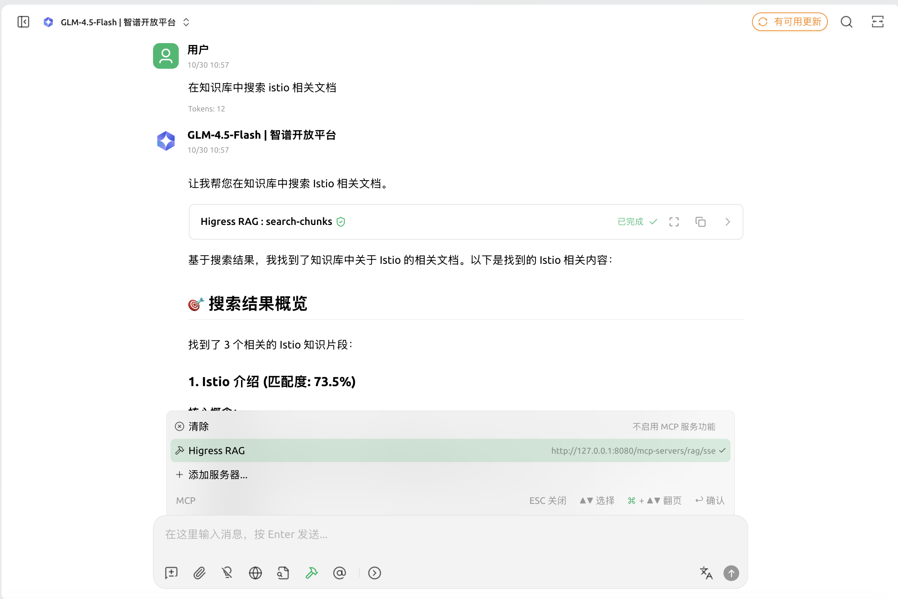

# Higress RAG MCP Server

这是一个 Model Context Protocol (MCP) 服务器，提供知识管理和检索功能。

## MCP 工具说明

Higress RAG MCP Server 提供以下工具，根据配置不同，可用工具也会有所差异：

| 工具名称 | 功能描述 | 依赖配置 | 必选/可选 |
|---------|---------|---------|----------|
| `create-chunks-from-text` | 将文本内容分块并存储到向量数据库，用于知识库构建 | embedding, vectordb | **必选** |
| `list-chunks` | 列出已存储的知识块，用于知识库管理 | vectordb | **必选** |
| `delete-chunk` | 删除指定的知识块，用于知识库维护 | vectordb | **必选** |
| `search` | 基于语义相似度搜索知识库中的内容 | embedding, vectordb | **必选** |
| `chat` | 基于检索增强生成(RAG)回答用户问题，结合知识库内容生成回答 | embedding, vectordb, llm | **可选** |

### 工具与配置的关系

- **基础功能**（知识管理、搜索）：只需配置 `embedding` 和 `vectordb`
- **高级功能**（聊天问答）：需额外配置 `llm`

具体关系如下：
- 未配置 `llm` 时，`chat` 工具将不可用
- 所有工具都依赖 `embedding` 和 `vectordb` 配置
- `rag` 配置用于调整分块和检索参数，影响所有工具的行为

## 典型使用场景

### 最小工具集场景（无LLM配置）

适用于仅需要知识库管理和检索的场景，不需要生成式回答。

**可用工具**：`create-chunks-from-text`、`list-chunks`、`delete-chunk`、`search`

**典型用例**：
1. 构建企业文档库，仅需检索相关文档片段
2. 数据索引系统，通过语义搜索快速定位信息
3. 内容管理系统，管理和检索结构化/非结构化内容

**示例流程**：
```
1. 使用 create-chunks-from-text 导入文档
2. 使用 search 检索相关内容
3. 使用 list-chunks 和 delete-chunk 管理知识库
```

### 完整工具集场景（含LLM配置）

适用于需要智能问答和内容生成的高级场景。

**可用工具**：`create-chunks-from-text`、`list-chunks`、`delete-chunk`、`search`、`chat`

**典型用例**：
1. 智能客服系统，基于企业知识库回答用户问题
2. 文档助手，帮助用户理解和分析复杂文档
3. 专业领域问答系统，如法律、金融、技术支持等

**示例流程**：
```
1. 使用 create-chunks-from-text 导入专业领域文档
2. 用户通过 chat 工具提问
3. 系统使用 search 检索相关知识
4. LLM 结合检索结果生成回答
5. 管理员使用 list-chunks 和 delete-chunk 维护知识库
```

## 配置说明

### 配置结构

| 名称                         | 数据类型 | 填写要求 | 默认值 | 描述 |
|----------------------------|----------|-----------|---------|--------|
| **rag**                    | object | 必填 | - | RAG系统基础配置 |
| rag.splitter.provider      | string | 必填 | recursive | 分块器类型：recursive或nosplitter |
| rag.splitter.chunk_size    | integer | 可选 | 500 | 块大小 |
| rag.splitter.chunk_overlap | integer | 可选 | 50 | 块重叠大小 |
| rag.top_k                  | integer | 可选 | 10 | 搜索返回的知识块数量 |
| rag.threshold              | float | 可选 | 0.5 | 搜索阈值 |
| **llm**                    | object | 可选 | - | LLM配置（不配置则无chat功能） |
| llm.provider               | string | 可选 | openai | LLM提供商 |
| llm.api_key                | string | 可选 | - | LLM API密钥 |
| llm.base_url               | string | 可选 |  | LLM API基础URL |
| llm.model                  | string | 可选 | gpt-4o | LLM模型名称 |
| llm.max_tokens             | integer | 可选 | 2048 | 最大令牌数 |
| llm.temperature            | float | 可选 | 0.5 | 温度参数 |
| **embedding**              | object | 必填 | - | 嵌入配置（所有工具必需） |
| embedding.provider         | string | 必填 | openai | 嵌入提供商：支持openai协议的任意供应商 |
| embedding.api_key          | string | 必填 | - | 嵌入API密钥 |
| embedding.base_url         | string | 可选 |  | 嵌入API基础URL |
| embedding.model            | string | 必填 | text-embedding-ada-002 | 嵌入模型名称 |
| embedding.dimensions       | integer | 可选 | 1536 | 嵌入维度 |
| **vectordb**               | object | 必填 | - | 向量数据库配置（所有工具必需） |
| vectordb.provider          | string | 必填 | milvus | 向量数据库提供商 |
| vectordb.host              | string | 必填 | localhost | 数据库主机地址 |
| vectordb.port              | integer | 必填 | 19530 | 数据库端口 |
| vectordb.database          | string | 必填 | default | 数据库名称 |
| vectordb.collection        | string | 必填 | test_collection | 集合名称 |
| vectordb.username          | string | 可选 | - | 数据库用户名 |
| vectordb.password          | string | 可选 | - | 数据库密码 |
| **vectordb.mapping**       | object | 可选 | - | 字段映射配置 |
| vectordb.mapping.fields    | array | 可选 | - | 字段映射列表 |
| vectordb.mapping.fields[].standard_name | string | 必填 | - | 标准字段名称（如 id, content, vector 等） |
| vectordb.mapping.fields[].raw_name | string | 必填 | - | 原始字段名称（数据库中的实际字段名） |
| vectordb.mapping.fields[].properties | object | 可选 | - | 字段属性（如 auto_id, max_length 等） |
| vectordb.mapping.index     | object | 可选 | - | 索引配置 |
| vectordb.mapping.index.index_type | string | 必填 | - | 索引类型（如 FLAT, IVF_FLAT, HNSW 等） |
| vectordb.mapping.index.params | object | 可选 | - | 索引参数（根据索引类型不同而异） |
| vectordb.mapping.search    | object | 可选 | - | 搜索配置 |
| vectordb.mapping.search.metric_type | string | 可选 | L2 | 度量类型（如 L2, IP, COSINE 等） |
| vectordb.mapping.search.params | object | 可选 | - | 搜索参数（如 nprobe, ef_search 等）


### higress-config 配置样例

```yaml
apiVersion: v1
kind: ConfigMap
metadata:
  name: higress-config
  namespace: higress-system
data:
  higress: |
    mcpServer:
      enable: true
      sse_path_suffix: "/sse"
      redis:
        address: "<Redis IP>:6379"
        username: ""
        password: ""
        db: 0
      match_list:
      - path_rewrite_prefix: ""
        upstream_type: ""
        enable_path_rewrite: false
        match_rule_domain: "*"
        match_rule_path: "/mcp-servers/rag"
        match_rule_type: "prefix"
      servers:
      - path: "/mcp-servers/rag"
        name: "rag"
        type: "rag"
        config:
          rag:
            splitter:
              provider: recursive
              chunk_size: 500
              chunk_overlap: 50
            top_k: 10
            threshold: 0.5
          llm:
            provider: openai
            api_key: sk-XXX
            base_url: https://openrouter.ai/api/v1
            model: openai/gpt-4o
            temperature: 0.5
            max_tokens: 2048
          embedding:
            provider: openai
            base_url: https://dashscope.aliyuncs.com/compatible-mode/v1
            api_key: sk-xxx
            model: text-embedding-v4
            dimensions: 1536
          vectordb:
            provider: milvus
            host: localhost
            port: 19530
            database: default
            collection: test_rag
            mapping:
              fields:
              - standard_name: id
                raw_name: id
                properties:
                  auto_id: false
                  max_length: 256
              - standard_name: content
                raw_name: content
                properties:
                  max_length: 8192
              - standard_name: vector
                raw_name: vector
              - standard_name: metadata
                raw_name: metadata
              - standard_name: created_at
                raw_name: created_at
              index:
                index_type: HNSW
                params:
                  M: 4
                  efConstruction: 32
              search:
                metric_type: IP
                params:
                  ef: 32

```
### 支持的提供商
#### Embedding
- **OpenAI 兼容**

#### Vector Database
- **Milvus**

#### LLM 
- **OpenAI 兼容**

## 如何测试数据集的效果

测试数据集的效果分两步，第一步导入数据集语料，第二步测试Chat效果。

### 导入数据集语料

使用 `RAGClient.CreateChunkFromText` 工具导入数据集语料，比如数据集语料格式为 JSON，每个 JSON 对象包含 `body`、`title` 和 `url` 等字段。样例代码如下：

```golang
func TestRAGClient_LoadChunks(t *testing.T) {
	t.Logf("TestRAGClient_LoadChunks")
	ragClient, err := getRAGClient()
	if err != nil {
		t.Errorf("getRAGClient() error = %v", err)
		return
	}
	// load json output/corpus.json and then call ragclient CreateChunkFromText to insert chunks
	file, err := os.Open("/dataset/corpus.json")
	if err != nil {
		t.Errorf("LoadData() error = %v", err)
		return
	}
	defer file.Close()
	decoder := json.NewDecoder(file)
	var data []struct {
		Body  string `json:"body"`
		Title string `json:"title"`
		Url   string `json:"url"`
	}
	if err := decoder.Decode(&data); err != nil {
		t.Errorf("LoadData() error = %v", err)
		return
	}

	for _, item := range data {
		t.Logf("LoadData() url = %s", item.Url)
		t.Logf("LoadData() title = %s", item.Title)
		t.Logf("LoadData() len body = %d", len(item.Body))
		chunks, err := ragClient.CreateChunkFromText(item.Body, item.Title)
		if err != nil {
			t.Errorf("LoadData() error = %v", err)
			continue
		} else {
			t.Logf("LoadData() chunks len = %d", len(chunks))
		}
	}
	t.Logf("TestRAGClient_LoadChunks done")
}
```

### 测试Chat效果

使用 `RAGClient.Chat` 工具测试 Chat 效果。样例代码如下：

```golang
func TestRAGClient_Chat(t *testing.T) {
	ragClient, err := getRAGClient()
	if err != nil {
		t.Errorf("getRAGClient() error = %v", err)
		return
	}
	query := "Which online betting platform provides a welcome bonus of up to $1000 in bonus bets for new customers' first losses, runs NBA betting promotions, and is anticipated to extend the same sign-up offer to new users in Vermont, as reported by both CBSSports.com and Sporting News?"
	resp, err := ragClient.Chat(query)
	if err != nil {
		t.Errorf("Chat() error = %v", err)
		return
	}
	if resp == "" {
		t.Errorf("Chat() resp = %s, want not empty", resp)
		return
	}
	t.Logf("Chat() resp = %s", resp)
}
```

## Milvus 安装

### Docker 配置
配置 Docker Desktop 镜像加速器
编辑 daemon.json 配置，加上镜像加速器，例如：
```
{
  "registry-mirrors": [
    "https://docker.m.daocloud.io",
    "https://mirror.ccs.tencentyun.com",
    "https://hub-mirror.c.163.com"
  ],
  "dns": ["8.8.8.8", "1.1.1.1"]
}
```

### 安装 milvus

```
v2.6.0
Download the configuration file
wget https://github.com/milvus-io/milvus/releases/download/v2.6.0/milvus-standalone-docker-compose.yml -O docker-compose.yml

v2.4
$ wget https://github.com/milvus-io/milvus/releases/download/v2.4.23/milvus-standalone-docker-compose.yml -O docker-compose.yml

# Start Milvus
$ sudo docker compose up -d

Creating milvus-etcd  ... done
Creating milvus-minio ... done
Creating milvus-standalone ... done
```

### 安装 attu

Attu 是 Milvus 的可视化管理工具，用于查看和管理 Milvus 中的数据。

```
docker run -p 8000:3000 -e MILVUS_URL=http://<本机 IP>:19530  zilliz/attu:v2.6
Open your browser and navigate to http://localhost:8000
```


## 如何对接已有的向量数据库

### 1. 基于 langchain + langchain-milvus 代码样例，用于生成测试向量数据库。

```python
#!/usr/bin/env python3
# -*- coding: utf-8 -*-
"""
基于 LangChain Milvus 的文档处理系统
功能：
1. 使用 langchain UnstructuredFileLoader 加载文本文件成 Document
2. 使用 RecursiveTextSplitter 对 Document 进行 chunk 分割
3. 使用 OpenAI 兼容的 embedding 模型生成向量
4. 使用 langchain_milvus.Milvus 进行向量存储和检索, 参考文档 https://python.langchain.com/docs/integrations/vectorstores/milvus/
"""

import os
import logging
import uuid
from typing import List, Dict, Any, Optional
from pathlib import Path

# LangChain imports
from langchain_community.document_loaders import UnstructuredFileLoader
from langchain_text_splitters import RecursiveCharacterTextSplitter
from langchain_core.documents import Document
from langchain_milvus import Milvus
from langchain_core.embeddings import Embeddings

# OpenAI client import
from openai import OpenAI

# 配置日志
logging.basicConfig(level=logging.INFO)
logger = logging.getLogger(__name__)


class DashScopeEmbeddings(Embeddings):
    def __init__(self, openai_api_key: Optional[str] = None, openai_api_base: Optional[str] = None, model: str = "text-embedding-v1", dim: int = 1536):
        self.client = OpenAI(
                api_key=openai_api_key or os.getenv("DASHSCOPE_API_KEY"),
                base_url=openai_api_base or "https://dashscope.aliyuncs.com/compatible-mode/v1"
        )
        self.model = model
        self.dim = dim
    
    def embed_documents(self, texts: List[str]) -> List[List[float]]:
        response = self.client.embeddings.create(
            model=self.model,
            input=texts,
            dimensions=self.dim,
            encoding_format="float"
        )
        return [data.embedding for data in response.data]
    
    def embed_query(self, text: str) -> List[float]:
        response = self.client.embeddings.create(
            model=self.model,
            input=[text],
            dimensions=self.dim,
            encoding_format="float"
        )
        return response.data[0].embedding


class LangChainMilvusProcessor:
    """基于 LangChain Milvus 的文档处理器"""
    
    def __init__(
        self,
        milvus_uri: str = "http://localhost:19530",
        milvus_token: str = "",
        db_name: str = "default",
        collection_name: str = "langchain_rag",
        embedding_model: str = "text-embedding-v4",
        openai_api_key: Optional[str] = None,
        openai_api_base: Optional[str] = None,
        chunk_size: int = 500,
        chunk_overlap: int = 50,
        embedding_dim: int = 1024,
        drop_old: bool = False
    ):
        """
        初始化 LangChain Milvus 文档处理器
        
        Args:
            milvus_uri: Milvus 服务器 URI
            milvus_token: Milvus 认证 token
            db_name: 数据库名称
            collection_name: 集合名称
            embedding_model: 嵌入模型名称
            openai_api_key: OpenAI API 密钥
            openai_api_base: OpenAI API 基础 URL
            chunk_size: 文本分割大小
            chunk_overlap: 文本分割重叠大小
            embedding_dim: 向量维度
            drop_old: 是否删除已存在的集合
        """
        self.milvus_uri = milvus_uri
        self.milvus_token = milvus_token
        self.db_name = db_name
        self.collection_name = collection_name
        self.chunk_size = chunk_size
        self.chunk_overlap = chunk_overlap
        self.embedding_dim = embedding_dim
        self.drop_old = drop_old
        self.embedding_model = embedding_model
        self.embedding_dim = embedding_dim
        
        # 初始化文本分割器
        self.text_splitter = RecursiveCharacterTextSplitter(
            chunk_size=chunk_size,
            chunk_overlap=chunk_overlap,
            length_function=len,
            separators=["\n\n", "\n", " ", ""]
        )
        
        self.embeddings = DashScopeEmbeddings(
            openai_api_key=openai_api_key,
            openai_api_base=openai_api_base,
            model=embedding_model,
            dim=embedding_dim
        )
    
        # 初始化 Milvus 向量存储
        self.vectorstore = None
        self._init_vectorstore()
    
    def _init_vectorstore(self):
        """初始化 Milvus 向量存储"""
        try:
            self.vectorstore = Milvus(
                embedding_function=self.embeddings,
                collection_name=self.collection_name,
                connection_args={
                    "uri": self.milvus_uri,
                    "token": self.milvus_token,
                    "db_name": self.db_name
                },
                index_params={
                    "index_type": "HNSW",
                    "metric_type": "IP",
                    "params": {"M": 8, "efConstruction": 64}
                },
                consistency_level="Strong",
                drop_old=self.drop_old,
                metadata_field="metadata"    # 自定义元数据字段名
            )
            
            logger.info(f"成功初始化 Milvus 向量存储: {self.collection_name}")
            
        except Exception as e:
            logger.error(f"初始化 Milvus 向量存储失败: {e}")
            raise
    
    def load_document(self, file_path: str) -> List[Document]:
        """
        使用 UnstructuredFileLoader 加载文档
        
        Args:
            file_path: 文件路径
            
        Returns:
            Document 列表
        """
        try:
            logger.info(f"加载文档: {file_path}")
            
            # 检查文件是否存在
            if not os.path.exists(file_path):
                raise FileNotFoundError(f"文件不存在: {file_path}")
            
            # 使用 UnstructuredFileLoader 加载文档
            loader = UnstructuredFileLoader(file_path)
            documents = loader.load()

            # 添加文件路径到元数据
            for doc in documents:
                doc.metadata["source"] = os.path.basename(file_path)
                doc.metadata["filename"] = file_path
            
            logger.info(f"成功加载 {len(documents)} 个文档")
            return documents
            
        except Exception as e:
            logger.error(f"加载文档失败: {e}")
            return []
    
    def split_documents(self, documents: List[Document]) -> List[Document]:
        """
        使用 RecursiveTextSplitter 分割文档
        
        Args:
            documents: 文档列表
            
        Returns:
            分割后的文档 chunk 列表
        """
        try:
            logger.info(f"开始分割 {len(documents)} 个文档")

            chunks = self.text_splitter.split_documents(documents)
            # 为每个 chunk 添加唯一 ID
            for i, chunk in enumerate(chunks):
                chunk.metadata["chunk_id"] = str(uuid.uuid4())
                chunk.metadata["chunk_index"] = i
            
            logger.info(f"文档分割完成，共生成 {len(chunks)} 个 chunk")
            return chunks
            
        except Exception as e:
            logger.error(f"文档分割失败: {e}")
            return []
    
    def add_documents(self, documents: List[Document], ids: Optional[List[str]] = None) -> List[str]:
        """
        添加文档到向量存储
        
        Args:
            documents: 文档列表
            ids: 文档 ID 列表（可选）
            
        Returns:
            添加的文档 ID 列表
        """
        try:
            if not documents:
                logger.warning("没有文档需要添加")
                return []
            
            logger.info(f"开始添加 {len(documents)} 个文档到向量存储")
            
            # 如果没有提供 ID，则生成 UUID
            if ids is None:
                ids = [str(uuid.uuid4()) for _ in range(len(documents))]
            
            # 添加文档到向量存储
            added_ids = self.vectorstore.add_documents(documents=documents, ids=ids)
            
            logger.info(f"成功添加 {len(added_ids)} 个文档到向量存储")
            return added_ids
            
        except Exception as e:
            logger.error(f"添加文档到向量存储失败: {e}")
            return []
    
    def process_file(self, file_path: str) -> bool:
        """
        处理单个文件的完整流程
        
        Args:
            file_path: 文件路径
            
        Returns:
            是否成功
        """
        try:
            logger.info(f"开始处理文件: {file_path}")
            
            # 1. 加载文档
            documents = self.load_document(file_path)
            if not documents:
                return False
            
            # 2. 分割文档
            chunks = self.split_documents(documents)
            if not chunks:
                return False
            
            # 3. 添加到向量存储
            added_ids = self.add_documents(chunks)
            
            if added_ids:
                logger.info(f"文件处理完成: {file_path}，添加了 {len(added_ids)} 个 chunk")
                return True
            else:
                logger.error(f"文件处理失败: {file_path}")
                return False
            
        except Exception as e:
            logger.error(f"处理文件失败: {e}")
            return False
    
    def process_directory(self, directory_path: str, file_extensions: List[str] = None) -> Dict[str, bool]:
        """
        处理目录中的所有文件
        
        Args:
            directory_path: 目录路径
            file_extensions: 支持的文件扩展名列表
            
        Returns:
            文件处理结果字典
        """
        if file_extensions is None:
            file_extensions = ['.txt', '.md']
        
        results = {}
        
        try:
            directory = Path(directory_path)
            if not directory.exists():
                logger.error(f"目录不存在: {directory_path}")
                return results
            
            # 遍历目录中的文件
            for file_path in directory.rglob('*'):
                if file_path.is_file() and file_path.suffix.lower() in file_extensions:
                    logger.info(f"处理文件: {file_path}")
                    results[str(file_path)] = self.process_file(str(file_path))
            
            # 统计结果
            success_count = sum(1 for success in results.values() if success)
            total_count = len(results)
            
            logger.info(f"目录处理完成: {success_count}/{total_count} 个文件成功处理")
            
        except Exception as e:
            logger.error(f"处理目录失败: {e}")
        
        return results
    
    def similarity_search(self, query: str, k: int = 5) -> List[Document]:
        """
        相似性搜索
        
        注意：此方法仅用于原生 LangChain 检索示例，如果通过 Higress 网关进行检索，
        请使用网关提供的 MCP 工具（如 search 工具），无需直接调用此方法。
        
        Args:
            query: 查询文本
            k: 返回结果数量
            
        Returns:
            相似文档列表
        """
        try:
            logger.info(f"执行相似性搜索: {query}")
            
            results = self.vectorstore.similarity_search(query, k=k)
            
            logger.info(f"搜索完成，返回 {len(results)} 个结果")
            return results
            
        except Exception as e:
            logger.error(f"相似性搜索失败: {e}")
            return []
    
    def similarity_search_with_score(self, query: str, k: int = 5) -> List[tuple]:
        """
        带分数的相似性搜索
        
        Args:
            query: 查询文本
            k: 返回结果数量
            
        Returns:
            (文档, 分数) 元组列表
        """
        try:
            logger.info(f"执行带分数的相似性搜索: {query}")
            
            results = self.vectorstore.similarity_search_with_score(query, k=k)
            
            logger.info(f"搜索完成，返回 {len(results)} 个结果")
            return results
            
        except Exception as e:
            logger.error(f"带分数的相似性搜索失败: {e}")
            return []
    
    def get_collection_stats(self) -> Dict[str, Any]:
        """
        获取集合统计信息
        
        Returns:
            集合统计信息字典
        """
        try:
            # 通过 vectorstore 获取基本信息
            stats = {
                "collection_name": self.collection_name,
                "milvus_uri": self.milvus_uri,
                "db_name": self.db_name,
                "embedding_model": self.embedding_model,
                "embedding_dim": self.embedding_dim,
                "chunk_size": self.chunk_size,
                "chunk_overlap": self.chunk_overlap
            }
            
            logger.info(f"成功获取集合 {self.collection_name} 的统计信息")
            return stats
            
        except Exception as e:
            logger.error(f"获取集合统计信息失败: {e}")
            return {}


def main():
    """主函数 - 示例用法"""
    # 配置参数
    config = {
        "milvus_uri": "http://localhost:19530",
        "milvus_token": "",
        "db_name": "default",
        "collection_name": "langchain_rag",
        "embedding_model": "text-embedding-v4",
        "openai_api_key": "sk-xxxx",
        "openai_api_base": "https://dashscope.aliyuncs.com/compatible-mode/v1",
        "chunk_size": 500,
        "chunk_overlap": 50,
        "embedding_dim": 1024,
        "drop_old": False
    }
    
    # 创建处理器
    processor = LangChainMilvusProcessor(**config)
    
    # 示例：处理单个文件
    file_path = "/path/demo.txt"
    processor.process_file(file_path)
    
    # 示例：添加一些测试文档
    test_documents = [
        Document(
            page_content="""Istio 介绍
服务网格是一个基础设施层，它为应用程序提供零信任安全、可观察性和高级流量管理等功能， 而无需更改代码。Istio 是最受欢迎、最强大、最值得信赖的服务网格。 Istio 由 Google、IBM 和 Lyft 于 2016 年创立，是云原生计算基金会的一个毕业项目， 与 Kubernetes 和 Prometheus 等项目并列。
Istio 可确保云原生和分布式系统具有弹性，帮助现代企业在保持连接和保护的同时跨不同平台维护其工作负载。 它启用安全和治理控制，包括 mTLS 加密、策略管理和访问控制、 支持网络功能，例如金丝雀部署、A/B 测试、负载平衡、故障恢复， 并增加对整个资产流量的可观察性。
Istio 并不局限于单个集群、网络或运行时的边界——在 Kubernetes 或 VM、多云、混合或本地上运行的服务都可以包含在单个网格中。
Istio 经过精心设计，具有可扩展性，并受到贡献者和合作伙伴的广泛生态系统的支持， 它为各种用例提供​​打包的集成和分发。您可以独立安装 Istio，也可以选择由提供基于 Istio 的解决方案的商业供应商提供的托管支持。""",
            metadata={"source": "istio introduction"}
        ),
        Document(
            page_content="""Istio 安全概述
Istio 安全功能提供了强大的身份、强大的策略、透明的 TLS 加密、 认证/授权/审计（AAA）工具来保护您的服务和数据。Istio 安全功能提供了强大的身份、强大的策略、透明的 TLS 加密、 认证/授权/审计（AAA）工具来保护您的服务和数据。
Istio 中的安全性涉及多个组件：
- 用于密钥和证书管理的证书颁发机构（CA）
- 配置 API 服务器分发给代理：
  - 认证策略
  - 授权策略
  - 安全命名信息
- Sidecar 和边缘代理作为策略执行点（PEP） 以保护客户端和服务器之间的通信安全。
- 一组 Envoy 代理扩展，用于管理遥测和审计。""",
            metadata={"source": "istio security"}
        ),
        Document(
            page_content="""Istio 流量管理介绍
为了在网格中导流，Istio 需要知道所有的 endpoint 在哪以及它们属于哪些服务。 为了定位到 service registry（服务注册中心）， Istio 会连接到一个服务发现系统。例如，如果您在 Kubernetes 集群上安装了 Istio， 那么它将自动检测该集群中的服务和 endpoint。
使用此服务注册中心，Envoy 代理可以将流量定向到相关服务。大多数基于微服务的应用程序， 每个服务的工作负载都有多个实例来处理流量，称为负载均衡池。默认情况下， Envoy 代理基于轮询调度模型在服务的负载均衡池内分发流量，按顺序将请求发送给池中每个成员， 一旦所有服务实例均接收过一次请求后，就重新回到第一个池成员。
Istio 基本的服务发现和负载均衡能力为您提供了一个可用的服务网格， 但它能做到的远比这多的多。在许多情况下，您可能希望对网格的流量情况进行更细粒度的控制。 作为 A/B 测试的一部分，您可能想将特定百分比的流量定向到新版本的服务， 或者为特定的服务实例子集应用不同的负载均衡策略。您可能还想对进出网格的流量应用特殊的规则， 或者将网格的外部依赖项添加到服务注册中心。通过使用 Istio 的流量管理 API 将流量配置添加到 Istio， 就可以完成所有这些甚至更多的工作。
和其他 Istio 配置一样，这些 API 也使用 Kubernetes 的自定义资源定义 （CRD）来声明，您可以像示例中看到的那样使用 YAML 进行配置。""",
            metadata={"source": "istio traffic management"}
        )
    ]
    
    # 添加测试文档
    processor.add_documents(test_documents)
    
    # 示例：搜索
    query = "Istio 安全功能"
    search_results = processor.similarity_search_with_score(query, k=3)
    
    print(f"\n搜索查询: {query}")
    print("=" * 50)
    for doc, score in search_results:
        print(f"分数: {score:.4f}")
        print(f"内容: {doc.page_content[:100]}...")
        print(f"元数据: {doc.metadata}")
        print("-" * 30)
    
    # 获取统计信息
    stats = processor.get_collection_stats()
    print("\n集合统计信息:")
    print("=" * 50)
    for key, value in stats.items():
        print(f"{key}: {value}")


if __name__ == "__main__":
    main()

```

### 2. python 参考 requirements.txt

```
langchain>=1.0.2
langchain-community>=0.4
unstructured[all-docs]
openai>=1.14.3

# Milvus向量数据库
pymilvus>=2.6.2
langchain-milvus>=0.2.2
```

### 3. Higress RAG mcp server config 配置

```yaml
rag:
  splitter:
    provider: "nosplitter"
    chunk_size: 500
    chunk_overlap: 50
  threshold: 0.5
  top_k: 10

embedding:
  provider: "openai"
  base_url: "https://dashscope.aliyuncs.com/compatible-mode/v1"
  api_key: "sk-xxx"
  model: "text-embedding-v4"
  dimensions: 1024

vector_db:
  provider: "milvus"
  host: "localhost"
  port: 19530
  database: "default"
  collection: "langchain_rag"
  mapping:
    # 字段映射配置：当标准字段名与 Milvus Collection 中实际字段名不一致时，需要通过 mapping 进行映射
    # standard_name: 系统内部使用的标准字段名（如 id, content, vector, metadata, created_at）
    # raw_name: milvus collection 中的实际字段名
    fields:
      - standard_name: "id"
        raw_name: "pk"
        properties:
          max_length: 256
          auto_id: false
      - standard_name: "content"
        raw_name: "text"
        properties:
          max_length: 8192
      - standard_name: "vector"
        raw_name: "vector"
        properties: {}
      - standard_name: "metadata"
        raw_name: "metadata"
        properties: {}
    index:
      index_type: "HNSW"
      params:
        M: 8
        ef_construction: 64
    search:
      metric_type: "IP"
      params:
        ef: 32
```

### 4. 关于 langchain-milvus 对 Document metadata 处理

在使用 langchain-milvus 进行文档处理时，有两种处理 metadata 的方法：

#### 方法一：JSON 字符串存储（推荐）
- **特点**：metadata 会被转换为 JSON 字符串存储在 Milvus 中，查询时会将 JSON 字符串转换为 Python 字典
- **优势**：可以动态添加字段
- **支持**：Higress RAG 支持读写操作

**配置步骤**：
1. 初始化 Milvus 时，需要指定 `metadata_field` 参数为实际的字段名称（这里为 "metadata"）
2. 在 mapping 配置中添加 metadata 字段

**Python 代码示例**：
```python
Milvus(
    ...
    metadata_field="metadata"    # 自定义元数据字段名
)
```

**YAML 配置示例**：
```yaml
mapping:
  fields:
    - standard_name: "metadata"
      raw_name: "metadata"
      properties: {}
```

#### 方法二：字段展开存储
- **特点**：metadata 中的字段会直接展开，metadata 里的 key 会作为字段名存储在 Milvus 中
- **限制**：不可以动态添加字段
- **支持**：Higress RAG 只支持读操作

**配置步骤**：
1. 初始化 Milvus 时，不需要指定 `metadata_field` 参数
2. 在 mapping 配置中移除 metadata 字段

**推荐使用方法一**，因为它提供了更好的灵活性和完整的读写支持。


### 5. Higress RAG 和 CherryStudio 集成

Higress RAG 插件可以与 CherryStudio 集成，实现基于 RAG 的智能问答功能。

**配置步骤**：

1. 在 CherryStudio 中配置 Higress RAG MCP 插件的 endpoint： `http://<higress-gateway>:<port>/mcp-servers/rag/sse`, 如下图：


2. 查看 CherryStudio 中配置 Higress RAG MCP 插件的 Tools 列表， 如下图：



**对话**：

在 CherryStudio 对话中， 添加 Higress RAG MCP 插件。然后在对话中就可以调用 Higress RAG MCP 插件的提供工具方法。如下图：


