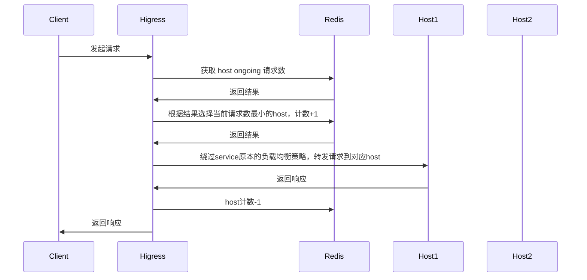

## 功能说明

此插件以热插拔的方式提供全局最小请求数负载均衡能力，处理过程如下所示：



如果插件执行过程中发生错误，负载均衡策略会退化为服务本身的负载均衡策略（轮训、本地最小请求数、随机、一致性hash等）

## 配置说明

| 名称                | 数据类型         | 填写要求          | 默认值       | 描述                                 |
|--------------------|-----------------|------------------|-------------|-------------------------------------|
| `serviceFQDN`      | string          | 必填              |             | redis服务的FQDN，例如: `redis.dns`    |
| `servicePort`      | int             | 必填              |             | redis服务的port                      |
| `username`         | string          | 必填              |             | redis 用户名                         |
| `password`         | string          | 选填              | 空          | redis 密码                           |
| `timeout`          | int             | 选填              | 3000ms      | redis 请求超时时间                    |
| `database`         | int             | 选填              | 0           | redis 数据库序号                      |

## 配置示例

```yaml
serviceFQDN: redis.static
servicePort: 6379
username: default
password: '123456'
```

