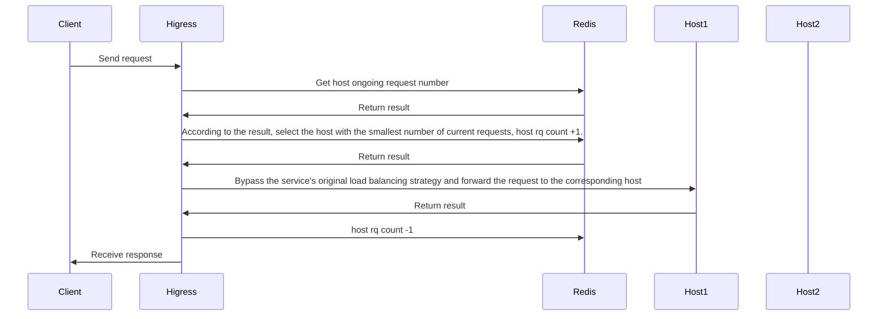

## Introduction

This plug-in provides the global minimum request number load balancing capability in a hot-swappable manner. The processing process is as follows:



If an error occurs during the execution of the plugin, the load balancing strategy will degenerate into the load balancing strategy of the service itself (round robin, local minimum request number, random, consistent hash, etc.).

## Configuration

| Name                | Type         | required          | default       | description                                 |
|--------------------|-----------------|------------------|-------------|-------------------------------------|
| `serviceFQDN`      | string          | required              |             | redis FQDN, e.g.  `redis.dns`    |
| `servicePort`      | int             | required              |             | redis port                      |
| `username`         | string          | required              |             | redis username                         |
| `password`         | string          | optional              | ``          | redis password                           |
| `timeout`          | int             | optional              | 3000ms      | redis request timeout                    |
| `database`         | int             | optional              | 0           | redis database number                      |

## Configuration Example

```yaml
serviceFQDN: redis.static
servicePort: 6379
username: default
password: '123456'
```

