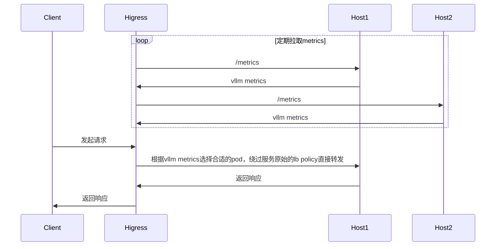

## 功能说明

[gateway-api-inference-extension](https://github.com/kubernetes-sigs/gateway-api-inference-extension/blob/main/README.md) 的 wasm 实现



pod选取流程图如下：


## 配置说明

| 名称                | 数据类型         | 填写要求          | 默认值       | 描述                                 |
|--------------------|-----------------|------------------|-------------|-------------------------------------|
| `criticalModels`      | []string          | 选填              |             | critical的模型列表    |

## 配置示例

```yaml
criticalModels:
- meta-llama/Llama-2-7b-hf
- sql-lora
```