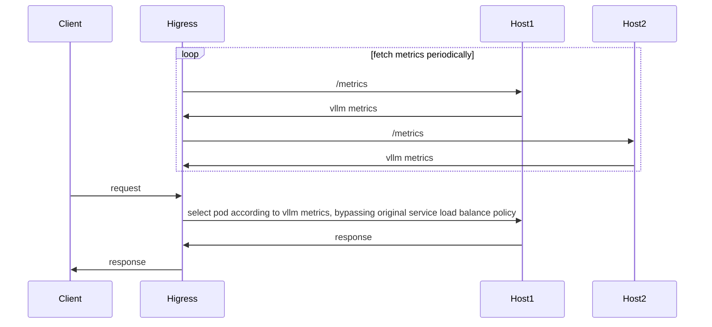

## Introduction

wasm implementation for [gateway-api-inference-extension](https://github.com/kubernetes-sigs/gateway-api-inference-extension/blob/main/README.md)



flowchart for pod selection:


## Configuration

| Name                | Type         | Required          | default       | description                                 |
|--------------------|-----------------|------------------|-------------|-------------------------------------|
| `criticalModels`      | []string          | required              |             | critical model names    |

## Configuration Example

```yaml
criticalModels:
- meta-llama/Llama-2-7b-hf
- sql-lora
```