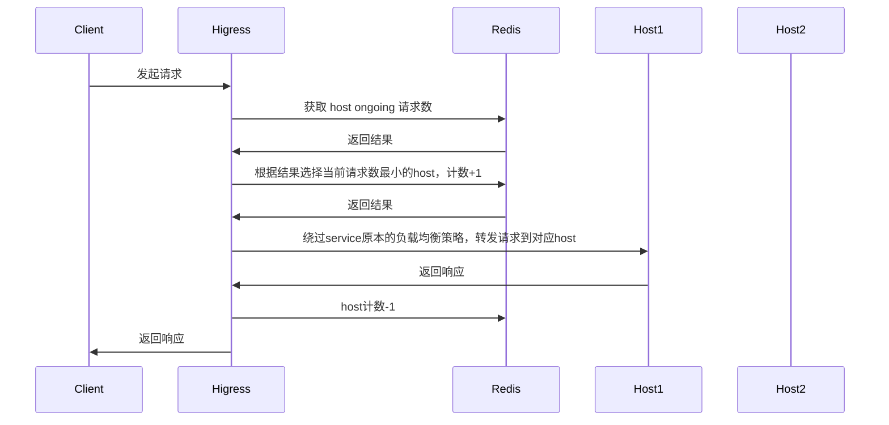
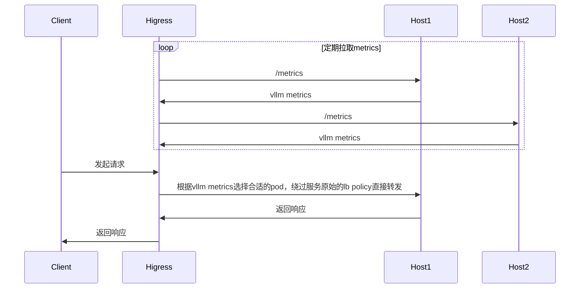

# 功能说明

**注意**：
- Higress网关版本需要>=v2.1.5

对LLM服务提供热插拔的负载均衡策略，如果关闭插件，负载均衡策略会退化为服务本身的负载均衡策略（轮训、本地最小请求数、随机、一致性hash等）。

配置如下：

| 名称                | 数据类型         | 填写要求          | 默认值       | 描述                                 |
|--------------------|-----------------|------------------|-------------|-------------------------------------|
| `lb_policy`      | string          | 必填              |             | 负载均衡策略类型    |
| `lb_config`      | object          | 必填              |             | 当前负载均衡策略类型的配置    |

目前支持的负载均衡策略包括：
- `global_least_request`: 基于redis实现的全局最小请求数负载均衡
- `prefix_cache`: 基于 prompt 前缀匹配选择后端节点，如果通过前缀匹配无法匹配到节点，则通过全局最小请求数进行服务节点的选择
- `least_busy`: [gateway-api-inference-extension](https://github.com/kubernetes-sigs/gateway-api-inference-extension/blob/main/README.md) 的 wasm 实现

# 全局最小请求数
## 功能说明



## 配置说明

| 名称                | 数据类型         | 填写要求          | 默认值       | 描述                                 |
|--------------------|-----------------|------------------|-------------|-------------------------------------|
| `serviceFQDN`      | string          | 必填              |             | redis 服务的FQDN，例如: `redis.dns`    |
| `servicePort`      | int             | 必填              |             | redis 服务的port                      |
| `username`         | string          | 必填              |             | redis 用户名                         |
| `password`         | string          | 选填              | 空          | redis 密码                           |
| `timeout`          | int             | 选填              | 3000ms      | redis 请求超时时间                    |
| `database`         | int             | 选填              | 0           | redis 数据库序号                      |

## 配置示例

```yaml
lb_policy: global_least_request
lb_config:
  serviceFQDN: redis.static
  servicePort: 6379
  username: default
  password: '123456'
```

# 前缀匹配
## 功能说明
根据 prompt 前缀匹配选择 pod，以复用 KV Cache，如果通过前缀匹配无法匹配到节点，则通过全局最小请求数进行服务节点的选择

例如以下请求被路由到了pod 1

```json
{
  "model": "qwen-turbo",
  "messages": [
    {
      "role": "user",
      "content": "hi"
    }
  ]
}
```

那么后续具有相同前缀的请求也会被路由到 pod 1
```json
{
  "model": "qwen-turbo",
  "messages": [
    {
      "role": "user",
      "content": "hi"
    },
    {
      "role": "assistant",
      "content": "Hi! How can I assist you today? 😊"
    },
    {
      "role": "user",
      "content": "write a short story aboud 100 words"
    }
  ]
}
```

## 配置说明

| 名称                | 数据类型         | 填写要求          | 默认值       | 描述                                 |
|--------------------|-----------------|------------------|-------------|-------------------------------------|
| `serviceFQDN`      | string          | 必填              |             | redis 服务的FQDN，例如: `redis.dns`    |
| `servicePort`      | int             | 必填              |             | redis 服务的port                      |
| `username`         | string          | 必填              |             | redis 用户名                         |
| `password`         | string          | 选填              | 空          | redis 密码                           |
| `timeout`          | int             | 选填              | 3000ms      | redis 请求超时时间                    |
| `database`         | int             | 选填              | 0           | redis 数据库序号                      |
| `redisKeyTTL`      | int             | 选填              | 1800ms      | prompt 前缀对应的key的ttl             |

## 配置示例

```yaml
lb_policy: prefix_cache
lb_config:
  serviceFQDN: redis.static
  servicePort: 6379
  username: default
  password: '123456'
```

# 最小负载
## 功能说明
[gateway-api-inference-extension](https://github.com/kubernetes-sigs/gateway-api-inference-extension/blob/main/README.md) 的 wasm 实现



<!-- pod选取流程图如下：

 -->

## 配置说明

| 名称                | 数据类型         | 填写要求          | 默认值       | 描述                                 |
|--------------------|-----------------|------------------|-------------|-------------------------------------|
| `criticalModels`      | []string          | 选填              |             | critical的模型列表    |

## 配置示例

```yaml
lb_policy: least_busy
lb_config:
  criticalModels:
  - meta-llama/Llama-2-7b-hf
  - sql-lora
```