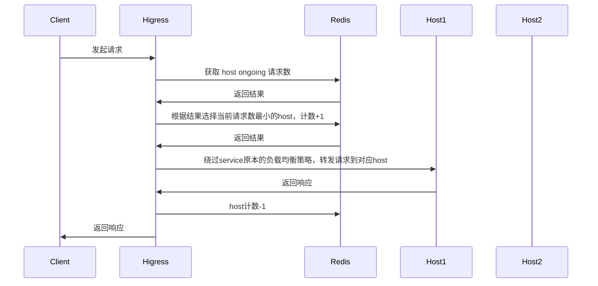
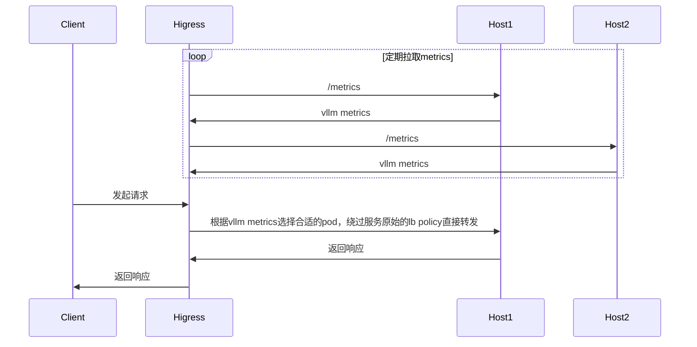

# 功能说明

**注意**：
- Higress网关版本需要>=v2.1.5

对LLM服务提供热插拔的负载均衡策略，如果关闭插件，负载均衡策略会退化为服务本身的负载均衡策略（轮训、本地最小请求数、随机、一致性hash等）。

配置如下：

| 名称                | 数据类型         | 填写要求          | 默认值       | 描述                                 |
|--------------------|-----------------|------------------|-------------|-------------------------------------|
| `lb_type`        | string          | 选填              | endpoint    | 负载均衡类型，可选`endpoint`,`cluster` |
| `lb_policy`      | string          | 必填              |             | 负载均衡策略类型    |
| `lb_config`      | object          | 必填              |             | 当前负载均衡策略类型的配置    |

`lb_type` 为 `endpoint` 时支持的负载均衡策略包括：

- `global_least_request`: 基于redis实现的全局最小请求数负载均衡
- `prefix_cache`: 基于 prompt 前缀匹配选择后端节点，如果通过前缀匹配无法匹配到节点，则通过全局最小请求数进行服务节点的选择
- `endpoint_metrics`: 基于 llm 服务暴露的 metrics 进行负载均衡

`lb_type` 为 `cluster` 时支持的负载均衡策略包括：
- `cluster_metrics`: 基于网关统计的不同service的指标进行服务之间的负载均衡
- `cluster_hash`: 读取指定请求头做 FNV-1a 一致性 hash，将相同 key 的请求始终路由到同一 cluster，支持按权重分配流量

这两种策略只负责将选中的 cluster 写入内部请求头。用户必须另外[显式配置 EnvoyFilter](#为-cluster-模式显式配置-envoyfilter)，将目标路由改为使用 `route.cluster_header`；Higress 控制面不会自动创建、更新或删除该 EnvoyFilter。

# 全局最小请求数
## 功能说明


```mermaid
sequenceDiagram
	participant C as Client
	participant H as Higress
	participant R as Redis
	participant H1 as Host1
	participant H2 as Host2

	C ->> H: 发起请求
	H ->> R: 获取 host ongoing 请求数
	R ->> H: 返回结果
	H ->> R: 根据结果选择当前请求数最小的host，计数+1
	R ->> H: 返回结果
	H ->> H1: 绕过service原本的负载均衡策略，转发请求到对应host
	H1 ->> H: 返回响应
	H ->> R: host计数-1
	H ->> C: 返回响应
```

## 配置说明

| 名称                | 数据类型         | 填写要求          | 默认值       | 描述                                 |
|--------------------|-----------------|------------------|-------------|-------------------------------------|
| `serviceFQDN`      | string          | 必填              |             | redis 服务的FQDN，例如: `redis.dns`    |
| `servicePort`      | int             | 必填              |             | redis 服务的port                      |
| `username`         | string          | 必填              |             | redis 用户名                         |
| `password`         | string          | 选填              | 空          | redis 密码                           |
| `timeout`          | int             | 选填              | 3000ms      | redis 请求超时时间                    |
| `database`         | int             | 选填              | 0           | redis 数据库序号                      |

## 配置示例

```yaml
lb_type: endpoint
lb_policy: global_least_request
lb_config:
  serviceFQDN: redis.static
  servicePort: 6379
  username: default
  password: '123456'
```

# 前缀匹配
## 功能说明
根据 prompt 前缀匹配选择 pod，以复用 KV Cache，如果通过前缀匹配无法匹配到节点，则通过全局最小请求数进行服务节点的选择

例如以下请求被路由到了pod 1

```json
{
  "model": "qwen-turbo",
  "messages": [
    {
      "role": "user",
      "content": "hi"
    }
  ]
}
```

那么后续具有相同前缀的请求也会被路由到 pod 1
```json
{
  "model": "qwen-turbo",
  "messages": [
    {
      "role": "user",
      "content": "hi"
    },
    {
      "role": "assistant",
      "content": "Hi! How can I assist you today? 😊"
    },
    {
      "role": "user",
      "content": "write a short story aboud 100 words"
    }
  ]
}
```

## 配置说明

| 名称                | 数据类型         | 填写要求          | 默认值       | 描述                                 |
|--------------------|-----------------|------------------|-------------|-------------------------------------|
| `serviceFQDN`      | string          | 必填              |             | redis 服务的FQDN，例如: `redis.dns`    |
| `servicePort`      | int             | 必填              |             | redis 服务的port                      |
| `username`         | string          | 必填              |             | redis 用户名                         |
| `password`         | string          | 选填              | 空          | redis 密码                           |
| `timeout`          | int             | 选填              | 3000ms      | redis 请求超时时间                    |
| `database`         | int             | 选填              | 0           | redis 数据库序号                      |
| `redisKeyTTL`      | int             | 选填              | 1800s      | prompt 前缀对应的key的ttl             |

## 配置示例

```yaml
lb_type: endpoint
lb_policy: prefix_cache
lb_config:
  serviceFQDN: redis.static
  servicePort: 6379
  username: default
  password: '123456'
```

# 最小负载
## 功能说明
[gateway-api-inference-extension](https://github.com/kubernetes-sigs/gateway-api-inference-extension/blob/main/README.md) 的 wasm 实现


```mermaid
sequenceDiagram
	participant C as Client
	participant H as Higress
	participant H1 as Host1
	participant H2 as Host2

	loop 定期拉取metrics
		H ->> H1: /metrics
		H1 ->> H: vllm metrics
		H ->> H2: /metrics
		H2 ->> H: vllm metrics
	end

	C ->> H: 发起请求
	H ->> H1: 根据vllm metrics选择合适的pod，绕过服务原始的lb policy直接转发
	H1 ->> H: 返回响应
	H ->> C: 返回响应
```

<!-- pod选取流程图如下：

 -->

## 配置说明

| 名称                | 数据类型         | 填写要求          | 默认值       | 描述                                 |
|--------------------|-----------------|------------------|-------------|-------------------------------------|
| `metric_policy`      | string | 必填 | | 如何使用llm暴露的metrics做负载均衡，当前支持`[default, least, most]` |
| `target_metric`      | string | 选填 | | 要使用的metric名称，`metric_policy` 取值为 `least` 或者 `most` 时生效 |
| `rate_limit`      | string | 选填 | 1 | 单个节点处理请求比例上限，取值范围0~1 |


## 配置示例

使用 [gateway-api-inference-extension](https://github.com/kubernetes-sigs/gateway-api-inference-extension/blob/main/README.md) 中的算法

```yaml
lb_type: endpoint
lb_policy: metrics_based
lb_config:
  metric_policy: default
  rate_limit: 0.6 # 单个节点承载的最大请求比例
```

根据当前排队请求数进行负载均衡

```yaml
lb_type: endpoint
lb_policy: metrics_based
lb_config:
  metric_policy: least
  target_metric: vllm:num_requests_waiting
  rate_limit: 0.6 # 单个节点承载的最大请求比例
```

根据当前GPU中正在处理的请求数进行负载均衡

```yaml
lb_type: endpoint
lb_policy: metrics_based
lb_config:
  metric_policy: least
  target_metric: vllm:num_requests_running
  rate_limit: 0.6 # 单个节点承载的最大请求比例
```


# 跨服务负载均衡

## 配置说明

| 名称                | 数据类型         | 填写要求          | 默认值       | 描述                                 |
|--------------------|-----------------|------------------|-------------|-------------------------------------|
| `mode`      | string | 必填 | | 如何使用服务级指标做负载均衡，当前支持`[LeastBusy, LeastTotalLatency, LeastFirstTokenLatency, AdaptiveScore]` |
| `service_list`      | []string | 必填 | | 路由后端服务列表 |
| `rate_limit`      | string | 选填 | 1 | 单个服务处理请求比例上限，取值范围0~1 |
| `cluster_header` | string | 选填 | `x-higress-target-cluster` | 通过取该header的值得知需要路由到哪个后端服务 |
| `queue_size`      | int | 选填 | 100 | 根据最近的多少个请求进行观测指标的计算 |
| `ewma_beta` | float | 选填 | 0.5 | `AdaptiveScore` 中历史 EWMA 值的权重，取值范围 0~1 |
| `p2c_choices` | int | 选填 | 2 | `AdaptiveScore` 每次随机采样并比较的候选服务数，配置值不小于服务数时比较全部服务 |
| `ttft_weight` | float | 选填 | 0.7 | `AdaptiveScore` 首包延迟权重 |
| `total_latency_weight` | float | 选填 | 0.3 | `AdaptiveScore` 总响应延迟权重 |
| `error_penalty` | float | 选填 | 3.0 | `AdaptiveScore` 对插件实例启动以来累计错误率的惩罚系数 |
| `failure_cooldown_ms` | int | 选填 | 30000 | `AdaptiveScore` 请求失败后服务进入冷却的时间；未配置或为 0 时使用默认值 |
| `metrics_missing_policy` | string | 选填 | `least_busy` | `AdaptiveScore` 缺少延迟指标时的兜底策略，默认按当前并发数选择 |
| `global_inflight_enabled` | bool | 选填 | false | `AdaptiveScore` 是否使用 Redis 记录跨网关实例的全局 in-flight |
| `serviceFQDN` | string | `global_inflight_enabled=true` 时必填 | | Redis 服务的 FQDN |
| `servicePort` | int | `global_inflight_enabled=true` 时必填 | | Redis 服务的端口 |
| `username` | string | 选填 | | Redis 用户名 |
| `password` | string | 选填 | 空 | Redis 密码 |
| `database` | int | 选填 | 0 | Redis 数据库序号 |
| `global_inflight_key_prefix` | string | 选填 | `higress:adaptive_score_inflight` | 全局 in-flight 计数 Redis key 前缀，实际 key 会追加 route 和 mode |
| `global_inflight_timeout` | int | 选填 | 3000 | Redis 请求超时时间，单位毫秒；未配置或为 0 时使用默认值 |
| `global_inflight_key_ttl` | int | 选填 | 1800 | 全局 in-flight Redis key 的 TTL，单位秒；未配置或为 0 时使用默认值 |

`mode` 各取值含义如下：
- `LeastBusy`: 路由到当前并发请求数最少的服务
- `LeastTotalLatency`: 路由到当前RT最低的服务
- `LeastFirstTokenLatency`: 路由到当前首包RT最低的服务
- `AdaptiveScore`: 综合 EWMA 首包延迟、EWMA 总延迟、当前并发数和累计失败率计算分数，选择分数最低的服务；适合 LLM 后端服务延迟和负载持续波动的场景

`AdaptiveScore` 的失败率基于当前插件实例生命周期内累计的成功和失败次数计算，目前不使用时间窗口或衰减。

`AdaptiveScore` 开启 `global_inflight_enabled` 后，会使用 Redis Lua 原子完成“按本地分数和全局 in-flight 修正后的分数选择服务，并将选中服务计数 +1”。请求结束时插件会将该服务计数 -1。Redis 初始化、请求或返回异常时会降级到本地 `AdaptiveScore`，不阻断请求。

## 配置示例

```yaml
lb_type: cluster
lb_policy: cluster_metrics
lb_config:
  mode: AdaptiveScore # 策略名称
  cluster_header: x-higress-target-cluster # 写入选中 cluster 的内部请求头
  queue_size: 100 # 统计指标时使用的最近请求数
  rate_limit: 0.6 # 单个服务承载的最大请求比例
  ewma_beta: 0.5 # 历史 EWMA 值权重
  p2c_choices: 2 # 每次比较的候选服务数
  ttft_weight: 0.7 # 首包延迟权重
  total_latency_weight: 0.3 # 总响应延迟权重
  error_penalty: 3.0 # 错误率惩罚系数
  failure_cooldown_ms: 30000 # 失败冷却时间
  global_inflight_enabled: true # 开启跨网关实例全局 in-flight
  serviceFQDN: redis.static # Redis 服务
  servicePort: 6379
  username: default
  password: ""
  database: 0
  global_inflight_key_prefix: higress:adaptive_score_inflight
  global_inflight_timeout: 3000
  global_inflight_key_ttl: 1800
  service_list:
  - outbound|80||test-1.dns
  - outbound|80||test-2.static
```

# Cluster Hash（一致性 Hash 路由）

## 功能说明

读取指定请求头的值，使用 FNV-1a 一致性 hash 算法将请求路由到固定的上游集群，确保相同 hash key 的请求始终落到同一个 cluster，同时支持按百分比权重控制各 cluster 的流量分配。

需要配合下文的[显式 EnvoyFilter 配置](#为-cluster-模式显式配置-envoyfilter)一起使用。

## 配置说明

| 名称 | 数据类型 | 填写要求 | 默认值 | 描述 |
|------|----------|----------|--------|------|
| `clusters` | []ClusterEntry | 必填 | - | cluster 列表，所有 `weight` 之和必须为 100 |
| `hash_header` | string | 选填 | `x-mse-consumer` | 读取 hash key 的请求头名称 |
| `cluster_header` | string | 选填 | `x-higress-target-cluster` | 写入目标 cluster 的请求头名称 |

### ClusterEntry 字段

| 名称 | 类型 | 必填 | 说明 |
|------|------|------|------|
| `cluster` | string | 是 | 上游集群名称，如 `outbound|443||llm-xxx.internal.static` |
| `weight` | int | 是 | 百分比权重，所有 cluster 的 weight 之和必须为 100 |

## 配置示例

```yaml
lb_type: cluster
lb_policy: cluster_hash
lb_config:
  clusters:
    - cluster: "outbound|80||llm-test1.internal.static"
      weight: 69
    - cluster: "outbound|443||llm-test2.internal.dns"
      weight: 30
    - cluster: "outbound|443||llm-test3.internal.dns"
      weight: 1
  hash_header: x-mse-consumer
  cluster_header: x-higress-target-cluster
```

若请求缺少 hash header，插件直接返回 **403**。

# 为 cluster 模式显式配置 EnvoyFilter

`lb_type: cluster` 时，ai-load-balancer 只会把选中的 cluster 名称写入 `lb_config.cluster_header` 指定的请求头。用户必须自行创建并维护 EnvoyFilter，将对应的 Envoy HTTP route 改为从该请求头读取目标 cluster。下面的示例假设：

- Higress 安装在 `higress-system` namespace，网关 Pod 标签为 `app: higress-gateway`；
- 目标 HTTPRoute 或 Ingress 位于 `default` namespace，资源名为 `llm-route`，生成的 xDS route 名为 `default/llm-route`；
- 目标域名为 `llm.example.com`，网关监听端口为 `80`，对应的 xDS route configuration 和 virtual host 名分别为 `higress-rds-80.llm.example.com` 和 `llm.example.com:80`；
- 后端 Kubernetes Service 为 `llm-a` 和 `llm-b`，端口均为 `80`。

先为目标 route 创建 ai-load-balancer WasmPlugin：

```yaml
apiVersion: extensions.higress.io/v1alpha1
kind: WasmPlugin
metadata:
  name: ai-load-balancer-cluster
  namespace: higress-system
spec:
  pluginName: ai-load-balancer
  url: oci://higress-registry.cn-hangzhou.cr.aliyuncs.com/plugins/ai-load-balancer:2.0.1
  matchRules:
    - ingress:
        - default/llm-route
      config:
        lb_type: cluster
        lb_policy: cluster_hash
        lb_config:
          clusters:
            - cluster: "outbound|80||llm-a.default.svc.cluster.local"
              weight: 50
            - cluster: "outbound|80||llm-b.default.svc.cluster.local"
              weight: 50
          hash_header: x-ai-session
          cluster_header: x-higress-target-cluster
```

再显式创建与同一 route 对齐的 EnvoyFilter：

```yaml
apiVersion: networking.istio.io/v1alpha3
kind: EnvoyFilter
metadata:
  name: ai-load-balancer-cluster-header
  namespace: higress-system
spec:
  workloadSelector:
    labels:
      app: higress-gateway
  configPatches:
    - applyTo: HTTP_ROUTE
      match:
        context: GATEWAY
        routeConfiguration:
          name: higress-rds-80.llm.example.com
          vhost:
            name: llm.example.com:80
            route:
              name: default/llm-route
              action: ROUTE
      patch:
        operation: MERGE
        value:
          route:
            cluster_header: x-higress-target-cluster
```

`patch.value.route.cluster_header` 必须与 ai-load-balancer 的 `lb_config.cluster_header` 完全一致。`matchRules[].ingress` 和 `vhost.route.name` 也必须指向同一条实际 route。原 HTTPRoute 或 Ingress 仍需引用所有可能被选中的后端服务，使对应 cluster 存在于 Envoy 中；该 EnvoyFilter 只改变 route 选择 cluster 的方式，不会创建 cluster。

EnvoyFilter 的 `metadata.namespace` 必须是目标网关工作负载所在的 namespace，`workloadSelector` 也必须匹配实际网关 Pod 标签。`context: GATEWAY` 将补丁限定在网关路由上；`routeConfiguration.name`、`vhost.name` 和 `vhost.route.name` 应继续把范围缩小到需要启用 cluster 模式的 route。Higress 默认的按 host RDS 名形如 `higress-rds-<port>.<host>`，vhost 名形如 `<host>:<port>`。

若实际 xDS 使用标准 Istio `http.*` 或 `https.*` route configuration，而不是 `higress-rds-*`，可用 `portNumber`、`portName` 和内部 Istio Gateway 名 `gateway` 限定 Gateway API listener。例如，Kubernetes Gateway `default/llm-gateway` 的 `https` listener 通常对应：

```yaml
routeConfiguration:
  portNumber: 443
  portName: https
  gateway: default/llm-gateway-istio-autogenerated-k8s-gateway-https
```

不要把上述 `gateway`/`portName`/`portNumber` 写法与 `higress-rds-*` 混用，也不要直接假设 Kubernetes 资源名就是 xDS vhost/route 名或把原始 Kubernetes Gateway 名直接填入 `routeConfiguration.gateway`。先从网关的 xDS 配置中确认实际值：

```bash
kubectl -n higress-system exec deploy/higress-gateway -- \
  pilot-agent request GET config_dump > /tmp/higress-config-dump.json

jq -r '
  .configs[]
  | select(."@type" == "type.googleapis.com/envoy.admin.v3.RoutesConfigDump")
  | .dynamic_route_configs[].route_config
  | .name as $route_config
  | .virtual_hosts[]
  | . as $vhost
  | .routes[]
  | [$route_config, $vhost.name, ($vhost.domains | join(",")), .name,
     (.route.cluster_header // .route.clusterHeader // "-")]
  | @tsv
' /tmp/higress-config-dump.json
```

应用 EnvoyFilter 后，再运行一次上述命令。目标行最后一列必须显示 `x-higress-target-cluster`；同时可用下面的命令确认 Kubernetes 对象和网关标签：

```bash
kubectl -n higress-system get envoyfilter ai-load-balancer-cluster-header -o yaml
kubectl -n higress-system get pods -l app=higress-gateway --show-labels
```

Higress 不会自动补建或修正这个 EnvoyFilter。若 EnvoyFilter 缺失、namespace/workload selector 不匹配，或 vhost/route 匹配错误，原 route 不会读取插件写入的 header；若 route 已切换为 `cluster_header`，但插件没有在该 route 上写入同名 header，请求会因无法解析目标 cluster 而返回 `404`。

`x-higress-target-cluster` 是内部路由控制头，不是客户端 API。不要信任外部客户端传入的同名 header；应在进入 Higress 的可信边界前拒绝或清除该 header，并确保只有 ai-load-balancer 在目标 route 的处理链中写入它。否则，客户端可能绕过预期的负载均衡选择。
