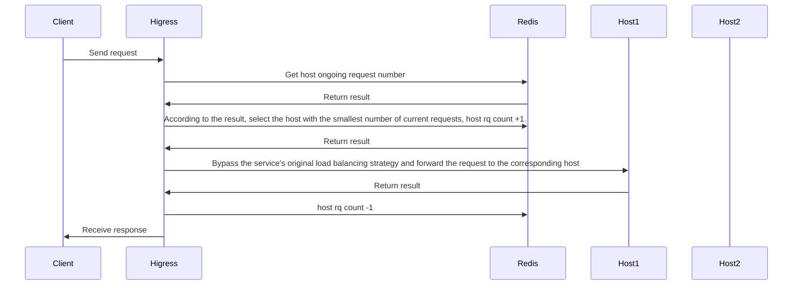
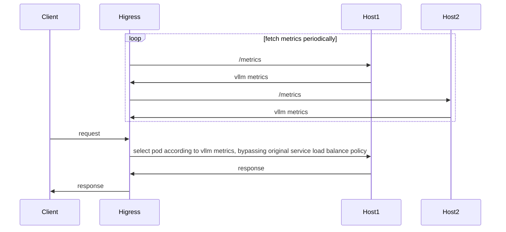

# Introduction

**Attention**: 
- Version of Higress should >= v2.1.5

This plug-in provides the llm-oriented load balancing capability in a hot-swappable manner. If the plugin is closed, the load balancing strategy will degenerate into the load balancing strategy of the service itself (round robin, local minimum request number, random, consistent hash, etc.).

The configuration is:

| Name                | Type         | Required          | default       | description                                 |
|--------------------|-----------------|------------------|-------------|-------------------------------------|
| `lb_policy`      | string          | required              |             | load balance type    |
| `lb_config`      | object          | required              |             | configuration for the current load balance type    |

Current supported load balance policies are:

- `global_least_request`: global least request based on redis
- `prefix_cache`: Select the backend node based on the prompt prefix match. If the node cannot be matched by prefix matching, the service node is selected based on the global minimum number of requests.
- `least_busy`: implementation for [gateway-api-inference-extension](https://github.com/kubernetes-sigs/gateway-api-inference-extension/blob/main/README.md)

# Global Least Request
## Introduction



## Configuration

| Name                | Type         | required          | default       | description                                 |
|--------------------|-----------------|------------------|-------------|-------------------------------------|
| `serviceFQDN`      | string          | required              |             | redis FQDN, e.g.  `redis.dns`    |
| `servicePort`      | int             | required              |             | redis port                      |
| `username`         | string          | required              |             | redis username                         |
| `password`         | string          | optional              | ``          | redis password                           |
| `timeout`          | int             | optional              | 3000ms      | redis request timeout                    |
| `database`         | int             | optional              | 0           | redis database number                      |

## Configuration Example

```yaml
lb_policy: global_least_request
lb_config:
  serviceFQDN: redis.static
  servicePort: 6379
  username: default
  password: '123456'
```

# Prefix Cache
## Introduction
Select pods based on the prompt prefix match to reuse KV Cache. If no node can be matched by prefix match, select the service node based on the global minimum number of requests.

For example, the following request is routed to pod 1:

```json
{
  "model": "qwen-turbo",
  "messages": [
    {
      "role": "user",
      "content": "hi"
    }
  ]
}
```

Then subsequent requests with the same prefix will also be routed to pod 1:

```json
{
  "model": "qwen-turbo",
  "messages": [
    {
      "role": "user",
      "content": "hi"
    },
    {
      "role": "assistant",
      "content": "Hi! How can I assist you today? 😊"
    },
    {
      "role": "user",
      "content": "write a short story aboud 100 words"
    }
  ]
}
```

## Configuration

| Name               | Type            | required              | default     | description                     |
|--------------------|-----------------|-----------------------|-------------|---------------------------------|
| `serviceFQDN`      | string          | required              |             | redis FQDN, e.g.  `redis.dns`   |
| `servicePort`      | int             | required              |             | redis port                      |
| `username`         | string          | required              |             | redis username                  |
| `password`         | string          | optional              | ``          | redis password                  |
| `timeout`          | int             | optional              | 3000ms      | redis request timeout           |
| `database`         | int             | optional              | 0           | redis database number           |
| `redisKeyTTL`      | int             | optional              | 1800ms      | prompt prefix key's ttl         |

## Configuration Example

```yaml
lb_policy: prefix_cache
lb_config:
  serviceFQDN: redis.static
  servicePort: 6379
  username: default
  password: '123456'
```

# Least Busy
## Introduction

wasm implementation for [gateway-api-inference-extension](https://github.com/kubernetes-sigs/gateway-api-inference-extension/blob/main/README.md)



<!-- flowchart for pod selection:

 -->

## Configuration

| Name                | Type         | Required          | default       | description                                 |
|--------------------|-----------------|------------------|-------------|-------------------------------------|
| `criticalModels`      | []string          | required              |             | critical model names    |

## Configuration Example

```yaml
lb_policy: least_busy
lb_config:
  criticalModels:
  - meta-llama/Llama-2-7b-hf
  - sql-lora
```
