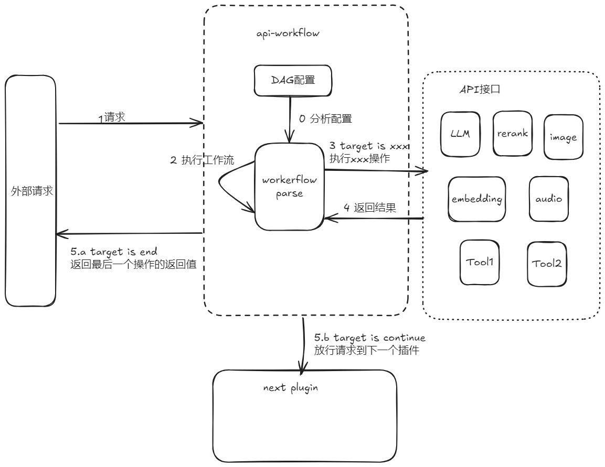
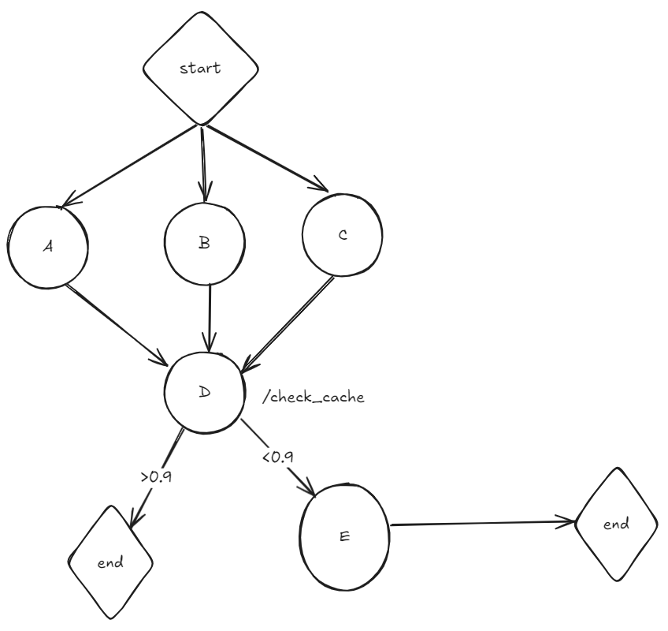

## 功能说明
可编排的API workflow 插件，支持根据配置定义生成DAG，来编排工作流

## 配置说明

| 名称             | 数据类型                 | 填写要求 | 默认值 | 描述        | 备注 |
|----------------|----------------------| ---- | --- |-----------|----|
| workflow.nodes | array of node object | 选填   |     | DAG的定义的节点 |    |
| workflow.edges | array of edge object | 必填   |     | DAG的定义的边  |    |
|                |                      |      |     |           |    |

edge object 配置说明：

| 名称          | 数据类型   | 填写要求 | 默认值 | 描述                                             |
|-------------| ------ | ---- | --- |------------------------------------------------|
| source      | string | 必填   | -   | 上一步的操作，必须是定义的node的name，或者初始化工作流的start          |
| target      | string | 必填   | -   | 当前的操作，必须是定义的node的name，或者结束工作流的关键字 end continue | |
| conditional | string | 选填   | -   | 这一步是否执行的判断条件                                   |

node object 配置说明：

| 名称              | 数据类型                               | 填写要求 | 默认值 | 描述                            | 备注                            |
| --------------- |------------------------------------|---| --- |-------------------------------|-------------------------------|
| name            | string                             | 必填 | -   | node名称                        | 全局唯一                          |
| service_name    | string                             | 必填 | -   | higress配置的服务名称                |                               |
| service_port    | int                                | 选填 | 80  | higress配置的服务端口                |                               |
| service_domain  | string                             | 选填 |     | higress配置的服务domain            |                               |
| service_path    | string                             | 必填 |     | 请求的path                       |                               |
| service_headers | array of header object             | 选填 |     | 请求的头                          |                               |
| service_body_replace_keys| array of bodyReplaceKeyPair object | 选填|   请求body模板替换键值对  | 用来构造请求| 如果为空，则直接使用service_body_tmpl请求 |
| service_body_tmpl   | string                             | 选填 |     | 请求的body模板                     |                               |
| service_type    | string                             | 必填 |     | 请求的类型                         | static，domain                 |
| service_method  | string                             | 必填 |     | 请求的方法                         | GET，POST                      |

header object 配置说明

| 名称    | 数据类型                   | 填写要求 | 默认值 | 描述        | 备注        |
|-------|------------------------|---| --- |-----------| --------- |
| key   | string                 | 必填 | -   | 头文件的key   |           |
| value | string                 | 必填 | -   | 头文件的value |           |

BodyReplaceKeyPair object 配置说明

| 名称   | 数据类型                   | 填写要求 | 默认值 | 描述        | 备注 |
|------|------------------------|---| --- |-----------|--|
| from | string                 | 必填 | -   | 描述数据从哪获得  |  |
| to   | string                 | 必填 | -   | 描述数据最后放到那 |  |


## 设计如下

我们把工作流抽象成DAG配置文件，加上控制流和数据流更方便的控制流程和构造请求。




## DAG的定义

### 边edge
描述操作如何执行

| 名称          | 数据类型   | 填写要求 | 默认值 | 描述                                             |
|-------------| ------ | ---- | --- |------------------------------------------------|
| source      | string | 必填   | -   | 上一步的操作，必须是定义的node的name，或者初始化工作流的start          |
| target      | string | 必填   | -   | 当前的操作，必须是定义的node的name，或者结束工作流的关键字 end continue | |
| conditional | string | 选填   | -   | 这一步是否执行的判断条件                                   |

样例
```yaml
  edges:
    - source: start
      target: A
    - source: start
      target: B
    - source: start
      target: C
    - source: A
      target: D
    - source: B
      target: D
    - source: C
      target: D
    - source: D
      target: end
      conditional: "gt {{D||check}} 0.9"
    - source: D
      target: E
      conditional: "lt {{D||check}} 0.9"
    - source: E
      target: end
```
### 控制流 conditional 和 target
#### 分支 conditional
插件执行到conditional的定义不为空的步骤时，会根据表达式定义判断这步是否执行，如果判断为否，会跳过这个分支。

参数可以使用{{xxx}}标注，具体定义见数据流`模板和变量`

支持比较表达式和例子如下：
`eq arg1 arg2`： arg1 == arg2时为true 
`ne arg1 arg2`： arg1 != arg2时为true 
`lt arg1 arg2`： arg1 < arg2时为true 
`le arg1 arg2`： arg1 <= arg2时为true 
`gt arg1 arg2`： arg1 > arg2时为true 
`ge arg1 arg2`： arg1 >= arg2时为true


#### 结束和执行工作流 target
当target为`name`,执行name的操作
当target 为`end`，直接返回source的结果，结束工作流
当target 为`continue`，结束工作流，将请求放行到下一个plugin

### 数据流

进入plugin的数据（request body）,会根据编和构造模板递给的执行的node，并把结果存在key为`nodeName`的上下文里，只支持json格式的数据。

#### 模板和变量

##### edge.conditional
配置文件的定义中，`edge.conditional`  支持模板，方便根据数据流的数据来构建
在模板里使用变量来代表数据和过滤。变量使用`{{str1||str2}}`包裹，使用`||`分隔，str1代表使用那个node的输出数据，str2代表如何取数据，过滤表达式基于 [GJSON PATH](https://github.com/tidwall/gjson/blob/master/SYNTAX.md) 语法提取字符串，`@all`代表全都要

例子
```yaml
conditional: "lt {{D||check}} 0.9"
```
node D 的返回值是
```json
{"check": 0.99}
```
构造表达式

##### node.service_body_tmpl 和 node.service_body_replace_keys
这组配置用来构造请求body，`tool.service_body_tmpl`是模板文件 ，`service_body_replace_keys`用来描述如何填充body，是一个object的数组，from标识数据从哪里来，to表示填充的位置
`from`是使用`str1||str2`的字符串，str1代表使用那个node的执行数据，str2代表如何取数据，表达式基于 [GJSON PATH](https://github.com/tidwall/gjson/blob/master/SYNTAX.md) 语法提取字符串
`to`标识数据放哪,表达式基于 [GJSON PATH](https://github.com/tidwall/gjson/blob/master/SYNTAX.md) 语法提取字符串，使用的是sjson来拼接json

| 名称   | 数据类型                   | 填写要求 | 默认值 | 描述        | 备注 |
|------|------------------------|---| --- |-----------|--|
| from | string                 | 必填 | -   | 描述数据从哪获得  |  |
| to   | string                 | 必填 | -   | 描述数据最后放到那 |  |

例子
```yaml
    service_body_tmpl:
      embeddings: 
        result: ""
      msg: ""
      sk: "sk-xxxxxx"
    service_body_replace_keys:
      - to "embeddings.result"
        from "A||output.embeddings.0.embedding"
      - to "msg"
        from "B||@all"
```
`A`节点的输出是
```json
{"embeddings":  {"output":{"embeddings":[{"embedding":[0.014398524595686043],"text_index":0}]},"usage":{"total_tokens":12},"request_id":"2a5229bc-53d9-91ca-bce2-00ae5e01a1d3"}}
```
`B`节点的输出是
```json
["higress项目主仓库的github地址是什么"]
```
根据 service_body_tmpl 和 service_body_replace_keys 解析后的request body如下
```json
{"embeddings":{"result":"[0.014398524595686043，......]"},"msg":["higress项目主仓库的github地址是什么"],"sk":"sk-xxxxxx"}
```


## node的定义

具体执行的单元，封装了httpCall，提供http的访问能力，获取各种api的能力。request body支持模板。

| 名称              | 数据类型                               | 填写要求 | 默认值 | 描述                            | 备注                            |
| --------------- |------------------------------------|---| --- |-------------------------------|-------------------------------|
| name            | string                             | 必填 | -   | node名称                        | 全局唯一                          |
| service_name    | string                             | 必填 | -   | higress配置的服务名称                |                               |
| service_port    | int                                | 选填 | 80  | higress配置的服务端口                |                               |
| service_domain  | string                             | 选填 |     | higress配置的服务domain            |                               |
| service_path    | string                             | 必填 |     | 请求的path                       |                               |
| service_headers | array of header object             | 选填 |     | 请求的头                          |                               |
| service_body_replace_keys| array of bodyReplaceKeyPair object | 选填|   请求body模板替换键值对  | 用来构造请求| 如果为空，则直接使用service_body_tmpl请求 |
| service_body_tmpl   | string                             | 选填 |     | 请求的body模板                     |                               |
| service_type    | string                             | 必填 |     | 请求的类型                         | static，domain                 |
| service_method  | string                             | 必填 |     | 请求的方法                         | GET，POST                      |

样例
```yaml
  nodes:
    - name: "A"
      service_domain: "dashscope.aliyuncs.com"
      service_name: "dashscope"
      service_port: 443
      service_type: "domain"
      service_path: "/api/v1/services/embeddings/text-embedding/text-embedding"
      service_method: "POST"
      service_body_tmpl:
        model: "text-embedding-v2"
        input:
          texts: ""
        parameters:
          text_type: "query"
      service_body_replace_keys:
        - from: "start||messages.#(role==user)#.content"
          to: "input.texts"
      service_headers:
        - key: "Authorization"
          value: "Bearer sk-b98f462xxxxxxxx"
        - key: "Content-Type"
          value:  "application/json"
```
这是请求官方 text-embedding-v2模型的请求样例  https://help.aliyun.com/zh/dashscope/developer-reference/text-embedding-api-details?spm=a2c22.12281978.0.0.4d596ea2lRn8xW
## 一个工作流的例子
从三个节点ABC获取信息，等到数据都就位了，再执行D。 并根据D的输出判断是否需要执行E还是直接结束

start的返回值(请求plugin的body)
```json
{
  "model":"qwen-7b-chat-xft",
  "frequency_penalty":0,
  "max_tokens":800,
  "stream":false,
  "messages": [{"role":"user","content":"higress项目主仓库的github地址是什么"}],
  "presence_penalty":0,"temperature":0.7,"top_p":0.95
}
```
A的返回值是
```json
{
    "output":{
        "embeddings": [
          {
             "text_index": 0,
             "embedding": [-0.006929283495992422,-0.005336422007530928]
          }, 
          {
             "text_index": 1,
             "embedding": [-0.006929283495992422,-0.005336422007530928]
          },
          {
             "text_index": 2,
             "embedding": [-0.006929283495992422,-0.005336422007530928]
          },
          {
             "text_index": 3,
             "embedding": [-0.006929283495992422,-0.005336422007530928]
          }
        ]
    },
    "usage":{
        "total_tokens":12
    },
    "request_id":"d89c06fb-46a1-47b6-acb9-bfb17f814969"
}
```
B的返回值是
```json
{"llm":"this is b"}
```
C的返回值是
```json
{
  "get": "this is c"
}
```
D的返回值是
```json
{"check": 0.99, "llm":{}}
```
E的返回值是
```json
{"save": "ok", "date":{}}
```
这个工作流的配置文件如下：
```yaml
workflow:
  edges:
    - source: start
      target: A
    - source: start
      target: B
    - source: start
      target: C
    - source: A
      target: D
    - source: B
      target: D
    - source: C
      target: D
    - source: D
      target: end
      conditional: "gt {{D||check}} 0.9"
    - source: D
      target: E
      conditional: "lt {{D||check}} 0.9"
    - source: E
      target: end
  nodes:
    - name: "A"
      service_domain: "dashscope.aliyuncs.com"
      service_name: "dashscope"
      service_port: 443
      service_type: "domain"
      service_path: "/api/v1/services/embeddings/text-embedding/text-embedding"
      service_method: "POST"
      service_body_tmpl:
        model: "text-embedding-v2"
        input:
          texts: ""
        parameters:
          text_type: "query"
      service_body_replace_keys:
        - from: "start||messages.#(role==user)#.content"
          to: "input.texts"
      service_headers:
        - key: "Authorization"
          value: "Bearer sk-b98f462xxxxxxxx"
        - key: "Content-Type"
          value:  "application/json"
    - name: "B"
      service_body_tmpl:
        embeddings: "default"
        msg: "default request body"
        sk: "sk-xxxxxx"
      service_body_replace_keys:
      service_headers:
        - key: "AK"
          value: "ak-xxxxxxxxxxxxxxxxxxxx"
        - key: "Content-Type"
          value:  "application/json"
      service_method: "POST"
      service_name: "whoai.static"
      service_path: "/llm"
      service_port: 80
      service_type: "static"
    - name: "C"
      service_method: "GET"
      service_name: "whoai.static"
      service_path: "/get"
      service_port: 80
      service_type: "static"
    - name: "D"
      service_headers:
      service_method: "POST"
      service_name: "whoai.static"
      service_path: "/check_cache"
      service_port: 80
      service_type: "static"
      service_body_tmpl:
        A_result: ""
        B_result: ""
        C_result: ""
      service_body_replace_keys:
        - from: "A||output.embeddings.0.embedding"
          to: "A_result"
        - from: "B||llm"
          to: "B_result"
        - from: "C||get"
          to: "C_result"
    - name: "E"
      service_method: "POST"
      service_name: "whoai.static"
      service_path: "/save_cache"
      service_port: 80
      service_type: "static"
      service_body_tmpl:
        save: ""
      service_body_replace_keys:
        - from: "D||llm"
          to: "save"
```


