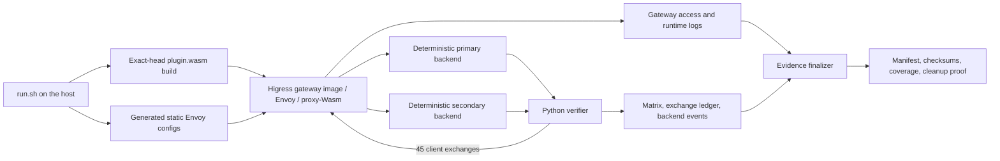

# MCP server Envoy runtime verification

This directory contains a repeatable runtime regression environment for the
Higress WASM `mcp-server` plugin. The harness builds `plugin.wasm` from the exact
checked-out source, loads it into Envoy from the fixed
`higress/gateway:v2.2.3` image, drives MCP requests through real proxy-Wasm
listeners, and records sanitized, machine-readable evidence. The full registry
name and resolved digest are retained in the evidence manifest.

The current clean exact-head baseline is **11 PASS / 0 FAIL**.

## Purpose and validation boundary

This harness verifies the MCP 2026 Tools Baseline at the Envoy data-plane
boundary:

- the built WASM module can be loaded by Envoy's real proxy-Wasm runtime;
- modern `2026-07-28` requests and the supported legacy protocol versions take
  the expected registered, REST, composed, and proxy paths;
- modern response contracts, legacy compatibility, proxy handshakes, error
  behavior, and header isolation hold at runtime;
- each client exchange has exactly one flushed Envoy access record; and
- evidence records the source, plugin, container-image, tool, result, and
  cleanup identities needed to reproduce and compare a run.

The environment is intentionally narrower than a complete Higress deployment.
It uses static Envoy configuration, deterministic Python fixtures, and direct
JSON-RPC requests. It does not exercise the Higress control plane, Helm, kind,
production services, persistent sessions, or deferred MCP capabilities. The
standalone composed endpoint verifies `tools/list` but rejects `tools/call`:
successful composed calls require the separate `mcp-router` routing layer. That
is an architecture boundary, not an `mcp-server` runtime defect.

GitHub Actions currently runs Go tests, official SDK interoperability tests,
and an explicit WASM build, but it does **not** run this real Envoy environment
or upload/save its evidence directory. CI unit-test, coverage, interoperability,
or WASM-build artifacts are not substitutes for runtime evidence produced by
this harness.

## Architecture and data flow



The run proceeds as follows:

1. [`run.sh`](./run.sh) resolves the repository root and source SHA, requires a
   clean tree by default, and creates or accepts an evidence directory outside
   the worktree.
2. Go builds the checked-out `mcp-server` module for `wasip1/wasm` with
   `-trimpath`. The script records the module's SHA256 before startup.
3. [`generate_envoy.py`](./generate_envoy.py) writes the main static Envoy
   configuration plus an isolated configuration that must reject
   `protocolStrategy: auto`.
4. Podman Compose starts two deterministic Python backends, the auto-rejection
   gateway, the main gateway, and a verifier container. Eight main listeners
   select registered, REST, composed, and proxy configurations.
5. [`verify.py`](./verify.py) sends all matrix traffic through the main Envoy
   listeners. The backends record safe event fields so upstream routing,
   protocol metadata, authentication policy, and isolation can be asserted.
6. The gateways are stopped before their logs are collected, ensuring buffered
   access records are flushed. Compose resources are then removed.
7. [`finalize_evidence.py`](./finalize_evidence.py) adds the auto-rejection
   result, checks access-log coverage, writes the manifest and checksums, and
   returns non-zero for any failed matrix or coverage assertion.
8. A completed run deletes the temporary `plugin.wasm`. The build artifact must
   never be committed.

## Directory components

- [`run.sh`](./run.sh) orchestrates source checks, compilation, image pulls,
  Compose lifecycle, log sanitization, evidence finalization, and cleanup.
- [`compose.yaml`](./compose.yaml) defines the two backends, two gateway
  processes, and verifier container.
- [`backend.py`](./backend.py) implements deterministic REST, modern MCP, and
  legacy MCP responses and exposes safe observable event state.
- [`generate_envoy.py`](./generate_envoy.py) generates listeners, routes,
  clusters, plugin configuration, and the invalid-auto configuration.
- [`verify.py`](./verify.py) executes the ten traffic-driven cases and writes
  the client ledger, case matrix, and final backend snapshots.
- [`finalize_evidence.py`](./finalize_evidence.py) adds the eleventh
  configuration-rejection case, verifies access coverage, and writes the
  manifest and SHA256 inventory.
- [`.gitignore`](./.gitignore) excludes local runtime-evidence and Python cache
  artifacts if they are accidentally created in this directory.

## Prerequisites

Run the harness from a Unix-like shell with:

- Git and Bash;
- Go with `GOOS=wasip1` and `GOARCH=wasm` support (Go 1.24 or later for this
  plugin tree);
- host Python 3 for configuration generation and evidence finalization;
- Podman with a running Podman machine or native Podman service;
- `podman compose` backed by `podman-compose` or another compatible external
  Compose provider; and
- network access to download Go modules and pull the fixed gateway and Python
  images when they are not already cached.

Check the local tools before a run:

```bash
git --version
bash --version
go version
python3 --version
podman version
podman compose version
podman info
```

### macOS Podman bind mounts

Podman machine can normally bind-mount shared paths under `/Users`, but it
cannot bind-mount an arbitrary host `/tmp` directory. The default evidence
directory is therefore a sibling of the repository, outside the worktree and
under the same macOS user path.

When setting `RUNTIME_EVIDENCE`, use an absolute, new or empty directory that is
shared with the Podman machine. Do not point it at an arbitrary host `/tmp`
path. A bind-mount error usually means the chosen path is not visible inside the
Podman VM.

## Quick run from a clean exact head

Commit the intended source first, then run from the repository root:

```bash
git status --short
git rev-parse HEAD
./plugins/wasm-go/extensions/mcp-server/testdata/runtime-verification/run.sh
```

`git status --short` must print nothing. The final JSON line should report
`"pass": 11`, `"fail": 0`, and `"access_coverage": "PASS"`; the command
should exit with status 0. The verifier prints an intermediate
`SUMMARY pass=10 fail=0` before the finalizer adds the auto-configuration
rejection case.

The finalizer also prints the absolute evidence path. The current expected
ledger contains 45 recorded client exchanges and 45 Envoy access records. The
matrix contains 35 backend events across its per-case snapshots.

### Choose the evidence directory

Use a fresh absolute path outside the repository for a named or retained run:

```bash
RUNTIME_EVIDENCE=/Users/your-name/higress-mcp-runtime-baseline \
  ./plugins/wasm-go/extensions/mcp-server/testdata/runtime-verification/run.sh
```

The harness does not clear a caller-provided directory. Reusing a directory can
mix stale and current files, so use a new or empty location for every evidence
set.

### Dirty-tree development runs

For local iteration only, bypass the clean-tree guard explicitly:

```bash
RUNTIME_ALLOW_DIRTY=1 \
  RUNTIME_EVIDENCE=/Users/your-name/higress-mcp-runtime-development \
  ./plugins/wasm-go/extensions/mcp-server/testdata/runtime-verification/run.sh
```

Such a manifest records `source_tree_clean: false`. A dirty-tree run is useful
for debugging but is not final exact-head evidence and should not be used as a
review, release, or regression baseline.

## Runtime matrix

The final matrix contains these eleven cases:

1. **Registered modern discover/list/call** verifies a compiled-in Amap tool,
   its tools-only discovery contract, and exactly one real backend call.
2. **REST modern discover/list/call** verifies deterministic REST argument
   mapping and exactly one backend call.
3. **REST invalid arguments and hostile Origin** verifies a tool execution
   error without an upstream request and HTTP 403 Origin rejection.
4. **Composed list and router boundary** verifies deterministic composed tool
   publication and rejects standalone calls that require `mcp-router`.
5. **Three legacy REST versions** runs initialize, initialized, list, and call
   for `2024-11-05`, `2025-03-26`, and `2025-06-18`, while checking that modern
   result fields do not leak into legacy responses.
6. **Modern-to-modern proxy** verifies one stateless upstream RPC per downstream
   RPC, modern metadata, scoped `Mcp-Param-*` forwarding, and credential/session
   header isolation.
7. **Modern-to-legacy proxy** verifies an isolated
   initialize -> initialized -> target-RPC handshake for each list or call and
   exactly six backend events in total.
8. **Default proxy strategy is legacy** verifies all three legacy downstream
   versions, request-scoped upstream handshakes, `/legacy` routing, and exactly
   18 backend events.
9. **Legacy-to-modern remains unsupported** verifies the deferred bridge is
   rejected without upstream probing, fallback, or retry.
10. **Authentication, error, and cross-origin isolation** verifies explicit
    bearer policy, preservation of 401/403 and `WWW-Authenticate`, and no state
    or header leakage from the primary backend to the secondary backend.
11. **Auto strategy rejection** verifies that the deferred
    `protocolStrategy: auto` configuration is rejected before any upstream
    request.

Successful modern results are also checked for `resultType: complete`, effective
server identity, and the applicable `ttlMs: 0` / `cacheScope: private` fields.
Discovery must advertise only implemented versions and tools capabilities.

### Historical proxy fallthrough regression guard

An older revision at `3c5819ed` exposed a request-resume fallthrough bug and
produced **9 PASS / 2 FAIL**. Modern-to-legacy traffic emitted eight backend
events instead of six, while the default-legacy flows emitted 24 instead of 18;
the extra requests forwarded the original downstream RPC after the completed
legacy proxy callout.

The fixed clean exact-head baseline is now **11 PASS / 0 FAIL**. The strict
six-event and 18-event assertions remain intentionally in place as regression
guards. Duplicate RPCs, extra `/mcp` requests, or cross-era
`Mcp-Param-Future` forwarding must not be accepted as a new baseline.

## Evidence artifacts

A completed evidence directory contains:

- `manifest.json`: top-level source, build, image, tool-version, matrix, access,
  sanitization, and cleanup identity.
- `matrix.json`: all case statuses and details, including sanitized per-case
  backend event snapshots and client exchanges.
- `client-exchanges.json`: the 45-exchange ledger with stable request IDs,
  selected request metadata, selected response headers, response bodies, and a
  canonical response-body SHA256.
- `access-coverage.json`: the recorded-exchange and Envoy-access counts plus any
  missing, duplicate, or unexpected request IDs.
- `backend-primary-final.json` and `backend-secondary-final.json`: final safe
  event state for each deterministic backend.
- `backend-auto-state.json`: proof that the rejected auto configuration made no
  upstream request.
- `envoy.yaml` and `envoy-auto.yaml`: the exact generated static Envoy
  configurations used by the run.
- `compose-config.yaml`: the resolved Compose configuration with fixture
  credentials redacted.
- `gateway.log` and `gateway-auto.log`: sanitized Envoy runtime and access logs,
  collected after the gateways stop.
- `podman-version.txt` and `compose-version.txt`: host runtime tool identities.
- `gateway-image-digests.txt` and `backend-image-digests.txt`: resolved image
  digests for the pulled tags.
- `cleanup-proof.txt`: the post-cleanup check for the exact Compose project.
- `SHA256SUMS`: SHA256 values for every retained evidence file except itself.

The main `manifest.json` fields have these meanings:

- `source_sha` and `source_tree_clean` identify the committed code under test.
- `plugin_sha256` identifies the exact temporary WASM bytes loaded by Envoy.
- `gateway_image`, `backend_image`, and their resolved digest arrays identify
  the container inputs; compare digests because tags can move.
- `podman_version` and `compose_version` identify the local orchestration tools.
- `client_exchange_count` and `access_coverage` bind the client ledger to the
  flushed Envoy access log.
- `sanitization` records the evidence redaction policy.
- `cleanup` embeds the cleanup-proof result.

`plugin.wasm` is temporary. Its SHA256 is calculated before the containers
start, then recorded in `manifest.json`; the completed run deletes the file and
does not include it in `SHA256SUMS`. If the script exits before finalization, a
partial evidence directory may still contain `plugin.wasm`. Delete that partial
artifact after diagnosis, and never add it to Git.

## Verify a completed evidence set

Set the absolute path printed by the finalizer:

```bash
EVIDENCE_DIR=/absolute/path/to/higress-mcp-runtime-evidence
```

First verify that none of the retained files changed after finalization:

```bash
if command -v sha256sum >/dev/null 2>&1; then
  (cd "$EVIDENCE_DIR" && sha256sum -c SHA256SUMS)
else
  (cd "$EVIDENCE_DIR" && shasum -a 256 -c SHA256SUMS)
fi
```

Then verify source identity, the 11/0 matrix, the 45/45 access ledger, backend
event count, plugin/image identities, and cleanup proof:

```bash
python3 - "$EVIDENCE_DIR" "$(git rev-parse HEAD)" <<'PY'
import json
import sys
from pathlib import Path

root = Path(sys.argv[1])
expected_source = sys.argv[2]
manifest = json.loads((root / "manifest.json").read_text())
matrix = json.loads((root / "matrix.json").read_text())
coverage = json.loads((root / "access-coverage.json").read_text())
cleanup = (root / "cleanup-proof.txt").read_text().strip()

backend_events = sum(
    len(events)
    for case in matrix["cases"]
    for events in case.get("detail", {}).get("backendEvents", {}).values()
    if isinstance(events, list)
)

assert manifest["source_sha"] == expected_source
assert manifest["source_tree_clean"] is True
assert matrix["summary"] == {"pass": 11, "fail": 0}
assert coverage["status"] == "PASS"
assert coverage["recordedClientExchangeCount"] == 45
assert coverage["accessRecordCount"] == 45
assert not coverage["missingRequestIds"]
assert not coverage["duplicateRequestIds"]
assert not coverage["unexpectedRequestIds"]
assert backend_events == 35
assert len(manifest["plugin_sha256"]) == 64
assert manifest["gateway_resolved_digests"]
assert manifest["backend_resolved_digests"]
assert cleanup.startswith("PASS no containers remain")

print(json.dumps({
    "source_sha": manifest["source_sha"],
    "plugin_sha256": manifest["plugin_sha256"],
    "gateway_digests": manifest["gateway_resolved_digests"],
    "backend_digests": manifest["backend_resolved_digests"],
    "matrix": matrix["summary"],
    "access": [coverage["recordedClientExchangeCount"],
               coverage["accessRecordCount"]],
    "backend_events": backend_events,
    "cleanup": cleanup,
}, indent=2, sort_keys=True))
PY
```

The `SHA256SUMS` check proves retained-file integrity within one evidence set.
The manifest's source, plugin, image, and tool identities establish what ran;
the matrix and ledgers establish behavior. None of those signals alone replaces
the others.

## Re-run and compare regressions

For a future regression check:

1. Start from a clean committed candidate head.
2. Use a fresh evidence directory and retain the previous accepted evidence
   directory unchanged.
3. Verify `SHA256SUMS` independently in both directories.
4. Compare source and plugin SHA values, resolved image digests, Podman/Compose
   versions, matrix summaries, per-case backend events, client responses, access
   coverage, and cleanup proof.
5. Review structured JSON before comparing logs. Container prefixes and log
   ordering can vary even when the protocol behavior is unchanged.

For example:

```bash
OLD_EVIDENCE=/absolute/path/to/accepted-evidence
NEW_EVIDENCE=/absolute/path/to/candidate-evidence

diff -u "$OLD_EVIDENCE/manifest.json" "$NEW_EVIDENCE/manifest.json"
diff -u "$OLD_EVIDENCE/matrix.json" "$NEW_EVIDENCE/matrix.json"
diff -u "$OLD_EVIDENCE/client-exchanges.json" \
  "$NEW_EVIDENCE/client-exchanges.json"
diff -u "$OLD_EVIDENCE/access-coverage.json" \
  "$NEW_EVIDENCE/access-coverage.json"
```

An expected source or plugin SHA change is not itself a regression. Investigate
behavioral differences case by case, and first account for image-digest or tool
version changes. Never weaken strict RPC, event-count, header-isolation, or
access-ledger assertions merely to make a changed run pass.

## Cleanup and troubleshooting

`run.sh` installs a cleanup trap and removes containers, networks, anonymous
volumes, and orphans for its unique Compose project. A successful cleanup writes
`PASS no containers remain ...` to `cleanup-proof.txt`. If a run is interrupted,
inspect only the exact Compose project before removing leftovers; do not remove
unrelated Podman resources.

Common failure boundaries are:

- exit 2: the worktree is dirty and `RUNTIME_ALLOW_DIRTY=1` was not set;
- exit 3: WASM build, Envoy generation, image pull, or identity capture failed;
- exit 4: backend/gateway startup, state capture, stop, or log collection failed;
- exit 1: a matrix assertion, access-coverage check, cleanup check, or evidence
  finalization failed.

For startup and runtime failures:

- confirm `podman info` succeeds and `podman compose version` finds its provider;
- confirm the evidence path is absolute, shared with the Podman machine, and
  writable by the host;
- check image-pull and Go-module network access;
- inspect `gateway.log`, `gateway-auto.log`, `matrix.json`, and the case's
  `backendEvents` / `clientExchanges` before rerunning;
- treat missing or duplicate access IDs as an incomplete or duplicated Envoy
  exchange, not merely a logging cosmetic; and
- use a new evidence directory after a partial run.

## Security and redaction boundary

All configured credentials are deterministic fake fixture values. The harness
redacts those known values from textual Compose and gateway logs. Backend events
store presence or policy-match booleans for credentials and session headers,
not their raw values. The client ledger similarly stores presence flags instead
of Authorization, Cookie, session, or Last-Event-ID values.

This is targeted fixture sanitization, not a general secret scanner. Do not put
real credentials, production endpoints, tenant data, or sensitive request
payloads into this environment. Evidence includes response bodies, request
metadata, backend routing facts, and logs; inspect it before sharing. Keep
evidence outside the repository, do not commit generated files, and use
`RUNTIME_ALLOW_DIRTY=1` only for disposable development diagnosis.
