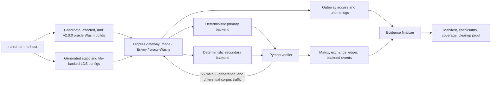

# MCP server Envoy runtime verification

This directory contains a repeatable runtime regression environment for the
Higress WASM `mcp-server` plugin. The harness builds `plugin.wasm` from the exact
checked-out source, loads it into Envoy from the fixed
`higress/gateway:v2.2.3` image, drives MCP requests through real proxy-Wasm
listeners, and records sanitized, machine-readable evidence. The full registry
name and resolved digest are retained in the evidence manifest.

The expected clean exact-head result is **26 PASS / 0 FAIL**.

## Purpose and validation boundary

This harness verifies the MCP 2026 Tools Baseline at the Envoy data-plane
boundary:

- the built WASM module can be loaded by Envoy's real proxy-Wasm runtime;
- modern `2026-07-28` requests and the supported legacy protocol versions take
  the expected registered, REST, composed, and proxy paths;
- modern response contracts, legacy compatibility, proxy handshakes, error
  behavior, and header isolation hold at runtime;
- each main-matrix client exchange has exactly one flushed Envoy access record;
- evidence records the source, plugin, container-image, tool, result, and
  cleanup identities needed to reproduce and compare a run;
- the v2.0.0 oracle `39ec41aab6eb1d40499bed2847085696de0ebb96` accepts
  the compatibility descriptor and constructs the historical REST request,
  while affected revision `c55d9825c90868f50edbff9764a6b3cf2eb13162`
  rejects it;
- an independent malformed URL-template control is rejected by the oracle,
  affected, and candidate revisions; and
- a ten-fixture representative corpus records the oracle, affected, and
  candidate acceptance matrix for semantic and bounded-resource failures,
  including mixed and rule-level configurations;
- one candidate Wasm is exercised against successive valid,
  validation-unavailable, and valid file-backed LDS generations in one Envoy
  process.

The environment is intentionally narrower than a complete Higress deployment.
It uses static Envoy configuration, deterministic Python fixtures, and direct
JSON-RPC requests. It does not exercise the Higress control plane, Helm, kind,
production services, persistent sessions, or deferred MCP capabilities. The
standalone composed endpoint verifies `tools/list` but rejects `tools/call`:
successful composed calls require the separate `mcp-router` routing layer. That
is an architecture boundary, not an `mcp-server` runtime defect.

The generation-transition gateway uses file-backed LDS in one Envoy process.
The verifier atomically replaces the watched DiscoveryResponse with valid,
validation-unavailable, and valid versions, waits for each version in Envoy's
config dump, then sends discovery and invocation traffic through the updated
listener. The harness records the gateway container ID, PID, and start time
before and after the sequence and requires them to remain identical. This is a
real same-process Envoy/proxy-Wasm configuration transition; it does not claim
to exercise the Higress control plane or Kubernetes delivery path.

GitHub Actions currently runs Go tests, official SDK interoperability tests,
and an explicit WASM build, but it does **not** run this real Envoy environment
or upload/save its evidence directory. CI unit-test, coverage, interoperability,
or WASM-build artifacts are not substitutes for runtime evidence produced by
this harness.

## Architecture and data flow



The run proceeds as follows:

The first exact-head attempt for source
`1e0ba0f5730db174ffaa4ab3859f1167b012b33a` is retained read-only at
`/Users/xiao/projects/go/higress-mcp-verify.G2NOis/evidence` as diagnostic,
not acceptance, evidence. It exposed three harness failures: the mixed valid
sibling called an unimplemented backend GET route; three concurrent corpus
Envoys starved LDS/admin progress on a 4 GiB Podman VM; and the baseline plus
three malformed controls were sampled after a fixed two-second sleep while
their logs had only reached `loading 1 listener(s)`. A repaired authoritative
run must use a new clean worktree and a fresh external evidence directory; the
failed directory must not be reused, modified, or deleted.

1. [`run.sh`](./run.sh) resolves the repository root and source SHA, requires a
   clean tree by default, and creates or accepts an evidence directory outside
   the worktree.
2. Go builds the checked-out `mcp-server` module plus archives of affected
   revision `c55d9825c90868f50edbff9764a6b3cf2eb13162` and v2.0.0 oracle
   `39ec41aab6eb1d40499bed2847085696de0ebb96` for `wasip1/wasm` with
   `-trimpath`. It also builds a corpus variant of each revision with the same
   hashed registered-tool fixture needed to represent a bounded `json.Number`
   that REST JSON decoding cannot preserve. The script records all six Wasm
   SHA256 values and removes the temporary archived source trees before startup.
3. [`generate_envoy.py`](./generate_envoy.py) writes the main static Envoy
   configuration plus an isolated configuration that must reject
   `protocolStrategy: auto`. Before any image pull or runtime traffic,
   [`run.sh`](./run.sh) necessarily runs the descriptor oracle's positive cases
   and asserts that both verifier and finalizer return non-zero for deleted
   fields, truncated arrays, and numeric-token-to-string tampering. Descriptor
   mismatch has the dedicated exit code `42`; exit `0` means a false acceptance
   and any other non-zero status means the checker itself failed. Temporary
   self-test inputs are deleted immediately and never enter final evidence;
   the EXIT/INT/TERM cleanup path removes them after success, failure, or
   interruption and is safe to invoke repeatedly.
4. Podman Compose starts two deterministic Python backends. Every Envoy uses
   one worker, and static rejection controls plus the candidate, affected, and
   oracle corpus gateways run sequentially as start -> verify -> stop -> log.
   Before each isolated phase the primary ledger is reset; rejection phases
   wait for both their specific historical error and `plugin start failed`,
   capture a zero-event ledger, and treat premature exit or timeout as a
   harness failure. Backend health and reset operations are bounded and
   retried. Every phase uses an inspected stop gate: a non-zero stop command is
   tolerated only when container inspection proves the service is no longer
   running, and logs are captured only after that gate. This keeps the maximum
   live Wasm footprint bounded on a 4 GiB Podman VM. Nine main listeners select
   registered, REST, composed, and proxy configurations.
5. [`verify.py`](./verify.py) first drives the candidate Wasm through valid ->
   validation-unavailable -> valid file-backed LDS generations in one Envoy
   process, then sends the main matrix traffic. The backends record safe event
   fields so upstream routing,
   protocol metadata, authentication policy, and isolation can be asserted.
6. The gateways are stopped before their logs are collected, ensuring buffered
   access records are flushed. Compose resources are then removed.
7. [`finalize_evidence.py`](./finalize_evidence.py) adds the affected rejection,
   v2.0.0 oracle, malformed-control, generation-transition, and auto-rejection
   results, checks access-log coverage, writes the manifest and checksums, and
   returns non-zero for any failed matrix or coverage assertion.
8. A completed run deletes all six temporary Wasm files. Build artifacts must
   never be committed.

## Directory components

- [`run.sh`](./run.sh) orchestrates source checks, compilation, image pulls,
  Compose lifecycle, log sanitization, evidence finalization, and cleanup.
- [`compose.yaml`](./compose.yaml) defines the two backends, isolated gateway
  services, and verifier container.
- [`backend.py`](./backend.py) implements deterministic REST, modern MCP, and
  legacy MCP responses and exposes safe observable event state.
- [`orchestration_self_test.py`](./orchestration_self_test.py) injects transient
  and permanent admin failures, distinguishes rejection from checker failure,
  and proves the mixed-fixture GET route records exactly one backend event.
- [`lifecycle.sh`](./lifecycle.sh) provides the bounded backend readiness/reset
  and inspected service-stop gates plus injectable static/corpus phase runners;
  [`lifecycle_self_test.sh`](./lifecycle_self_test.sh) fault-injects transient
  and permanent backend failures, stop-command/container-state disagreement,
  and asserts recorded start/verify/stop/log order including early termination
  after a failed stop.
- [`compose_config_self_test.py`](./compose_config_self_test.py) parses the
  provider-resolved Compose JSON and requires each of the eleven Envoy command
  arrays to contain the independent tokens `--concurrency` and `1`.
- [`generate_envoy.py`](./generate_envoy.py) generates listeners, routes,
  clusters, plugin configuration, and the invalid-auto configuration.
- [`typed_canonical.py`](./typed_canonical.py) defines the shared type-tagged
  JSON canonical form, including the numeric lexeme wrapper.
- [`descriptor_self_test.py`](./descriptor_self_test.py) creates and removes
  the positive and intentionally tampered inputs exercised by `run.sh`.
- [`descriptor_gate.sh`](./descriptor_gate.sh) requires exact exit code `42`
  for every tampered input and rejects false acceptance or checker failure.
- [`verify.py`](./verify.py) executes the eleven traffic-driven cases and writes
  the client ledger, case matrix, and final backend snapshots.
- [`finalize_evidence.py`](./finalize_evidence.py) adds the isolated and corpus
  configuration/generation cases, verifies access coverage, and writes the
  manifest and SHA256 inventory.
- [`.gitignore`](./.gitignore) excludes local runtime-evidence and Python cache
  artifacts if they are accidentally created in this directory.

## Prerequisites

Run the harness from a Unix-like shell with:

- Git and Bash;
- Go with `GOOS=wasip1` and `GOARCH=wasm` support (Go 1.24 or later for this
  plugin tree);
- host Python 3 for configuration generation and evidence finalization;
- Podman with a running Podman machine or native Podman service;
- `podman compose` backed by `podman-compose` or another compatible external
  Compose provider; and
- network access to download Go modules and pull the fixed gateway and Python
  images when they are not already cached.

Check the local tools before a run:

```bash
git --version
bash --version
go version
python3 --version
podman version
podman compose version
podman info
```

### macOS Podman bind mounts

Podman machine can normally bind-mount shared paths under `/Users`, but it
cannot bind-mount an arbitrary host `/tmp` directory. The default evidence
directory is therefore a sibling of the repository, outside the worktree and
under the same macOS user path.

When setting `RUNTIME_EVIDENCE`, use an absolute, new or empty directory that is
shared with the Podman machine. Do not point it at an arbitrary host `/tmp`
path. A bind-mount error usually means the chosen path is not visible inside the
Podman VM.

## Quick run from a clean exact head

Commit the intended source first, then run from the repository root:

```bash
git status --short
git rev-parse HEAD
./plugins/wasm-go/extensions/mcp-server/testdata/runtime-verification/run.sh
```

The descriptor-only negative stage can also be reproduced before Podman is
started. After generating an evidence directory and running
`descriptor_self_test.py prepare`, this command must print `PASS`; substitute
`finalize_evidence.py` to exercise the second consumer. `run.sh` performs both
consumers and all three tamper cases automatically.

```bash
RUNTIME_EVIDENCE=$(mktemp -d)
RUNTIME_OUT="$RUNTIME_EVIDENCE" \
  python3 ./plugins/wasm-go/extensions/mcp-server/testdata/runtime-verification/generate_envoy.py
python3 ./plugins/wasm-go/extensions/mcp-server/testdata/runtime-verification/descriptor_self_test.py \
  prepare "$RUNTIME_EVIDENCE"
if RUNTIME_EVIDENCE="$RUNTIME_EVIDENCE" RUNTIME_DESCRIPTOR_SELF_TEST=1 \
  RUNTIME_DESCRIPTOR_FIXTURE=numeric-comparison-limit \
  RUNTIME_DESCRIPTOR_ACTUAL="$RUNTIME_EVIDENCE/.descriptor-selftest-number-as-string.json" \
  python3 ./plugins/wasm-go/extensions/mcp-server/testdata/runtime-verification/verify.py; then
  checker_status=0
else
  checker_status=$?
fi
case "$checker_status" in
  42) echo "PASS: numeric string tamper was rejected" ;;
  0) echo "FAIL: numeric string tamper was accepted"; exit 1 ;;
  *) echo "FAIL: descriptor checker failed with $checker_status"; exit 1 ;;
esac
python3 ./plugins/wasm-go/extensions/mcp-server/testdata/runtime-verification/descriptor_self_test.py \
  cleanup "$RUNTIME_EVIDENCE"
```

`git status --short` must print nothing. The final JSON line should report
`"pass": 26`, `"fail": 0`, and `"access_coverage": "PASS"`; the command
should exit with status 0. The verifier prints an intermediate
`SUMMARY pass=11 fail=0` before the finalizer adds the affected baseline,
oracle, corpus, malformed-control, dynamic-generation, and auto-configuration
cases.

The finalizer also prints the absolute evidence path. The expected ledger
contains 55 recorded client exchanges and 55 Envoy access records. The matrix
contains 59 backend events across its per-case snapshots.

### Choose the evidence directory

Use a fresh absolute path outside the repository for a named or retained run:

```bash
RUNTIME_EVIDENCE=/Users/your-name/higress-mcp-runtime-baseline \
  ./plugins/wasm-go/extensions/mcp-server/testdata/runtime-verification/run.sh
```

The harness does not clear a caller-provided directory. Reusing a directory can
mix stale and current files, so use a new or empty location for every evidence
set.

### Dirty-tree development runs

For local iteration only, bypass the clean-tree guard explicitly:

```bash
RUNTIME_ALLOW_DIRTY=1 \
  RUNTIME_EVIDENCE=/Users/your-name/higress-mcp-runtime-development \
  ./plugins/wasm-go/extensions/mcp-server/testdata/runtime-verification/run.sh
```

Such a manifest records `source_tree_clean: false`. A dirty-tree run is useful
for debugging but is not final exact-head evidence and should not be used as a
review, release, or regression baseline.

If a registry is temporarily rate-limited and both fixed images already exist
locally, a dirty development run may also set `RUNTIME_SKIP_PULL=1`. The harness
still records the cached resolved digests. This flag is rejected unless
`RUNTIME_ALLOW_DIRTY=1`; clean exact-head evidence always refreshes both tags.

## Runtime matrix

The final matrix contains these 26 cases. The first eleven are driven
through the main gateway:

1. **Registered modern discover/list/call** verifies a compiled-in Amap tool,
   its tools-only discovery contract, and exactly one real backend call.
2. **REST modern discover/list/call** verifies deterministic REST argument
   mapping and exactly one backend call.
3. **REST invalid arguments and hostile Origin** verifies a tool execution
   error without an upstream request and HTTP 403 Origin rejection.
4. **Composed list and router boundary** verifies deterministic composed tool
   publication and rejects standalone calls that require `mcp-router`.
5. **Three legacy REST versions** runs initialize, initialized, list, and call
   for `2024-11-05`, `2025-03-26`, and `2025-06-18`, while checking that modern
   result fields do not leak into legacy responses.
6. **REST schema compatibility** publishes the pinned array/string-enum
   descriptor to modern and legacy discovery, blocks modern invocation with
   the exact `schema_validation_unavailable` JSON-RPC error and zero affected
   upstream calls, keeps an unrelated valid tool callable before and after the
   blocked call, and preserves the legacy method, path, query, header,
   conversion, and JSON-body mapping for all three retained legacy versions.
7. **Modern-to-modern proxy** verifies one stateless upstream RPC per downstream
   RPC, modern metadata, scoped `Mcp-Param-*` forwarding, and credential/session
   header isolation.
8. **Modern-to-legacy proxy** verifies an isolated
   initialize -> initialized -> target-RPC handshake for each list or call and
   exactly six backend events in total.
9. **Default proxy strategy is legacy** verifies all three legacy downstream
   versions, request-scoped upstream handshakes, `/legacy` routing, and exactly
   18 backend events.
10. **Legacy-to-modern remains unsupported** verifies the deferred bridge is
   rejected without upstream probing, fallback, or retry.
11. **Authentication, error, and cross-origin isolation** verifies explicit
    bearer policy, preservation of 401/403 and `WWW-Authenticate`, and no state
    or header leakage from the primary backend to the secondary backend.
12. **Affected revision rejection** builds revision `c55d9825...`, loads the same
    affected descriptor, records the baseline Wasm hash and compiler rejection,
    and proves zero upstream activity.
13. **v2.0.0 compatibility oracle** builds `39ec41aa...`, loads the identical
    descriptor, lists it, invokes it, and asserts the historical method, path,
    query, header conversion, JSON body, and one upstream call.
14. **Malformed non-Schema control** loads an invalid URL template with all
    three revisions and requires each plugin configuration to be rejected with
    zero upstream activity.
15-24. **Representative schema corpus** runs unsupported and contradictory
    semantics, byte/depth/node/collection/enum/numeric-comparison bounds,
    mixed valid plus invalid tools, and rule-level configuration against the
    same oracle, affected, and candidate revisions. Each fixture records its
    expected and actual acceptance. Candidate modern discovery and candidate/
    oracle legacy discovery must match an independently generated full
    input-schema SHA256 for every fixture; replacing the schema with `{}`,
    truncating an array, or deleting a field therefore fails the run. Candidate
    traffic must list the original descriptor and block modern invocation with
    `-32603` and zero upstream
    activity; the mixed fixture also requires the complete modern success
    result contract (`resultType=complete`, server metadata, non-empty content,
    and `isError=false`) plus exactly
    one `GET /corpus/valid` backend event from its valid sibling, and the rule-level
    fixture verifies the unaffected global fallback. Oracle and candidate
    legacy discovery must succeed; the nine REST
    fixtures also prove method, path, query, header, JSON body, and exactly one
    upstream call per revision. The affected revision must retain a distinct
    logged rejection for every fixture. The numeric fixture uses the same
    hashed registered-tool source overlay for each revision because Go's normal
    REST JSON unmarshal converts numbers to `float64` before schema preparation.
    Descriptor hashes encode a type-tagged UTF-8 JSON tree with lexically sorted
    object keys. Integer and floating tokens are tagged as numbers and retain
    their source lexeme, while strings use a different tag; therefore numeric
    `json.Number("1e5000")` is stable across Python and Go revisions but cannot
    collide with the JSON string `"1e5000"`.
25. **Same-process dynamic generation transition** atomically updates a
    file-backed LDS source in one Envoy process and proves validated ->
    validation-unavailable -> validated descriptors, call behavior, and backend
    counts of 1 -> 0 -> 1. Container ID, PID, and start time must remain stable.
26. **Auto strategy rejection** verifies that the deferred
    `protocolStrategy: auto` configuration is rejected before any upstream
    request.

Successful modern results are also checked for `resultType: complete`, effective
server identity, and the applicable `ttlMs: 0` / `cacheScope: private` fields.
Discovery must advertise only implemented versions and tools capabilities.

### Historical proxy fallthrough regression guard

An older revision at `3c5819ed` exposed a request-resume fallthrough bug and
produced **9 PASS / 2 FAIL**. Modern-to-legacy traffic emitted eight backend
events instead of six, while the default-legacy flows emitted 24 instead of 18;
the extra requests forwarded the original downstream RPC after the completed
legacy proxy callout.

The pre-compatibility clean exact-head baseline was **11 PASS / 0 FAIL**. The strict
six-event and 18-event assertions remain intentionally in place as regression
guards. Duplicate RPCs, extra `/mcp` requests, or cross-era
`Mcp-Param-Future` forwarding must not be accepted as a new baseline.

## Evidence artifacts

A completed evidence directory contains:

- `manifest.json`: top-level source, build, image, tool-version, matrix, access,
  sanitization, and cleanup identity.
- `matrix.json`: all case statuses and details, including sanitized per-case
  backend event snapshots and client exchanges.
- `client-exchanges.json`: the 55-exchange ledger with stable request IDs,
  selected request metadata, selected response headers, response bodies, and a
  canonical response-body SHA256.
- `access-coverage.json`: the recorded-exchange and Envoy-access counts plus any
  missing, duplicate, or unexpected request IDs.
- `backend-primary-final.json` and `backend-secondary-final.json`: final safe
  event state for each deterministic backend.
- `backend-auto-state.json`: proof that the rejected auto configuration made no
  upstream request.
- `backend-baseline-state.json` and `gateway-baseline.log`: affected-revision
  zero-upstream and compiler-rejection proof.
- `oracle-verification.json`, `backend-oracle-state.json`, and
  `gateway-oracle.log`: v2.0.0 list, descriptor, REST mapping, backend, and
  plugin-start proof.
- `backend-control-*-state.json`, the aggregate `backend-control-state.json`,
  and `gateway-control-*.log`: per-revision historical malformed URL-template
  rejection and zero-upstream proof.
- `corpus-manifest.json`, `corpus-*.json`, `gateway-corpus-*.log`,
  `envoy-corpus-*.yaml`, and `lds-corpus-*.yaml`: per-fixture, per-revision
  acceptance, protocol behavior, REST mapping, LDS rejection, and configuration
  identity for the representative corpus.
- `generation-transition.json`, `generation-process-*.txt`, and
  `gateway-generation.log`: per-generation descriptors, responses, backend
  events, exchanges, runtime log, and stable process identity.
- `envoy.yaml`, `envoy-auto.yaml`, `envoy-baseline.yaml`, `envoy-oracle.yaml`,
  `envoy-control-*.yaml`, `envoy-generation.yaml`, and
  `lds-generation-*.yaml`: the exact static and dynamic Envoy configurations.
- `compose-config.yaml` and `compose-config.json`: the provider-resolved Compose
  configuration with fixture credentials redacted; the JSON form is the input
  to the structured Envoy concurrency check.
- `gateway.log` and `gateway-auto.log`: sanitized Envoy runtime and access logs,
  collected after the gateways stop.
- `podman-version.txt` and `compose-version.txt`: host runtime tool identities.
- `gateway-image-digests.txt` and `backend-image-digests.txt`: resolved image
  digests for the pulled tags.
- `cleanup-proof.txt`: the post-cleanup check for the exact Compose project.
- `lifecycle-diagnostics.log`: bounded stop/backend lifecycle errors; empty for
  a successful run and retained when a lifecycle gate fails.
- `SHA256SUMS`: SHA256 values for every retained evidence file except itself.

The main `manifest.json` fields have these meanings:

- `source_sha` and `source_tree_clean` identify the committed code under test.
- `plugin_sha256` identifies the exact temporary WASM bytes loaded by Envoy.
- `baseline_source_sha` and `baseline_plugin_sha256` identify the independently
  built pinned rejection baseline.
- `oracle_source_sha` and `oracle_plugin_sha256` identify the independently
  built v2.0.0 acceptance oracle.
- `corpus_fixture_sha256` and `corpus_plugin_sha256` bind the common registered
  numeric fixture source and all three derived corpus Wasm modules.
- `corpus-manifest.json.expectedInputSchemaSha256` binds each fixture to its
  generator-owned canonical descriptor rather than hashing the observed
  `tools/list` response as its own oracle.
- `gateway_image`, `backend_image`, and their resolved digest arrays identify
  the container inputs; compare digests because tags can move.
- `podman_version` and `compose_version` identify the local orchestration tools.
- `client_exchange_count` and `access_coverage` bind the client ledger to the
  flushed Envoy access log.
- `sanitization` records the evidence redaction policy.
- `cleanup` embeds the cleanup-proof result.

The three exact-revision Wasm files and three `corpus-plugin-*.wasm` files are
temporary. Their SHA256 values are calculated before containers start and
recorded in `manifest.json`; the completed run deletes all six and excludes
them from `SHA256SUMS`. If the script exits before finalization, delete any
partial artifact after diagnosis and never add it to Git.

## Verify a completed evidence set

Set the absolute path printed by the finalizer:

```bash
EVIDENCE_DIR=/absolute/path/to/higress-mcp-runtime-evidence
```

First verify that none of the retained files changed after finalization:

```bash
if command -v sha256sum >/dev/null 2>&1; then
  (cd "$EVIDENCE_DIR" && sha256sum -c SHA256SUMS)
else
  (cd "$EVIDENCE_DIR" && shasum -a 256 -c SHA256SUMS)
fi
```

Then verify source identity, the 26/0 matrix, the 55/55 main access ledger, backend
event count, plugin/image identities, and cleanup proof:

```bash
python3 - "$EVIDENCE_DIR" "$(git rev-parse HEAD)" <<'PY'
import json
import sys
from pathlib import Path

root = Path(sys.argv[1])
expected_source = sys.argv[2]
manifest = json.loads((root / "manifest.json").read_text())
matrix = json.loads((root / "matrix.json").read_text())
coverage = json.loads((root / "access-coverage.json").read_text())
cleanup = (root / "cleanup-proof.txt").read_text().strip()

backend_events = sum(
    len(events)
    for case in matrix["cases"]
    for events in case.get("detail", {}).get("backendEvents", {}).values()
    if isinstance(events, list)
)

assert manifest["source_sha"] == expected_source
assert manifest["source_tree_clean"] is True
assert manifest["baseline_source_sha"] == "c55d9825c90868f50edbff9764a6b3cf2eb13162"
assert manifest["oracle_source_sha"] == "39ec41aab6eb1d40499bed2847085696de0ebb96"
assert matrix["summary"] == {"pass": 26, "fail": 0}
assert coverage["status"] == "PASS"
assert coverage["recordedClientExchangeCount"] == 55
assert coverage["accessRecordCount"] == 55
assert not coverage["missingRequestIds"]
assert not coverage["duplicateRequestIds"]
assert not coverage["unexpectedRequestIds"]
assert backend_events == 59
assert len(manifest["plugin_sha256"]) == 64
assert len(manifest["baseline_plugin_sha256"]) == 64
assert len(manifest["oracle_plugin_sha256"]) == 64
assert len(manifest["corpus_fixture_sha256"]) == 64
assert all(len(value) == 64 for value in manifest["corpus_plugin_sha256"].values())
assert manifest["gateway_resolved_digests"]
assert manifest["backend_resolved_digests"]
assert cleanup.startswith("PASS no containers remain")

print(json.dumps({
    "source_sha": manifest["source_sha"],
    "plugin_sha256": manifest["plugin_sha256"],
    "baseline_plugin_sha256": manifest["baseline_plugin_sha256"],
    "oracle_plugin_sha256": manifest["oracle_plugin_sha256"],
    "corpus_plugin_sha256": manifest["corpus_plugin_sha256"],
    "gateway_digests": manifest["gateway_resolved_digests"],
    "backend_digests": manifest["backend_resolved_digests"],
    "matrix": matrix["summary"],
    "access": [coverage["recordedClientExchangeCount"],
               coverage["accessRecordCount"]],
    "backend_events": backend_events,
    "cleanup": cleanup,
}, indent=2, sort_keys=True))
PY
```

The `SHA256SUMS` check proves retained-file integrity within one evidence set.
The manifest's source, plugin, image, and tool identities establish what ran;
the matrix and ledgers establish behavior. None of those signals alone replaces
the others.

## Re-run and compare regressions

For a future regression check:

1. Start from a clean committed candidate head.
2. Use a fresh evidence directory and retain the previous accepted evidence
   directory unchanged.
3. Verify `SHA256SUMS` independently in both directories.
4. Compare source and plugin SHA values, resolved image digests, Podman/Compose
   versions, matrix summaries, per-case backend events, client responses, access
   coverage, and cleanup proof.
5. Review structured JSON before comparing logs. Container prefixes and log
   ordering can vary even when the protocol behavior is unchanged.

For example:

```bash
OLD_EVIDENCE=/absolute/path/to/accepted-evidence
NEW_EVIDENCE=/absolute/path/to/candidate-evidence

diff -u "$OLD_EVIDENCE/manifest.json" "$NEW_EVIDENCE/manifest.json"
diff -u "$OLD_EVIDENCE/matrix.json" "$NEW_EVIDENCE/matrix.json"
diff -u "$OLD_EVIDENCE/client-exchanges.json" \
  "$NEW_EVIDENCE/client-exchanges.json"
diff -u "$OLD_EVIDENCE/access-coverage.json" \
  "$NEW_EVIDENCE/access-coverage.json"
```

An expected source or plugin SHA change is not itself a regression. Investigate
behavioral differences case by case, and first account for image-digest or tool
version changes. Never weaken strict RPC, event-count, header-isolation, or
access-ledger assertions merely to make a changed run pass.

## Cleanup and troubleshooting

`run.sh` installs a cleanup trap and removes containers, networks, anonymous
volumes, and orphans for its unique Compose project. A successful cleanup writes
`PASS no containers remain ...` to `cleanup-proof.txt`. If a run is interrupted,
inspect only the exact Compose project before removing leftovers; do not remove
unrelated Podman resources.

Common failure boundaries are:

- exit 2: the worktree is dirty and `RUNTIME_ALLOW_DIRTY=1` was not set;
- exit 3: WASM build, Envoy generation, image pull, or identity capture failed;
- exit 4: backend/gateway startup, state capture, stop, or log collection failed;
- exit 1: a matrix assertion, access-coverage check, cleanup check, or evidence
  finalization failed.

For startup and runtime failures:

- confirm `podman info` succeeds and `podman compose version` finds its provider;
- confirm the evidence path is absolute, shared with the Podman machine, and
  writable by the host;
- check image-pull and Go-module network access;
- inspect `gateway.log`, `gateway-auto.log`, `gateway-baseline.log`,
  `gateway-generation.log`, `matrix.json`, and the case's
  `backendEvents` / `clientExchanges` before rerunning;
- treat missing or duplicate access IDs as an incomplete or duplicated Envoy
  exchange, not merely a logging cosmetic; and
- use a new evidence directory after a partial run.

## Security and redaction boundary

All configured credentials are deterministic fake fixture values. The harness
redacts those known values from textual Compose and gateway logs. Backend events
store presence or policy-match booleans for credentials and session headers,
not their raw values. The client ledger similarly stores presence flags instead
of Authorization, Cookie, session, or Last-Event-ID values.

This is targeted fixture sanitization, not a general secret scanner. Do not put
real credentials, production endpoints, tenant data, or sensitive request
payloads into this environment. Evidence includes response bodies, request
metadata, backend routing facts, and logs; inspect it before sharing. Keep
evidence outside the repository, do not commit generated files, and use
`RUNTIME_ALLOW_DIRTY=1` only for disposable development diagnosis.
