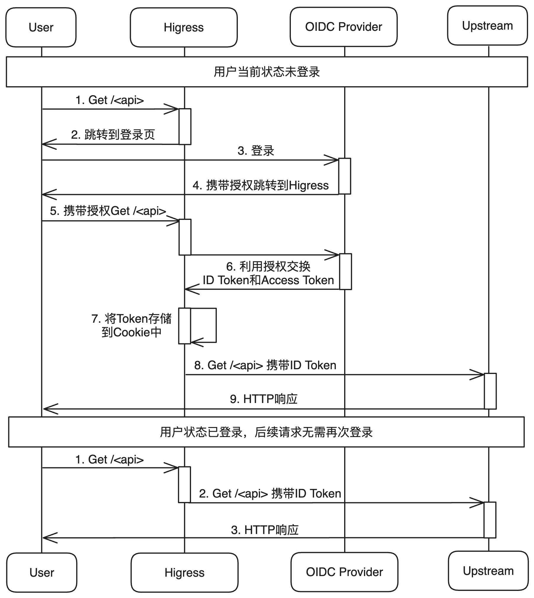
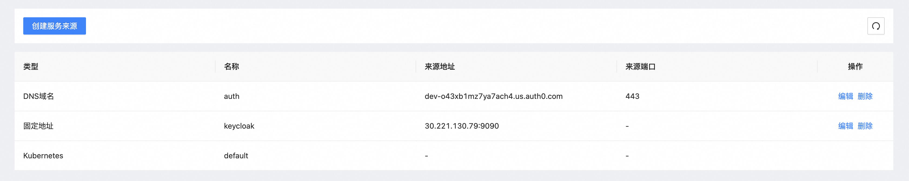
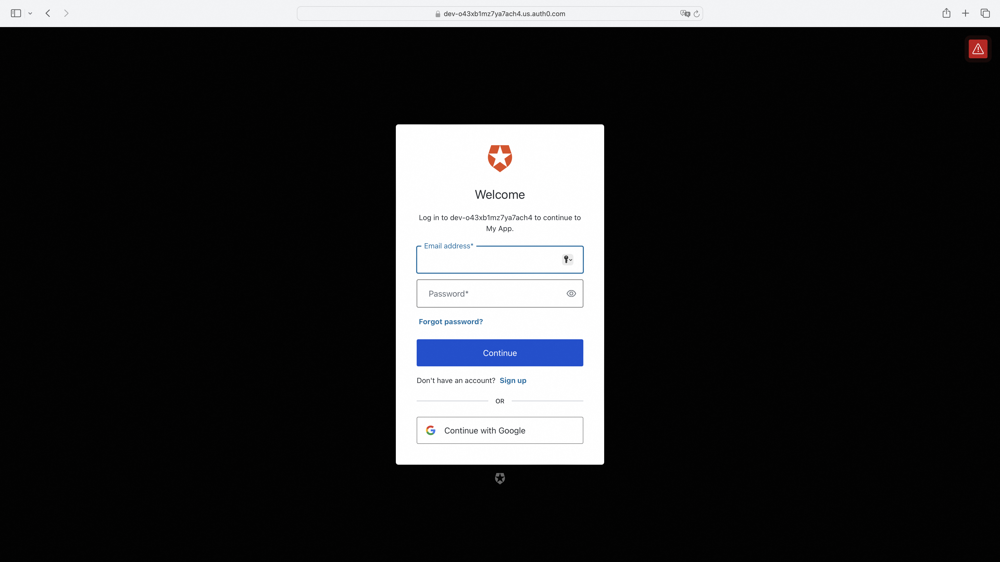
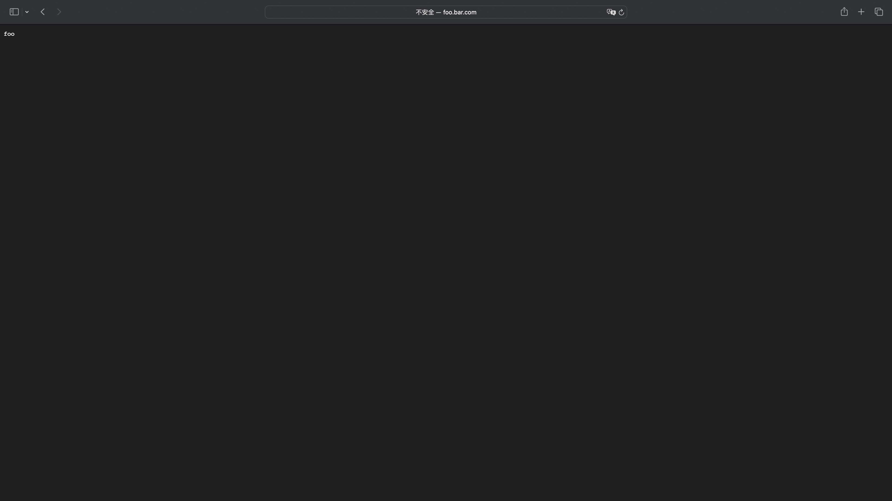
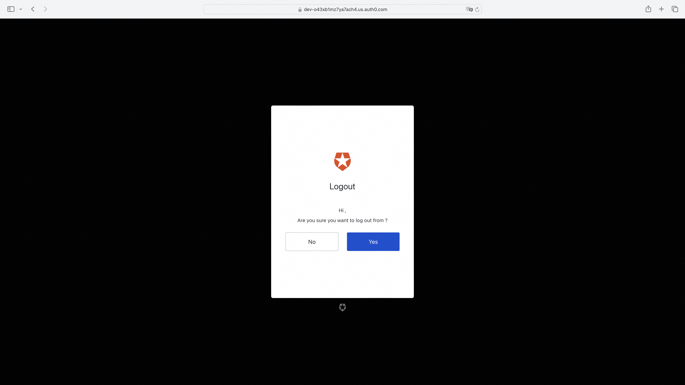
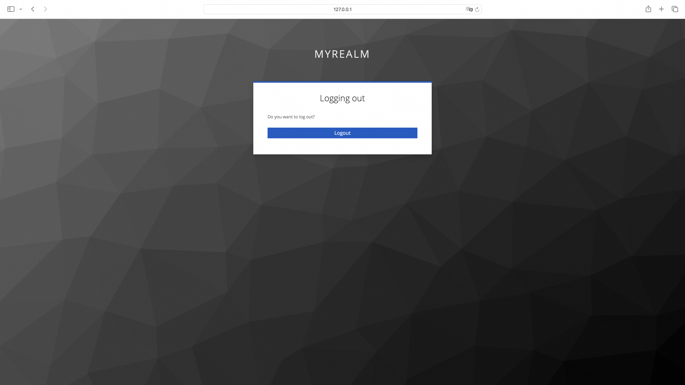

# OIDC Wasm 插件

### 简介

本仓库提供了一个高度可集成的Wasm插件支持OpenID Connect（OIDC）身份认证，同时强化了对跨站请求伪造（CSRF）攻击的防御能力，支持OpenID Connect协议中的Logout Endpoint。在通过Wasm插件OIDC验证后的请求会携带 `Authorization`的标头对应ID Token。

### OIDC 流程

#### 流程图
<p align="center">
  
</p>

#### OIDC 流程解析

1. 浏览器访问对应api `curl foo.bar.com/foo`

2. Higress响应跳转OIDC Provider登录页携带client_id、response_type、scope等OIDC认证的参数并设置csrf cookie防御CSRF攻击
   > HTTP/1.1 302 Found
   >
   > location: `http://127.0.0.1:9090/realms/myrealm/protocol/openid-connect/auth?approval_prompt=force&client_id=myclient&redirect_uri=http%3A%2F%2Ffoo.bar.com%2Foauth2%2Fcallback&response_type=code&scope=openid+email&state=3Y9ARxuuh9m0q-RjdRhgNvKfo3soCB26-fho28gmGnw%3A%2Fheaders`
   >
   >set-cookie:_oauth2_proxy_csrf=LPruATEDgcdmelr8zScD_ObhsbP4zSzvcgmPlcNDcJpFJ0OvhxP2hFotsU-kZnYxd5KsIjzeIXGTOjf8TKcbTHbDIt-aQoZORXI_0id3qeY0Jt78223DPeJ1xBqa8VO0UiEOUFOR53FGxirJOdKFxaAvxDFb1Ok=|1718962455|V1QGWyjQ4hMNOQ4Jtf17HeQJdVqHdt5d65uraFduMIU=; Path=/; Expires=Fri, 21 Jun 2024 08:06:20 GMT; HttpOnly

3. 在登录页进行登录


4. 携带授权跳转回Higress并携带了state参数用于验证CSRF Cookie，code用于交换Token

   > HTTP/1.1 302 Found
   >
   > location: `http://foo.bar.com/oauth2/callback?state=nT06xdCqn4IqemzBRV5hmO73U_hCjskrH_VupPqdcdw%3A%2Ffoo&session_state=d7ea733a-73f3-4838-9395-7172f334b54d&iss=http%3A%2F%2F127.0.0.1%3A9090%2Frealms%2Fmyrealm&code=1084eb9a-dc19-44fd-bcdd-9f2f8a494183.d7ea733a-73f3-4838-9395-7172f334b54d.f9b87a15-5b6e-4da9-bf9b-e7e539293fba`

5. 利用授权交换ID Token和Access Token

6. 将获得的ID Token和Access Token加密存储在Cookie中，用于后续用户登录状态的验证

7. 携带 Authorization的标头对应ID Token访问对应api

8. 后端服务根据ID Token获取用户信息并返回对应的Http响应

### 配置说明

| Option                        | Type         | Description                                                  | Default           |
| ----------------------------- | ------------ | ------------------------------------------------------------ | ----------------- |
| cookie_name                   | string       | the name of the cookie that the oauth_proxy creates. Should be changed to use a [cookie prefix](https://developer.mozilla.org/en-US/docs/Web/HTTP/Cookies#cookie_prefixes) (`__Host-` or `__Secure-`) if `--cookie-secure` is set. | `"_oauth2_proxy"` |
| cookie_secret                 | string       | the seed string for secure cookies (optionally base64 encoded) |                   |
| cookie_domains                | string\|list | Optional cookie domains to force cookies to (e.g. `.yourcompany.com`). The longest domain matching the request's host will be used (or the shortest cookie domain if there is no match). |                   |
| cookie_path                   | string       | an optional cookie path to force cookies to (e.g. `/poc/`)   | `"/"`             |
| cookie_expire                 | duration     | expire timeframe for cookie. If set to 0, cookie becomes a session-cookie which will expire when the browser is closed. | 168h0m0s          |
| cookie_refresh                | duration     | refresh the cookie after this duration; `0` to disable       |                   |
| cookie_secure                 | bool         | set [secure (HTTPS only) cookie flag](https://owasp.org/www-community/controls/SecureFlag) | true              |
| cookie_httponly               | bool         | set HttpOnly cookie flag                                     | true              |
| cookie_samesite               | string       | set SameSite cookie attribute (`"lax"`, `"strict"`, `"none"`, or `""`). | `""`              |
| cookie_csrf_per_request       | bool         | Enable having different CSRF cookies per request, making it possible to have parallel requests. | false             |
| cookie_csrf_expire            | duration     | expire timeframe for CSRF cookie                             | 15m               |
| client_id                     | string       | the OAuth Client ID                                          |                   |
| client_secret                 | string       | the OAuth Client Secret                                      |                   |
| provider                      | string       | OAuth provider                                               | oidc              |
| pass_authorization_header     | bool         | pass OIDC IDToken to upstream via Authorization Bearer header | true              |
| oidc_issuer_url               | string       | the OpenID Connect issuer URL, e.g. `"https://dev-o43xb1mz7ya7ach4.us.auth0.com"` |                   |
| oidc_verifier_request_timeout | uint32       | OIDC verifier discovery request timeout                      | 500(ms)           |
| redeem_timeout                | uint32       | OIDC redeem token request timeout                            | 500(ms)           |
| scope                         | string       | OAuth scope specification                                    |                   |
| redirect_url                  | string       | the OAuth Redirect URL, e.g. `"https://internalapp.yourcompany.com/oauth2/callback"` |                   |
| service_source                | string       | source of registration for the OIDC service (dns or ip)      |                   |
| service_name                  | string       | registered name of the OIDC service                          |                   |
| service_port                  | int64        | service port of the OIDC service                             |                   |
| service_host                  | string       | host of the OIDC service when type is ip                     |                   |
| service_domain                | string       | domain of the oidc service when the type is DNS              |                   |

### 生成 Cookie Secret

``` python
python -c 'import os,base64; print(base64.urlsafe_b64encode(os.urandom(32)).decode())'
```

### 注销用户

为了注销用户，需将他们重定向到`/oauth2/sign_out`这个端点。这个端点仅移除oauth2-proxy自己设置的cookie，也就是说，用户仍然在认证提供商那里保持登录状态，并且在再次访问应用时可能会自动重新登录。之后，您还需要使用`rd`查询参数将用户重定向到认证提供商的注销页面，即重定向用户到类似如下地址（注意URL编码！）：

```
/oauth2/sign_out?rd=https%3A%2F%2Fmy-oidc-provider.example.com%2Fsign_out_page
```

或者，可以在`X-Auth-Request-Redirect`头部中包含重定向URL：

```
GET /oauth2/sign_out HTTP/1.1
X-Auth-Request-Redirect: https://my-oidc-provider/sign_out_page
...
```

（如果您的OIDC提供商支持会话管理和发现，那么"sign_out_page"应该是从[metadata](https://openid.net/specs/openid-connect-discovery-1_0.html#ProviderConfig)中获取的`end_session_endpoint`

**注**：想要重定向到的域名（例如示例中的`my-oidc-provider.example.com`）必须添加到`whitelist_domains`配置选项中，否则重定向将会被忽略。确保包含实际的域名和端口，而不是完整的URL（例如，应使用"localhost:8081"而非"[http://localhost:8081](http://localhost:8081/)")。

### OIDC with auth0

#### 配置 auth0 账户

- 登录到开发人员 Okta 网站 [Developer Auth0 site](https://auth0.com/)
- 注册测试 web 应用程序

#### Higress 配置服务来源

* 在Higress服务来源中创建auth0 DNS来源



#### Auth0 Ingress 配置 

```yaml
apiVersion: networking.k8s.io/v1
kind: Ingress
metadata:
  name: auth0-ingress
  annotations:
    higress.io/destination: auth.dns
    higress.io/backend-protocol: "HTTPS"
    higress.io/ignore-path-case: "false"
spec:
  ingressClassName: higress
  rules:
    - host: foo.bar.com
      http:
        paths:
          - path: /
            pathType: Prefix
            backend:
              resource:
                apiGroup: networking.higress.io
                kind: McpBridge
                name: default
```

#### Wasm 插件配置

```yaml
redirect_url: 'http://foo.bar.com/oauth2/callback'
oidc_issuer_url: 'https://dev-o43xb1mz7ya7ach4.us.auth0.com/'
client_id: 'YagFqRD9tfNIaac5BamjhsSatjrAnsnZ'
client_secret: 'ekqv5XoZuMFtYms1NszEqRx03qct6BPvGeJUeptNG4y09PrY16BKT9IWezTrrhJJ'
scope: 'openid email'
cookie_secret: 'nqavJrGvRmQxWwGNptLdyUVKcBNZ2b18Guc1n_8DCfY='
cookie_secure: false
service_domain: 'dev-o43xb1mz7ya7ach4.us.auth0.com'
service_name: 'auth'
service_port: 443
service_source: 'dns'
oidc_verifier_request_timeout: 2000
whitelist_domains:
    - 'dev-o43xb1mz7ya7ach4.us.auth0.com'
```

**注**：必须先配置服务来源及oidc provider ingress，wasm插件在初始化时需要访问配置的服务获取openid-configuration

#### 访问服务页面，未登陆的话进行跳转



#### 登陆成功跳转到服务页面



#### 访问登出跳转到登出页面

```
http://foo.bar.com/oauth2/sign_out?rd=https%3A%2F%2Fdev-o43xb1mz7ya7ach4.us.auth0.com%2Foidc%2Flogout
```



### OIDC with keycloak

#### Get started with keycloak on docker

<https://www.keycloak.org/getting-started/getting-started-docker> 

#### Higress 配置服务来源

* 在Higress服务来源中创建Keycloak固定地址服务


#### Keycloak Ingress 配置 

```yaml
apiVersion: networking.k8s.io/v1
kind: Ingress
metadata:
  name: keycloak-ingress
  annotations:
    higress.io/destination: keycloak.static
    higress.io/backend-protocol: "HTTP"
    higress.io/ignore-path-case: "false"
spec:
  ingressClassName: higress
  rules:
    - host: foo.bar.com
      http:
        paths:
          - path: /
            pathType: Prefix
            backend:
              resource:
                apiGroup: networking.higress.io
                kind: McpBridge
                name: default
```

#### Wasm 插件配置

```yaml
redirect_url: 'http://foo.bar.com/oauth2/callback'
oidc_issuer_url: 'http://127.0.0.1:9090/realms/myrealm'
client_id: 'myclient'
client_secret: 'PgSvuK7M4GYMPUaO0naQteKhpWYDpBYE'
scope: 'openid email offline_access'
cookie_secret: 'nqavJrGvRmQxWwGNptLdyUVKcBNZ2b18Guc1n_8DCfY='
cookie_secure: false
service_name: 'keycloak'
service_port: 80
service_source: 'ip'
service_host: '127.0.0.1:9090'
oidc_verifier_request_timeout: 2000
whitelist_domains:
    - '127.0.0.1:9090'
```

#### 访问服务页面，未登陆的话进行跳转


#### 登陆成功跳转到服务页面


#### 访问登出跳转到登出页面

```
http://foo.bar.com/oauth2/sign_out?rd=http%3A%2F%2F127.0.0.1:9090%2Frealms%2Fmyrealm%2Fprotocol%2Fopenid-connect%2Flogout
```

