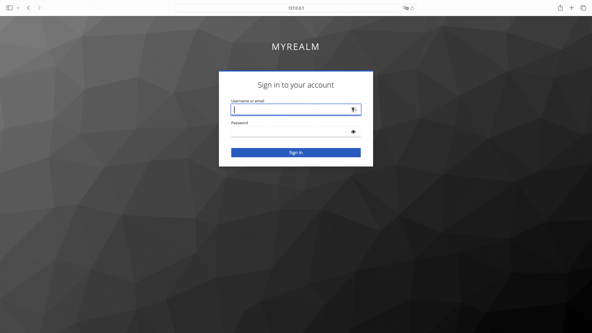

# OIDC Wasm 插件

### 简介

实现了Wasm插件支持OIDC认证能力

### 配置说明

| Option                        | Type         | Description                                                  | Default           |
| ----------------------------- | ------------ | ------------------------------------------------------------ | ----------------- |
| cookie_name                   | string       | the name of the cookie that the oauth_proxy creates. Should be changed to use a [cookie prefix](https://developer.mozilla.org/en-US/docs/Web/HTTP/Cookies#cookie_prefixes) (`__Host-` or `__Secure-`) if `--cookie-secure` is set. | `"_oauth2_proxy"` |
| cookie_secret                 | string       | the seed string for secure cookies (optionally base64 encoded) |                   |
| cookie_domains                | string\|list | Optional cookie domains to force cookies to (e.g. `.yourcompany.com`). The longest domain matching the request's host will be used (or the shortest cookie domain if there is no match). |                   |
| cookie_path                   | string       | an optional cookie path to force cookies to (e.g. `/poc/`)   | `"/"`             |
| cookie_expire                 | duration     | expire timeframe for cookie. If set to 0, cookie becomes a session-cookie which will expire when the browser is closed. | 168h0m0s          |
| cookie_refresh                | duration     | refresh the cookie after this duration; `0` to disable; not supported by all providers [1](https://oauth2-proxy.github.io/oauth2-proxy/configuration/overview#user-content-fn-1) |                   |
| cookie_secure                 | bool         | set [secure (HTTPS only) cookie flag](https://owasp.org/www-community/controls/SecureFlag) | true              |
| cookie_httponly               | bool         | set HttpOnly cookie flag                                     | true              |
| cookie_samesite               | string       | set SameSite cookie attribute (`"lax"`, `"strict"`, `"none"`, or `""`). | `""`              |
| cookie_csrf_per_request       | bool         | Enable having different CSRF cookies per request, making it possible to have parallel requests. | false             |
| cookie_csrf_expire            | duration     | expire timeframe for CSRF cookie                             | 15m               |
| client_id                     | string       | the OAuth Client ID                                          |                   |
| client_secret                 | string       | the OAuth Client Secret                                      |                   |
| provider                      | string       | OAuth provider                                               | oidc              |
| pass_authorization_header     | bool         | pass OIDC IDToken to upstream via Authorization Bearer header | true              |
| oidc_issuer_url               | string       | the OpenID Connect issuer URL, e.g. `"https://dev-o43xb1mz7ya7ach4.us.auth0.com"` |                   |
| oidc_verifier_request_timeout | uint32       | OIDC verifier discovery request timeout                      | 500(ms)           |
| redeem_timeout                | uint32       | OIDC redeem token request timeout                            | 500(ms)           |
| scope                         | string       | OAuth scope specification                                    |                   |
| redirect_url                  | string       | the OAuth Redirect URL, e.g. `"https://internalapp.yourcompany.com/oauth2/callback"` |                   |
| service_source                | string       | source of registration for the OIDC service (dns or ip)      |                   |
| service_name                  | string       | registered name of the OIDC service                          |                   |
| service_port                  | int64        | service port of the OIDC service                             |                   |
| service_host                  | string       | host of the OIDC service when type is ip                     |                   |
| service_domain                | string       | domain of the oidc service when the type is DNS              |                   |

### Cookie Secret 生成

``` python
python -c 'import os,base64; print(base64.urlsafe_b64encode(os.urandom(32)).decode())'
```

### OIDC with keycloak

#### Get started with keycloak on docker

<https://www.keycloak.org/getting-started/getting-started-docker> 

#### Higress 配置服务来源

* 在Higress服务来源中创建Keycloak固定地址服务


#### Wasm 插件配置

```yaml
redirect_url: 'http://foo.bar.com/oauth2/callback'
oidc_issuer_url: 'http://127.0.0.1:9090/realms/myrealm'
client_id: 'myclient'
client_secret: 'PgSvuK7M4GYMPUaO0naQteKhpWYDpBYE'
scope: 'openid email offline_access'
cookie_secret: 'nqavJrGvRmQxWwGNptLdyUVKcBNZ2b18Guc1n_8DCfY='
cookie_secure: false
service_name: 'keycloak'
service_port: 80
service_source: 'ip'
service_host: '127.0.0.1:9090'
```

#### Keycloak Ingress 配置 

```yaml
apiVersion: networking.k8s.io/v1
kind: Ingress
metadata:
  name: keycloak-ingress
  annotations:
    higress.io/destination: keycloak.static
    higress.io/backend-protocol: "HTTP"
    higress.io/ignore-path-case: "false"
spec:
  ingressClassName: higress
  rules:
    - host: foo.bar.com
      http:
        paths:
          - path: /
            pathType: Prefix
            backend:
              resource:
                apiGroup: networking.higress.io
                kind: McpBridge
                name: default
```

#### 访问服务页面，未登陆的话进行跳转



#### 登陆成功跳转到服务页面


### OIDC with auth0

#### 配置 auth0 账户

- 登录到开发人员 Okta 网站 [Developer Auth0 site](https://auth0.com/)
- 注册测试 web 应用程序

#### Higress 配置服务来源

* 在Higress服务来源中创建auth0 DNS来源


#### Wasm 插件配置

```yaml
redirect_url: 'http://foo.bar.com/oauth2/callback'
oidc_issuer_url: 'https://dev-o43xb1mz7ya7ach4.us.auth0.com/'
client_id: 'YagFqRD9tfNIaac5BamjhsSatjrAnsnZ'
client_secret: 'ekqv5XoZuMFtYms1NszEqRx03qct6BPvGeJUeptNG4y09PrY16BKT9IWezTrrhJJ'
scope: 'openid email'
cookie_secret: 'nqavJrGvRmQxWwGNptLdyUVKcBNZ2b18Guc1n_8DCfY='
cookie_secure: false
service_domain: 'dev-o43xb1mz7ya7ach4.us.auth0.com'
service_name: 'auth'
service_port: 443
service_source: 'dns'
oidc_verifier_request_timeout: 2000
```

#### Auth0 Ingress 配置 

```yaml
apiVersion: networking.k8s.io/v1
kind: Ingress
metadata:
  name: example-ingress
  annotations:
    higress.io/destination: auth.dns
    higress.io/backend-protocol: "HTTPS"
    higress.io/ignore-path-case: "false"
spec:
  ingressClassName: higress
  rules:
    - host: foo.bar.com
      http:
        paths:
          - path: /
            pathType: Prefix
            backend:
              resource:
                apiGroup: networking.higress.io
                kind: McpBridge
                name: default
```

#### 访问服务页面，未登陆的话进行跳转


#### 登陆成功跳转到服务页面

