# OpenID Connect 

本文介绍了一个示例 OpenID Connect 插件配置，用于使用与 Okta , Auth0 , keycloak 身份提供程序对浏览器客户端进行身份验证。

##  OpenID Connect with Okta
###  配置 okta 账户
* 登录到开发人员 Okta 网站 [Developer Okta site](https://developer.okta.com/)
* 注册测试 web 应用程序

### 将测试 okta 应用程序与 Higress 关联
* 创建服务来源
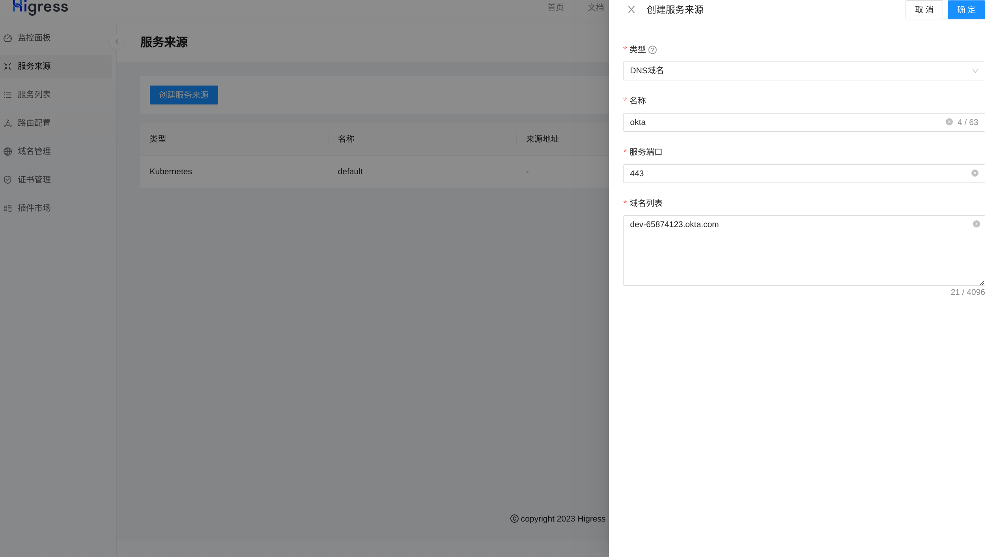
* 查看服务列表，有即成功
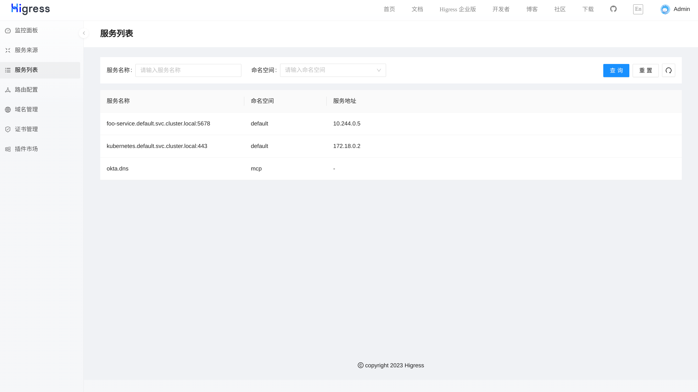
### 将测试 okta 应用程序与您的 Oidc-Wasm 插件关联
* 创建访问 okta 的 ingress
```yaml
apiVersion: networking.k8s.io/v1
kind: Ingress
metadata:
  name: example-ingress
  annotations:
    higress.io/destination: okta.dns
    higress.io/backend-protocol: "HTTPS"
    higress.io/ignore-path-case: "false"
spec:
  ingressClassName: higress
  rules:
    - host: foo.bar.com
      http:
        paths:
          - path: /
            pathType: Prefix
            backend:
              resource:
                apiGroup: networking.higress.io
                kind: McpBridge
                name: default

```
* 配置 oidc 插件
```yaml
issuer: "https://dev-65874123.okta.com"
redirect_url: "http://foo.bar.com/a/oauth2/callback"
scopes:
  - "openid"
  - "email"
client_url: "http://foo.bar.com/a"
cookie_domain: "foo.bar.com"
client_id: "xxxx"
client_secret: "xxxxx"
service_domain: "dev-65874123.okta.com"
service_name: "okta"
service_port: 443
service_source: "dns"
timeout_millis: 2000
```
### 访问服务页面，未登陆的话进行跳转
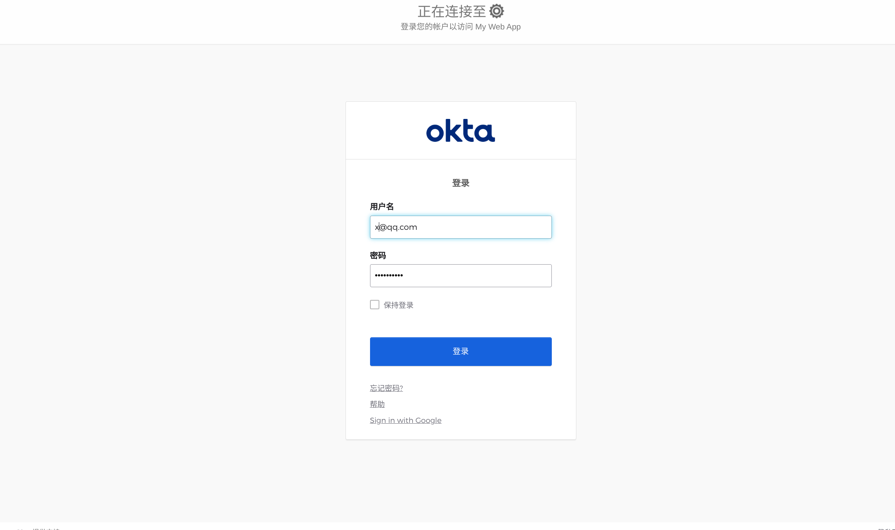
### 登陆成功跳转到服务页面
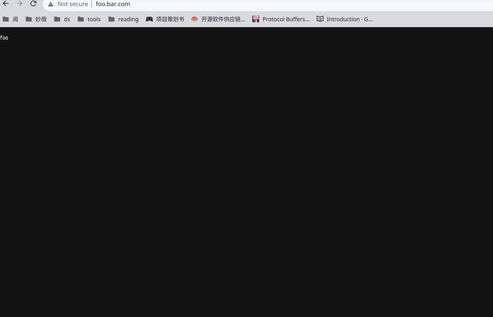


---

##  OpenID Connect with auth0
###  配置 auth0 账户
* 登录到开发人员 Okta 网站 [Developer Auth0 site](https://auth0.com/)
* 注册测试 web 应用程序

### 将测试 auth0  应用程序与 Higress 关联
* 创建服务来源
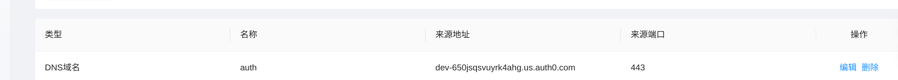

### 将测试 auth0   应用程序与您的 Oidc-Wasm 插件关联
* 创建访问 auth0 的 ingress
```yaml
apiVersion: networking.k8s.io/v1
kind: Ingress
metadata:
  name: example-ingress
  annotations:
    higress.io/destination: auth.dns
    higress.io/backend-protocol: "HTTPS"
    higress.io/ignore-path-case: "false"
spec:
  ingressClassName: higress
  rules:
    - host: foo.bar.com
      http:
        paths:
          - path: /
            pathType: Prefix
            backend:
              resource:
                apiGroup: networking.higress.io
                kind: McpBridge
                name: default


```
* 配置 oidc 插件
```yaml
CookieName: "_oauth2_wasm_c"
client_id: "xxxxx"
client_secret: "xxxxxx"
cookie_domain: "foo.bar.com"
cookie_path: "/b"
client_url: "http://foo.bar.com/b"
service_domain: "dev-650jsqsvuyrk4ahg.us.auth0.com"
issuer: "https://dev-650jsqsvuyrk4ahg.us.auth0.com/"
redirect_url: "http://foo.bar.com/b/oauth2/callback"
scopes:
  - "openid"
  - "email"
service_name: "auth"
service_port: 443
service_source: "dns"
timeout_millis: 2000
```


### 访问服务页面，未登陆的话进行跳转
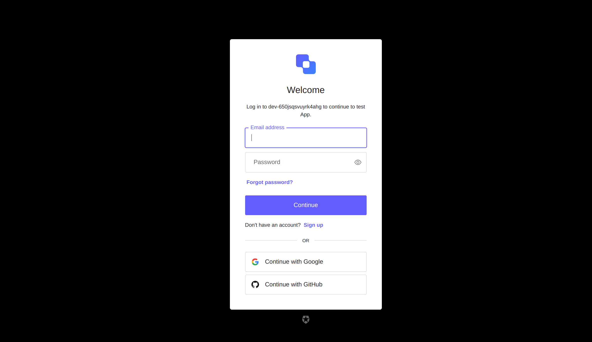

### 登陆成功跳转到服务页面
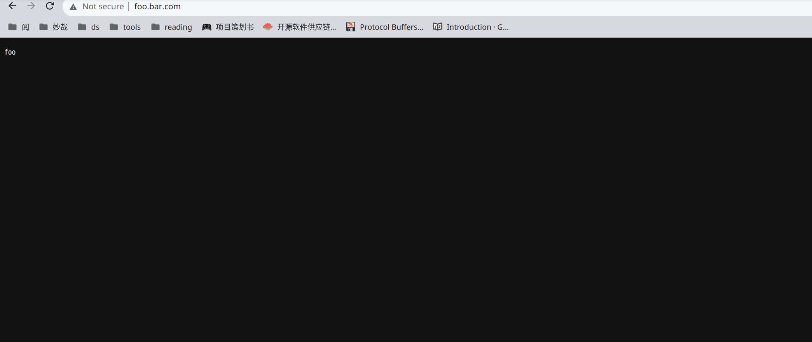

---


##  OpenID Connect with keyclocak
###  配置 keyclocak 账户
* 本文档采用 docker 本机进行部署，所以注册的 ip 应该采用 ifconfig 获取网卡 ip
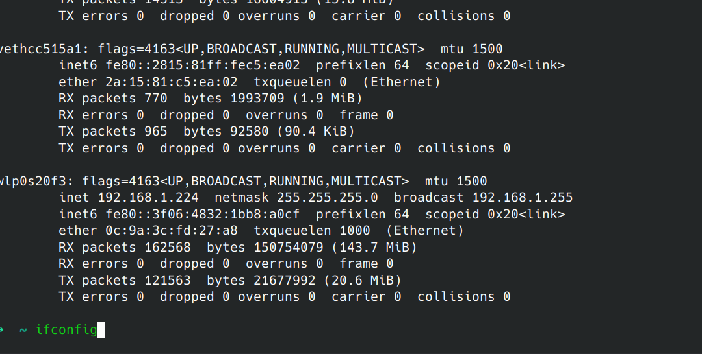

* 注册测试 web 应用程序

### 将测试 keyclocak  应用程序与 Higress 关联
* 创建服务来源

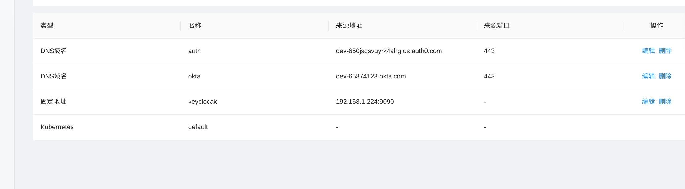
### 将测试 keyclocak 应用程序与您的 Oidc-Wasm 插件关联
* 配置 oidc 插件
```yaml
issuer: "http://127.0.0.1:9090/realms/myrealm"
redirect_url: "http://foo.bar.com/bar/oauth2/callback"
client_url: "http://foo.bar.com/"
scopes:
  - "openid"
  - "email"
cookie_name: "_oauth2_wasm_keyclocak"
cookie_domain: "foo.bar.com"
client_id: "myclinet"
client_secret: "EdKdKBX4N0jtYuPD4aGxZWiI7EVh4pr9"
service_host: "127.0.0.1:9090"
service_name: "keyclocak"
service_port: 80
service_source: "ip"
```


### 访问服务页面，未登陆的话进行跳转
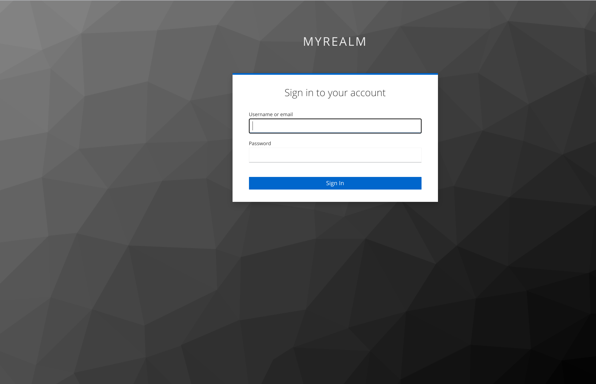
### 登陆成功跳转到服务页面
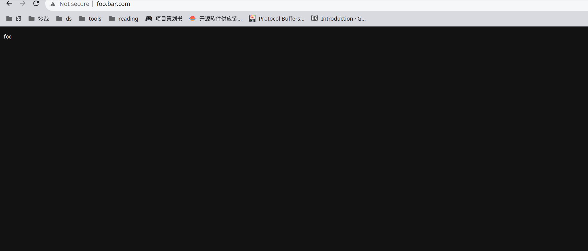


## 与oauth2-proxy支持的服务对比
| 服务                    | 是否支持          |                              |      
| ----------------------- | ----------------- | ---------------------------------------- |
| Auth0                   | 支持              |                                          |
| Okta                    | 支持              |                                          |
| dex                     | 支持              |                                          |
| Keycloak                | 支持              |                                          |
| Gitea                   | 支持              |                                         |
| GitLab                  | 支持            |                                          |
| Google                  | 不支持            | 域名不一致                                |
| GitHub                  | 不支持            | 域名不一致                                |
| Microsoft Azure AD      | 不支持            |                                          |
| Azure                   | 不支持            |                                     |


## 主要的差异
| 主要功能差异                                         | OAuth2-Proxy | OIDC-Wasm                                                                                                                                                  |
|----------------------------------------------------|--------------|-----------------------------------------------------------------------------------------------------------------------------------------------------------|
| 将服务放置在 OAuth2-Proxy 后                        | ✓            | 不具备直接验证的能力                                                                                                                                              |
| 在当前层可以展示具体信息，如 email 等                   | ✓            | 作为网关的插件，校验 token 的正确性后只是进行了转发。在实现的过程中已经捕捉到了 ID Token 信息，可以实现提取出具体的信息用于优化日志展示等。                                        |
| 校验一些非标准的 issuer，如启动 skipIssuerCheck 的 Github | ✓            | 已经抽象出 OIDCHandler，开启 skipIssuerChecker。只要实现 OIDCHandler 的能力，可以在 ProcessRedirect 中指定 authURL 的校验，在 ProcessExchangeToken 中指定 TokenURL 获取 token，在 ProcessVerify 中校验 token |