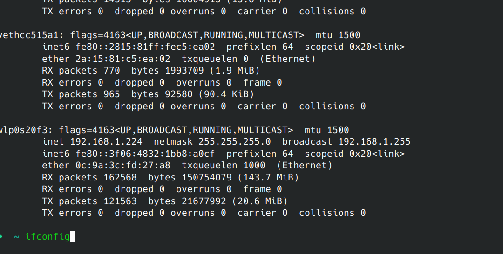
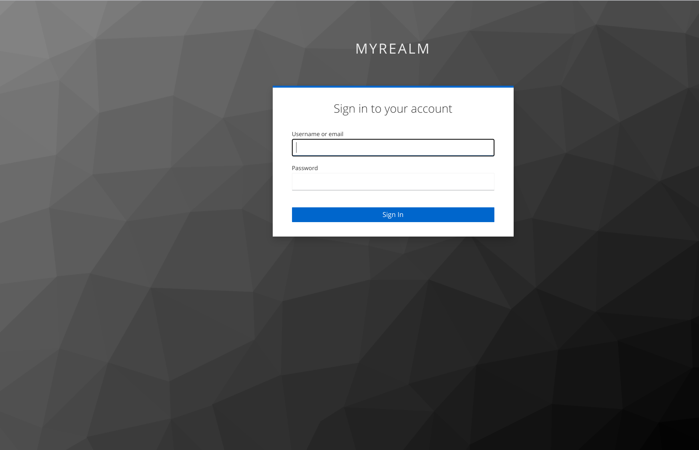
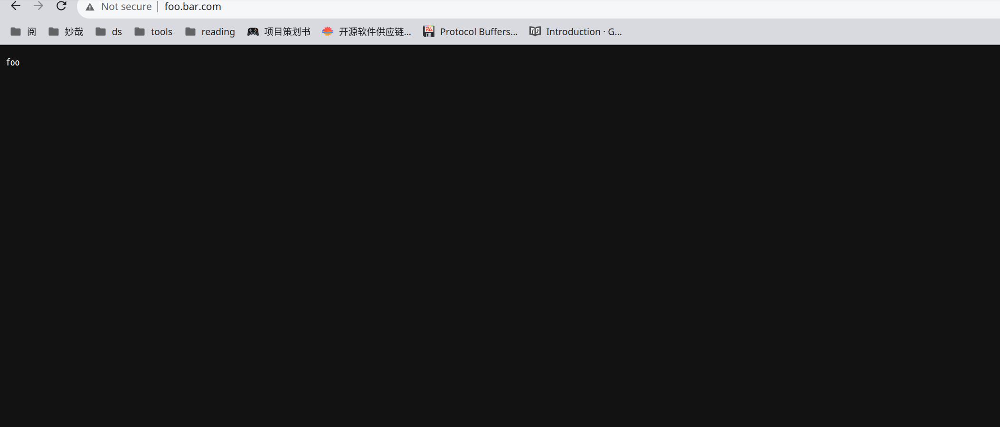

# OpenID Connect 

本文介绍了一个示例 OpenID Connect 插件配置，用于使用与 Okta , Auth0 , keycloak 身份提供程序对浏览器客户端进行身份验证。

##  OpenID Connect with Okta
###  配置 okta 账户
* 登录到开发人员 Okta 网站 [Developer Okta site](https://developer.okta.com/)
* 注册测试 web 应用程序

### 将测试 okta 应用程序与 Higress 关联
* 创建服务来源

* 查看服务列表，有即成功

### 将测试 okta 应用程序与您的 Oidc-Wasm 插件关联
* 创建访问 okta 的 ingress
```yaml
apiVersion: networking.k8s.io/v1
kind: Ingress
metadata:
  name: example-ingress
  annotations:
    higress.io/destination: auth.dns
    higress.io/backend-protocol: "HTTPS"
    higress.io/ignore-path-case: "false"
spec:
  ingressClassName: higress
  rules:
    - host: foo.bar.com
      http:
        paths:
          - path: /
            pathType: Prefix
            backend:
              resource:
                apiGroup: networking.higress.io
                kind: McpBridge
                name: default


```
* 配置 oidc 插件
```yaml
issuer: "https://dev-65874123.okta.com"
redirectUrl: "http://foo.bar.com/a/oidc/callback"
scopes:
- "openid"
- "email"
clientDomain: "foo.bar.com"
clientId: "xxxxxx"
clientSecret: "xxxxx"
domain: "dev-65874123.okta.com"
serviceName: "okta"
servicePort: 443
serviceSource: "dns"
```
### 访问服务页面，未登陆的话进行跳转

### 登陆成功跳转到服务页面


---

##  OpenID Connect with Oauth0
###  配置 Oauth0 账户
* 登录到开发人员 Okta 网站 [Developer Auth0 site](https://auth0.com/)
* 注册测试 web 应用程序

### 将测试 Oauth0  应用程序与 Higress 关联
* 创建服务来源


### 将测试 Oauth0   应用程序与您的 Oidc-Wasm 插件关联
* 创建访问 okta 的 ingress
```yaml
apiVersion: networking.k8s.io/v1
kind: Ingress
metadata:
  name: example-ingress
  annotations:
     higress.io/destination: okta.dns    
     higress.io/backend-protocol: "HTTPS"
     higress.io/ignore-path-case: "false"
spec:
  ingressClassName: higress
  rules:
    - host: foo.bar.com
      http:
        paths:
          - path: /
            pathType: Prefix
            backend:
              resource:
                apiGroup: networking.higress.io
                kind: McpBridge
                name: default

```
* 配置 oidc 插件
```yaml
issuer: "https://dev-650jsqsvuyrk4ahg.us.auth0.com/"
clientId: "xxxxxx"
clientSecret: "xxxx"
redirectUrl: "http://foo.bar.com/a/oidc/callback"
clientDomain : "foo.bar.com"
scopes :
  - "openid"
  - "email"
serviceSource: "dns"
serviceName: "auth"
servicePort: 443
domain: "dev-650jsqsvuyrk4ahg.us.auth0.com"
```

### 将测试 Oauth0   应用程序与您的 Oidc-Wasm 插件关联
* 创建访问 okta 的 ingress
```yaml
apiVersion: networking.k8s.io/v1
kind: Ingress
metadata:
  name: example-ingress
  annotations:
     higress.io/destination: okta.dns    
     higress.io/backend-protocol: "HTTPS"
     higress.io/ignore-path-case: "false"
spec:
  ingressClassName: higress
  rules:
    - host: foo.bar.com
      http:
        paths:
          - path: /
            pathType: Prefix
            backend:
              resource:
                apiGroup: networking.higress.io
                kind: McpBridge
                name: default

```
* 配置 oidc 插件
```yaml
issuer: "https://dev-650jsqsvuyrk4ahg.us.auth0.com/"
clientId: "xxxxxx"
clientSecret: "xxxx"
redirectUrl: "http://foo.bar.com/a/oidc/callback"
clientDomain : "foo.bar.com"
scopes :
  - "openid"
  - "email"
serviceSource: "dns"
serviceName: "auth"
servicePort: 443
domain: "dev-650jsqsvuyrk4ahg.us.auth0.com"
```
### 访问服务页面，未登陆的话进行跳转


### 登陆成功跳转到服务页面


---


##  OpenID Connect with keyclocak
###  配置 keyclocak 账户
* 本文档采用 docker 本机进行部署，所以注册的 ip 应该采用 ifconfig 获取网卡 ip



* 注册测试 web 应用程序

### 将测试 keyclocak  应用程序与 Higress 关联
* 创建服务来源


### 将测试 keyclocak 应用程序与您的 Oidc-Wasm 插件关联
* 配置 oidc 插件
```yaml
issuer: "http://127.0.0.1:9090/realms/myrealm"
redirectUrl: "http://foo.bar.com/bar/oidc/callback"
scopes:
  - "openid"
  - "email"
clientDomain: "foo.bar.com"
clientId: "xxx"
clientSecret: "xxxx"
serviceHost: "127.0.0.1:9090"
serviceName: "keyclocak"
servicePort: 80
serviceSource: "ip"
```

### 将测试 keyclocak   应用程序与您的 Oidc-Wasm 插件关联
* 创建访问 okta 的 ingress
```yaml
apiVersion: networking.k8s.io/v1
kind: Ingress
metadata:
  name: example-ingress
  annotations:
     higress.io/destination: okta.dns    
     higress.io/backend-protocol: "HTTPS"
     higress.io/ignore-path-case: "false"
spec:
  ingressClassName: higress
  rules:
    - host: foo.bar.com
      http:
        paths:
          - path: /
            pathType: Prefix
            backend:
              resource:
                apiGroup: networking.higress.io
                kind: McpBridge
                name: default

```
* 配置 oidc 插件
```yaml
issuer: "https://dev-650jsqsvuyrk4ahg.us.auth0.com/"
clientId: "xxxxxx"
clientSecret: "xxxx"
redirectUrl: "http://foo.bar.com/a/oidc/callback"
clientDomain : "foo.bar.com"
scopes :
  - "openid"
  - "email"
serviceSource: "dns"
serviceName: "auth"
servicePort: 443
domain: "dev-650jsqsvuyrk4ahg.us.auth0.com"
```
### 访问服务页面，未登陆的话进行跳转

### 登陆成功跳转到服务页面



## 与oauth2-proxy支持的服务对比
| 服务                    | 是否支持          |                              |      
| ----------------------- | ----------------- | ---------------------------------------- |
| Auth0                   | 支持              |                                          |
| Okta                    | 支持              |                                          |
| dex                     | 支持              |                                          |
| Keycloak                | 支持              |                                          |
| Gitea                   | 支持              |                                         |
| GitLab                  | 支持            |                                          |
| Google                  | 不支持            | 域名不一致                                |
| GitHub                  | 不支持            | 域名不一致                                |
| Microsoft Azure AD      | 不支持            |                                          |
| Azure                   | 不支持            |                                     |


## 主要的差异
|  主要功能差异                                   |       oauth2-proxy                       | oidc-wasm                                                                                                                          | 
 |-------------------------------------------| ----------------- |------------------------------------------------------------------------------------------------------------------------------------|
| 把服务放到 oauth2-proxy 后面                     |      ✓             |   不具备直接验证的能力                                                                                                                      |    |                                                        |
| 在当前层可以展示具体信息比如email等                      |         ✓            | 作为网关的插件，校验token的正确性后只是进行了转发 ，在实现的过程中已经捕捉到了idtoken信息，可以实现提取出具体的信息用于优化日志展示等                                                          |
| 在校验一些不标准的issuer,启动skipIssuerCheck比如github | ✓  | 已经抽象出 oidcHandler,开启skipissuerchecker，只要实现oidchandler的能力，可以ProcessRedirect中指定出authurl的校验，ProcessExchangeToken中指定给出jwksurl,  TokenURL |
| 退出重定向| ✓  | 不具备全局登出的能力 |
