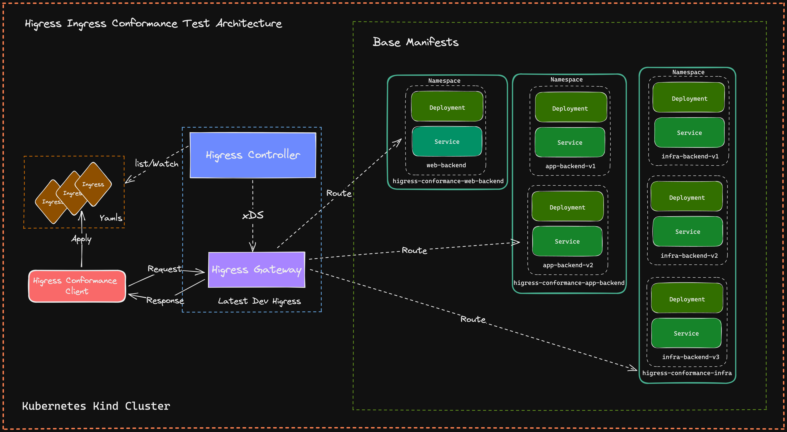
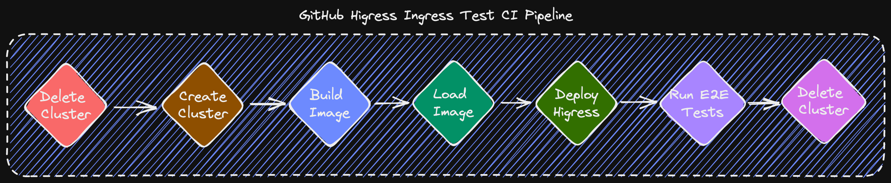

# Higress E2E Tests

Higress e2e tests are mainly focusing on two parts for now:

+ Conformance Test for Ingress API
+ Conformance Test for Gateway API

## Ingress APIs Conformance Tests

### Architecture

### Workflow

Higress provides make target to run ingress api conformance tests and wasmplugin tests,

+  API Tests: `make higress-conformance-test`
+  WasmPlugin Tests: `make higress-wasmplugin-test`
    + Build ALL GO WasmPlugins for testing: `make higress-wasmplugin-test`
    + Only build one GO WasmPlugin for testing: `PLUGIN_NAME=request-block make higress-wasmplugin-test`
    + Only build one CPP WasmPlugin for testing: `PLUGIN_TYPE=CPP PLUGIN_NAME=key_auth make higress-wasmplugin-test`

It can be divided into below steps:

1. delete-cluster: checks if we have undeleted kind cluster.
2. create-cluster: create a new kind cluster.
3. docker-build: build a dev image of higress.
4. kube-load-image: load dev higress-controller image it into kind cluster.
5. install-dev: install higress-controller with dev image, and latest higress-gateway, istiod with helm.
6. run-e2e-test:
    1. Setup conformance suite, like define what conformance tests we want to run, in `e2e_test.go` / `higressTests Slice`. Each case we choose to open is difined in `test/ingress/conformance/tests`.
    2. Prepare resources and install them into cluster, like backend services/deployments.
    3. Load conformance tests we choose to open in `e2e_test.go` / `higressTests Slice`, and run them one by one, fail if it is not expected.

### How to write a test case

To add a new test case, you firstly need to add `xxx.go` and `xxx.yaml` in `test/ingress/conformance/tests`. `xxx.yaml` is the Ingress resource you need to apply in the cluster, `xxx.go` defines the HigressConformanceTest.

And after that, you should add your defined HigressConformanceTest to `e2e_test.go` / `higressTests Slice`.

You can understand it quickly just by looking at codes in `test/ingress/conformance/tests/httproute-simple-same-namespace.go` and `test/ingress/conformance/tests/httproute-simple-same-namespace.yaml`, and try to write one.

## Gateway APIs Conformance Tests

Gateway API Conformance tests are based on the suite provided by `kubernetes-sig/gateway-api`, we can reuse that,
and descide what conformance tests we need to open. Conformance tests of Gateway API.

This API covers a broad set of features and use cases and has been implemented widely.
This combination of both a large feature set and variety of implementations requires
clear conformance definitions and tests to ensure the API provides a consistent experience wherever it is used.

Gateway API includes a set of conformance tests. These create a series of Gateways and Routes with the specified
GatewayClass, and test that the implementation matches the API specification.

Each release contains a set of conformance tests, these will continue to expand as the API evolves.
Currently conformance tests cover the majority of Core capabilities in the standard channel, in addition to some Extended capabilities.
