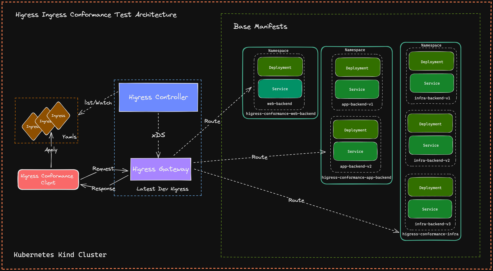
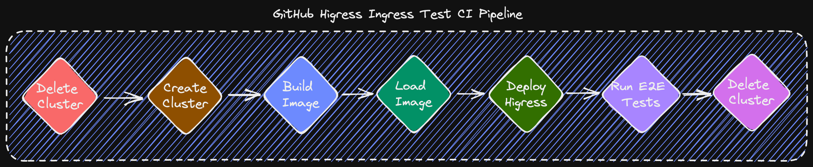

# Higress E2E 测试

Higress E2E 测试主要关注两个部分：

+ Ingress API 的一致性测试
+ Gateway API 的一致性测试

## Ingress API 一致性测试

### 架构

### 工作流程

Higress 提供了运行 Ingress API 一致性测试和 wasmplugin 测试的 make 目标，

+ API 测试: `make higress-conformance-test`
+ WasmPlugin 测试: `make higress-wasmplugin-test`
    + 为测试构建所有 GO WasmPlugins: `make higress-wasmplugin-test`
    + 仅为一个 GO WasmPlugin 构建测试: `PLUGIN_NAME=request-block make higress-wasmplugin-test`
    + 仅为一个 CPP WasmPlugin 构建测试: `PLUGIN_TYPE=CPP PLUGIN_NAME=key_auth make higress-wasmplugin-test`
    + 仅运行指定测试,用逗号分隔 `TEST_SHORTNAME=WasmPluginsIPRestrictionAllow,WasmPluginsIPRestrictionDeny make higress-wasmplugin-test`

可以分为以下步骤：

1. delete-cluster: 检查是否有未删除的 kind 集群。
2. create-cluster: 创建一个新的 kind 集群。
3. docker-build: 构建 higress 的开发镜像。
4. kube-load-image: 将 dev higress-controller 镜像加载到 kind 集群中。
5. install-dev: 使用 helm 安装带有 dev 镜像的 higress-controller，并安装最新的 higress-gateway、istiod。
6. run-e2e-test:
    1. 设置一致性测试套件，例如在 `e2e_test.go` / `higressTests Slice` 中定义我们想要运行的一致性测试。我们选择打开的每个测试都在 `test/ingress/conformance/tests` 中定义。
    2. 准备资源并将它们安装到集群中，例如后端服务/部署。
    3. 在 `e2e_test.go` / `higressTests Slice` 中加载我们选择打开的一致性测试，并逐个运行它们，如果不符合预期，则失败。

### 如何编写测试用例

要添加新的测试用例，首先需要在 `test/ingress/conformance/tests` 中添加 `xxx.go` 和 `xxx.yaml`。`xxx.yaml` 是您需要在集群中应用的 Ingress 资源，`xxx.go` 定义了 HigressConformanceTest。

然后，您应该将您定义的 HigressConformanceTest 添加到 `e2e_test.go` / `higressTests Slice` 中。

通过查看 `test/ingress/conformance/tests/httproute-simple-same-namespace.go` 和 `test/ingress/conformance/tests/httproute-simple-same-namespace.yaml` 中的代码，您可以快速了解并尝试编写一个测试用例。

### 如何实现测试环境的复用

主要通过 Makefile 中的以下几个目标实现：

1. **make higress-conformance-test:** 用于运行整个 Conformance 测试流程，包括搭建测试环境、运行测试用例、清理测试环境。
    - **make higress-conformance-test-prepare:** 可用于搭建 higress-controller、higress-gateway 等 deployment 的环境。
    - **make run-higress-e2e-test:** 可用于运行测试用例。
        - **make run-higress-e2e-test-setup:** 可用于安装测试用例所需的基础资源，例如 nacos、dubbo 等。
        - **make run-higress-e2e-test-run:** 可用于运行测试用例。
        - **make run-higress-e2e-test-clean:** 可用于清理测试用例在 setup 阶段所安装的基础资源。
    - **make higress-conformance-test-clean:** 可用于清理 higress-controller、higress-gateway 等 deployment 的测试环境。

2. **make higress-wasmplugin-test:** 用于运行整个 WasmPlugin 测试流程，包括搭建测试环境、编译 WasmPlugin 插件、运行测试用例、清理测试环境。
    - **make higress-wasmplugin-test-prepare:** 可用于搭建 higress-controller、higress-gateway 等 deployment 的环境，并编译 WasmPlugin 插件。
    - **make run-higress-e2e-test-wasmplugin:** 可用于运行测试用例。
        - **make run-higress-e2e-test-wasmplugin-setup:** 可用于安装测试用例所需的基础资源，例如 nacos、dubbo 等。
        - **make run-higress-e2e-test-wasmplugin-run:** 可用于运行测试用例。
        - **make run-higress-e2e-test-wasmplugin-clean:** 可用于清理测试用例在 setup 阶段所安装的基础资源。
    - **make higress-wasmplugin-test-clean:** 可用于清理 higress-controller、higress-gateway 等 deployment 的测试环境。

## Gateway API 一致性测试

Gateway API 一致性测试基于 `kubernetes-sig/gateway-api` 提供的套件，我们可以重复使用它，并决定我们需要打开哪些 Gateway API 的一致性测试。

此 API 包含一系列广泛的功能和用例，并已得到广泛实现。
这个大的功能集和各种实现的结合需要明确的一致性定义和测试，以确保在任何地方使用该 API 时都提供一致的体验。

Gateway API 包括一组一致性测试。这些测试创建具有指定 GatewayClass 的一系列 Gateways 和 Routes，并测试实现是否符合 API 规范。

每个发布版本都包含一组一致性测试，随着 API 的演进，这些测试将不断扩展。
目前，一致性测试覆盖了标准通道中的大多数核心功能，以及一些扩展功能。